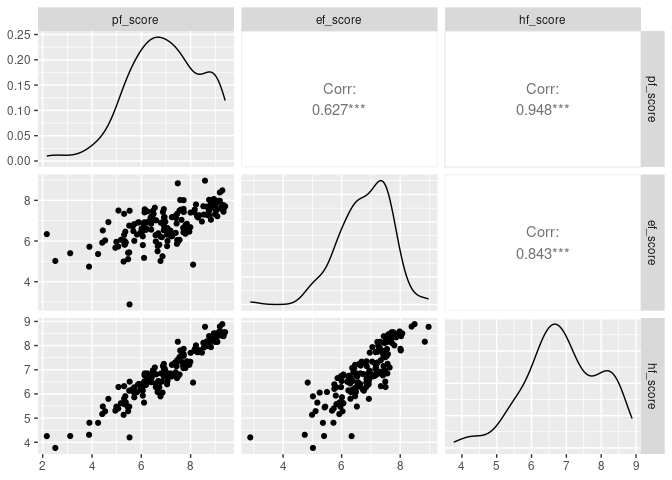

Activity 3 - Day 1
================

### Task 2: Loading the necessary packages

### Task 3: Loading the data

``` r
hfi <- data.frame(readr::read_csv("https://www.openintro.org/data/csv/hfi.csv"))
```

    ## Rows: 1458 Columns: 123
    ## ── Column specification ────────────────────────────────────────────────────────
    ## Delimiter: ","
    ## chr   (3): ISO_code, countries, region
    ## dbl (120): year, pf_rol_procedural, pf_rol_civil, pf_rol_criminal, pf_rol, p...
    ## 
    ## ℹ Use `spec()` to retrieve the full column specification for this data.
    ## ℹ Specify the column types or set `show_col_types = FALSE` to quiet this message.

``` r
hfi_2016 <- hfi %>% filter(year == "2016") 
hfi_2016
```

    ##     year ISO_code              countries                        region
    ## 1   2016      ALB                Albania                Eastern Europe
    ## 2   2016      DZA                Algeria    Middle East & North Africa
    ## 3   2016      AGO                 Angola            Sub-Saharan Africa
    ## 4   2016      ARG              Argentina Latin America & the Caribbean
    ## 5   2016      ARM                Armenia       Caucasus & Central Asia
    ## 6   2016      AUS              Australia                       Oceania
    ## 7   2016      AUT                Austria                Western Europe
    ## 8   2016      AZE             Azerbaijan       Caucasus & Central Asia
    ## 9   2016      BHS                Bahamas Latin America & the Caribbean
    ## 10  2016      BHR                Bahrain    Middle East & North Africa
    ## 11  2016      BGD             Bangladesh                    South Asia
    ## 12  2016      BRD               Barbados Latin America & the Caribbean
    ## 13  2016      BLR                Belarus                Eastern Europe
    ## 14  2016      BEL                Belgium                Western Europe
    ## 15  2016      BLZ                 Belize Latin America & the Caribbean
    ## 16  2016      BEN                  Benin            Sub-Saharan Africa
    ## 17  2016      BTN                 Bhutan                    South Asia
    ## 18  2016      BOL                Bolivia Latin America & the Caribbean
    ## 19  2016      BIH Bosnia and Herzegovina                Eastern Europe
    ## 20  2016      BWA               Botswana            Sub-Saharan Africa
    ## 21  2016      BRA                 Brazil Latin America & the Caribbean
    ## 22  2016      BRN      Brunei Darussalam                    South Asia
    ## 23  2016      BGR               Bulgaria                Eastern Europe
    ## 24  2016      BFA           Burkina Faso            Sub-Saharan Africa
    ## 25  2016      BDI                Burundi            Sub-Saharan Africa
    ## 26  2016      KHM               Cambodia                    South Asia
    ## 27  2016      CMR               Cameroon            Sub-Saharan Africa
    ## 28  2016      CAN                 Canada                 North America
    ## 29  2016      CPV             Cape Verde            Sub-Saharan Africa
    ## 30  2016      CAF      Central Afr. Rep.            Sub-Saharan Africa
    ## 31  2016      TCD                   Chad            Sub-Saharan Africa
    ## 32  2016      CHL                  Chile Latin America & the Caribbean
    ## 33  2016      CHN                  China                     East Asia
    ## 34  2016      COL               Colombia Latin America & the Caribbean
    ## 35  2016      COD         Congo, Dem. R.            Sub-Saharan Africa
    ## 36  2016      COG         Congo, Rep. Of            Sub-Saharan Africa
    ## 37  2016      CRI             Costa Rica Latin America & the Caribbean
    ## 38  2016      CIV          Cote d'Ivoire            Sub-Saharan Africa
    ## 39  2016      HRV                Croatia                Eastern Europe
    ## 40  2016      CYP                 Cyprus                Eastern Europe
    ## 41  2016      CZE             Czech Rep.                Eastern Europe
    ## 42  2016      DNK                Denmark                Western Europe
    ## 43  2016      DOM         Dominican Rep. Latin America & the Caribbean
    ## 44  2016      ECU                Ecuador Latin America & the Caribbean
    ## 45  2016      EGY                  Egypt    Middle East & North Africa
    ## 46  2016      SLV            El Salvador Latin America & the Caribbean
    ## 47  2016      EST                Estonia                Eastern Europe
    ## 48  2016      ETH               Ethiopia            Sub-Saharan Africa
    ## 49  2016      FJI                   Fiji                       Oceania
    ## 50  2016      FIN                Finland                Western Europe
    ## 51  2016      FRA                 France                Western Europe
    ## 52  2016      GAB                  Gabon            Sub-Saharan Africa
    ## 53  2016      GMB            Gambia, The            Sub-Saharan Africa
    ## 54  2016      GEO                Georgia       Caucasus & Central Asia
    ## 55  2016      DEU                Germany                Western Europe
    ## 56  2016      GHA                  Ghana            Sub-Saharan Africa
    ## 57  2016      GRC                 Greece                Eastern Europe
    ## 58  2016      GTM              Guatemala Latin America & the Caribbean
    ## 59  2016      GIN                 Guinea            Sub-Saharan Africa
    ## 60  2016      GNB          Guinea-Bissau            Sub-Saharan Africa
    ## 61  2016      GUY                 Guyana Latin America & the Caribbean
    ## 62  2016      HTI                  Haiti Latin America & the Caribbean
    ## 63  2016      HND               Honduras Latin America & the Caribbean
    ## 64  2016      HKG              Hong Kong                     East Asia
    ## 65  2016      HUN                Hungary                Eastern Europe
    ## 66  2016      ISL                Iceland                Western Europe
    ## 67  2016      IND                  India                    South Asia
    ## 68  2016      IDN              Indonesia                    South Asia
    ## 69  2016      IRN                   Iran    Middle East & North Africa
    ## 70  2016      IRQ                   Iraq    Middle East & North Africa
    ## 71  2016      IRL                Ireland                Western Europe
    ## 72  2016      ISR                 Israel    Middle East & North Africa
    ## 73  2016      ITA                  Italy                Western Europe
    ## 74  2016      JAM                Jamaica Latin America & the Caribbean
    ## 75  2016      JPN                  Japan                     East Asia
    ## 76  2016      JOR                 Jordan    Middle East & North Africa
    ## 77  2016      KAZ             Kazakhstan       Caucasus & Central Asia
    ## 78  2016      KEN                  Kenya            Sub-Saharan Africa
    ## 79  2016      KOR           Korea, South                     East Asia
    ## 80  2016      KWT                 Kuwait    Middle East & North Africa
    ## 81  2016      KGZ        Kyrgyz Republic       Caucasus & Central Asia
    ## 82  2016      LAO                   Laos                    South Asia
    ## 83  2016      LVA                 Latvia                Eastern Europe
    ## 84  2016      LBN                Lebanon    Middle East & North Africa
    ## 85  2016      LSO                Lesotho            Sub-Saharan Africa
    ## 86  2016      LBR                Liberia            Sub-Saharan Africa
    ## 87  2016      LBY                  Libya    Middle East & North Africa
    ## 88  2016      LTU              Lithuania                Eastern Europe
    ## 89  2016      LUX             Luxembourg                Western Europe
    ## 90  2016      MKD              Macedonia                Eastern Europe
    ## 91  2016      MDG             Madagascar            Sub-Saharan Africa
    ## 92  2016      MWI                 Malawi            Sub-Saharan Africa
    ## 93  2016      MYS               Malaysia                    South Asia
    ## 94  2016      MLI                   Mali            Sub-Saharan Africa
    ## 95  2016      MLT                  Malta                Western Europe
    ## 96  2016      MRT             Mauritania            Sub-Saharan Africa
    ## 97  2016      MUS              Mauritius            Sub-Saharan Africa
    ## 98  2016      MEX                 Mexico Latin America & the Caribbean
    ## 99  2016      MDA                Moldova                Eastern Europe
    ## 100 2016      MNG               Mongolia                     East Asia
    ## 101 2016      MNE             Montenegro                Eastern Europe
    ## 102 2016      MAR                Morocco    Middle East & North Africa
    ## 103 2016      MOZ             Mozambique            Sub-Saharan Africa
    ## 104 2016      MMR                Myanmar                    South Asia
    ## 105 2016      NAM                Namibia            Sub-Saharan Africa
    ## 106 2016      NPL                  Nepal                    South Asia
    ## 107 2016      NLD            Netherlands                Western Europe
    ## 108 2016      NZL            New Zealand                       Oceania
    ## 109 2016      NIC              Nicaragua Latin America & the Caribbean
    ## 110 2016      NER                  Niger            Sub-Saharan Africa
    ## 111 2016      NGA                Nigeria            Sub-Saharan Africa
    ## 112 2016      NOR                 Norway                Western Europe
    ## 113 2016      OMN                   Oman    Middle East & North Africa
    ## 114 2016      PAK               Pakistan                    South Asia
    ## 115 2016      PAN                 Panama Latin America & the Caribbean
    ## 116 2016      PNG        Pap. New Guinea                       Oceania
    ## 117 2016      PRY               Paraguay Latin America & the Caribbean
    ## 118 2016      PER                   Peru Latin America & the Caribbean
    ## 119 2016      PHL            Philippines                    South Asia
    ## 120 2016      POL                 Poland                Eastern Europe
    ## 121 2016      PRT               Portugal                Western Europe
    ## 122 2016      QAT                  Qatar    Middle East & North Africa
    ## 123 2016      ROU                Romania                Eastern Europe
    ## 124 2016      RUS                 Russia                Eastern Europe
    ## 125 2016      RWA                 Rwanda            Sub-Saharan Africa
    ## 126 2016      SAU           Saudi Arabia    Middle East & North Africa
    ## 127 2016      SEN                Senegal            Sub-Saharan Africa
    ## 128 2016      SRB                 Serbia                Eastern Europe
    ## 129 2016      SYC             Seychelles            Sub-Saharan Africa
    ## 130 2016      SLE           Sierra Leone            Sub-Saharan Africa
    ## 131 2016      SGP              Singapore                    South Asia
    ## 132 2016      SVK            Slovak Rep.                Eastern Europe
    ## 133 2016      SVN               Slovenia                Eastern Europe
    ## 134 2016      ZAF           South Africa            Sub-Saharan Africa
    ## 135 2016      ESP                  Spain                Western Europe
    ## 136 2016      LKA              Sri Lanka                    South Asia
    ## 137 2016      SDN                  Sudan            Sub-Saharan Africa
    ## 138 2016      SUR               Suriname Latin America & the Caribbean
    ## 139 2016      SWZ              Swaziland            Sub-Saharan Africa
    ## 140 2016      SWE                 Sweden                Western Europe
    ## 141 2016      CHE            Switzerland                Western Europe
    ## 142 2016      SYR                  Syria    Middle East & North Africa
    ## 143 2016      TWN                 Taiwan                     East Asia
    ## 144 2016      TJK             Tajikistan       Caucasus & Central Asia
    ## 145 2016      TZA               Tanzania            Sub-Saharan Africa
    ## 146 2016      THA               Thailand                    South Asia
    ## 147 2016      TLS            Timor-Leste                    South Asia
    ## 148 2016      TGO                   Togo            Sub-Saharan Africa
    ## 149 2016      TTO    Trinidad and Tobago Latin America & the Caribbean
    ## 150 2016      TUN                Tunisia    Middle East & North Africa
    ## 151 2016      TUR                 Turkey    Middle East & North Africa
    ## 152 2016      UGA                 Uganda            Sub-Saharan Africa
    ## 153 2016      UKR                Ukraine                Eastern Europe
    ## 154 2016      ARE   United Arab Emirates    Middle East & North Africa
    ## 155 2016      GBR         United Kingdom                Western Europe
    ## 156 2016      USA          United States                 North America
    ## 157 2016      URY                Uruguay Latin America & the Caribbean
    ## 158 2016      VEN              Venezuela Latin America & the Caribbean
    ## 159 2016      VNM                Vietnam                    South Asia
    ## 160 2016      YEM            Yemen, Rep.    Middle East & North Africa
    ## 161 2016      ZMB                 Zambia            Sub-Saharan Africa
    ## 162 2016      ZWE               Zimbabwe            Sub-Saharan Africa
    ##     pf_rol_procedural pf_rol_civil pf_rol_criminal   pf_rol pf_ss_homicide
    ## 1            6.661503     4.547244        4.666508 5.291752       8.920429
    ## 2                  NA           NA              NA 3.819566       9.456254
    ## 3                  NA           NA              NA 3.451814       8.060260
    ## 4            7.098483     5.791960        4.343930 5.744791       7.622974
    ## 5                  NA           NA              NA 5.003205       8.808750
    ## 6            8.439110     7.525648        7.364078 7.776279       9.623538
    ## 7            8.969832     7.872188        7.673227 8.171749       9.737912
    ## 8                  NA           NA              NA 4.270861       9.143499
    ## 9            6.930835     6.008696        6.262840 6.400790       0.000000
    ## 10                 NA           NA              NA 5.900339       9.790481
    ## 11           2.333137     3.712171        3.353370 3.132892       8.998765
    ## 12           7.668771     6.520983        5.908108 6.699287       5.637136
    ## 13           4.483689     5.934587        4.968499 5.128925       8.566135
    ## 14           8.669067     7.343872        7.240364 7.751101       9.220407
    ## 15           4.753383     4.737766        3.315467 4.268872       0.000000
    ## 16                 NA           NA              NA 4.129480       7.526895
    ## 17                 NA           NA              NA 5.925575       9.548283
    ## 18           3.702869     3.361331        2.090006 3.051402       7.479924
    ## 19           6.312217     4.995851        5.102173 5.470080       9.489855
    ## 20           5.333481     6.055928        5.535643 5.641684       3.984712
    ## 21           4.965023     5.288791        3.701204 4.651673       0.000000
    ## 22                 NA           NA              NA 6.163383       9.802818
    ## 23           4.984199     5.631897        4.058021 4.891372       9.545583
    ## 24           5.148742     4.884167        4.548815 4.860575       9.852021
    ## 25                 NA           NA              NA 2.961470       7.591791
    ## 26           3.022812     1.983626        2.693785 2.566741       9.262616
    ## 27           2.624329     3.695063        2.761362 3.026918       8.330360
    ## 28           8.622615     7.181646        7.410711 7.738324       9.326358
    ## 29                 NA           NA              NA 5.720581       5.405668
    ## 30                 NA           NA              NA 2.238883       2.097050
    ## 31                 NA           NA              NA 2.900353       6.383880
    ## 32           7.706122     6.291439        5.550751 6.516104       8.614887
    ## 33           3.954893     5.380302        4.779259 4.704818       9.753760
    ## 34           4.968106     4.874353        3.426459 4.422973       0.000000
    ## 35                 NA           NA              NA 2.603961       4.581445
    ## 36                 NA           NA              NA 3.512352       6.271019
    ## 37           8.053553     6.267071        5.560009 6.626877       5.238007
    ## 38           2.988534     5.187530        3.925204 4.033756       5.347790
    ## 39           6.312658     5.732319        5.056636 5.700538       9.582146
    ## 40                 NA           NA              NA 6.327702       9.555653
    ## 41           8.711492     7.237188        7.411397 7.786692       9.754941
    ## 42           9.273488     8.619286        8.168529 8.687101       9.607727
    ## 43           5.242039     4.544211        3.270030 4.352093       3.927318
    ## 44           4.368084     4.596152        3.812076 4.258771       7.658493
    ## 45           2.948325     3.763257        4.166860 3.626148       8.994685
    ## 46           5.106082     4.977861        2.981356 4.355100       0.000000
    ## 47           8.766076     7.847471        6.789710 7.801086       8.722745
    ## 48           2.613462     3.896895        3.397061 3.302473       6.975355
    ## 49                 NA           NA              NA 4.701806       9.096868
    ## 50           9.498083     7.955568        8.464094 8.639248       9.432892
    ## 51           6.822107     7.021794        6.469894 6.771265       9.459125
    ## 52                 NA           NA              NA 4.241028       6.782865
    ## 53                 NA           NA              NA 3.981623       6.348597
    ## 54           5.648379     5.432612        5.076458 5.385816       9.604153
    ## 55           8.623039     8.542968        7.743621 8.303210       9.529523
    ## 56           5.849976     6.243898        5.148001 5.747292       9.326481
    ## 57           6.420952     5.682751        5.265669 5.789791       9.699859
    ## 58           5.446891     3.469544        3.046596 3.987677       0.000000
    ## 59                 NA           NA              NA 3.120741       6.470168
    ## 60                 NA           NA              NA 2.799701       6.180058
    ## 61           4.863326     5.139138        3.980731 4.661065       2.651690
    ## 62                 NA           NA              NA 3.582254       5.984143
    ## 63           3.093771     4.053457        2.436940 3.194723       0.000000
    ## 64           6.484917     7.724473        7.204062 7.137817       9.846703
    ## 65           6.555008     5.013990        4.748055 5.439018       9.171400
    ## 66                 NA           NA              NA 7.572815       9.879821
    ## 67           4.521140     4.193634        4.246546 4.320440       8.710520
    ## 68           4.182062     4.506668        3.542565 4.077098       9.801973
    ## 69           3.410152     5.211233        4.505767 4.375717       9.012385
    ## 70                 NA           NA              NA 2.464387       6.058217
    ## 71                 NA           NA              NA 7.614722       9.679168
    ## 72                 NA           NA              NA 6.790678       9.454402
    ## 73           7.522592     5.556020        6.432903 6.503838       9.730775
    ## 74           5.785643     5.438131        4.987695 5.403823       0.000000
    ## 75           7.677815     7.865213        7.387443 7.643490       9.886591
    ## 76           5.186786     6.181327        6.028310 5.798808       9.380949
    ## 77           3.894770     5.624606        4.094420 4.537932       8.077708
    ## 78           3.464645     4.596396        3.800403 3.953815       8.050626
    ## 79           7.939076     7.403502        6.971971 7.438183       9.719554
    ## 80                 NA           NA              NA 5.222398       9.260432
    ## 81           3.586664     4.648818        3.185602 3.807028       8.205846
    ## 82                 NA           NA              NA 3.953482       7.196007
    ## 83                 NA           NA              NA 6.681684       8.655066
    ## 84           4.601614     4.746243        3.671315 4.339724       8.402759
    ## 85                 NA           NA              NA 4.888498       0.000000
    ## 86           3.961120     4.309724        3.087193 3.786012       8.708617
    ## 87                 NA           NA              NA 2.198018       8.998449
    ## 88                 NA           NA              NA 6.795901       7.901253
    ## 89                 NA           NA              NA 7.897751       9.712394
    ## 90           4.684099     5.632479        4.666636 4.994404       9.364619
    ## 91           3.333572     3.930339        3.575734 3.613215       6.925294
    ## 92           5.059202     5.412025        4.296704 4.922643       9.306716
    ## 93           5.231990     5.579143        5.453439 5.421524       9.155747
    ## 94                 NA           NA              NA 3.930246       5.638730
    ## 95                 NA           NA              NA 6.880670       9.625833
    ## 96                 NA           NA              NA 3.933861       6.023326
    ## 97                 NA           NA              NA 6.446820       9.271222
    ## 98           4.690790     4.041975        3.035141 3.922635       2.294416
    ## 99           5.143328     4.658885        3.552056 4.451423       8.722340
    ## 100          5.430154     5.339118        4.985356 5.251542       7.737631
    ## 101                NA           NA              NA 5.103068       8.217753
    ## 102          3.426608     5.434931        3.735974 4.199171       9.504645
    ## 103                NA           NA              NA 3.551132       8.638278
    ## 104          2.399945     3.657112        2.872087 2.976382       9.093876
    ## 105                NA           NA              NA 5.796622       3.144676
    ## 106          3.930952     4.661817        4.309426 4.300731       9.134488
    ## 107          8.867740     8.714600        7.991312 8.524551       9.778655
    ## 108          8.365538     7.877339        7.362762 7.868546       9.605842
    ## 109          3.951176     3.928453        3.421570 3.767066       7.053150
    ## 110                NA           NA              NA 4.150644       8.222386
    ## 111          3.810968     4.990420        4.179642 4.327010       6.060660
    ## 112          8.904126     8.509218        8.256121 8.556488       9.794278
    ## 113                NA           NA              NA 5.861203       9.737435
    ## 114          3.010365     3.708664        3.796178 3.505069       8.236642
    ## 115          5.052444     4.823172        3.281000 4.385539       6.132164
    ## 116                NA           NA              NA 3.970458       6.861761
    ## 117                NA           NA              NA 4.108066       6.282639
    ## 118          6.172623     4.405750        3.569158 4.715844       6.933614
    ## 119          2.534832     4.670852        3.104072 3.436585       5.592069
    ## 120          6.579361     6.409359        6.159868 6.382863       9.731942
    ## 121          8.170780     6.920652        6.405393 7.165608       9.745627
    ## 122                NA           NA              NA 6.546296       9.848384
    ## 123          6.778754     6.460960        5.745707 6.328474       9.500479
    ## 124          3.329539     5.310768        3.345276 3.995194       5.673527
    ## 125                NA           NA              NA 5.282070       8.992223
    ## 126                NA           NA              NA 5.914095       9.401720
    ## 127          4.075341     5.649207        4.322606 4.682385       7.049766
    ## 128          4.732948     4.910500        3.555612 4.399687       9.442291
    ## 129                NA           NA              NA 5.384695       4.905248
    ## 130          3.836276     4.135833        3.803179 3.925096       9.314636
    ## 131          6.920866     8.131372        7.997979 7.683406       9.871777
    ## 132                NA           NA              NA 6.275761       9.581016
    ## 133          7.694842     5.859112        5.797913 6.450623       9.807344
    ## 134          5.888715     6.067467        5.228230 5.728138       0.000000
    ## 135          8.088213     6.596637        6.350741 7.011864       9.746606
    ## 136          4.241601     4.482074        4.832259 4.518645       8.980183
    ## 137                NA           NA              NA 3.163435       7.934184
    ## 138          4.607893     5.016272        5.167021 4.930395       6.661154
    ## 139                NA           NA              NA 4.658352       3.083054
    ## 140          9.517962     8.094623        8.006348 8.539644       9.568895
    ## 141                NA           NA              NA 8.249290       9.785457
    ## 142                NA           NA              NA 1.980355       9.118885
    ## 143                NA           NA              NA 6.983996       9.672993
    ## 144                NA           NA              NA 3.297264       9.355165
    ## 145          3.749894     5.043568        3.938931 4.244131       7.219003
    ## 146          3.515098     5.328005        4.015992 4.286365       8.704225
    ## 147                NA           NA              NA 3.261571       8.420599
    ## 148                NA           NA              NA 4.083064       6.400033
    ## 149          4.420308     5.900686        3.873113 4.731369       0.000000
    ## 150          5.074037     4.903501        4.295872 4.757804       8.780159
    ## 151          3.579995     4.373414        3.970161 3.974523       8.274906
    ## 152          2.161522     4.527822        3.399779 3.363041       5.392619
    ## 153          4.766431     5.136370        3.736319 4.546374       7.464543
    ## 154          5.347898     6.827330        6.922625 6.365951       9.642476
    ## 155          8.227729     7.512237        7.409705 7.716557       9.519036
    ## 156          7.619550     6.682994        6.547191 6.949912       7.858670
    ## 157          7.139103     7.372884        5.412934 6.641640       6.922292
    ## 158          1.479799     3.271891        1.429083 2.060257       0.000000
    ## 159          5.376034     4.448922        4.911257 4.912071       9.392643
    ## 160                NA           NA              NA 2.623957       7.336599
    ## 161          3.300633     4.891213        4.154905 4.115584       7.880823
    ## 162          2.432142     4.334427        3.756227 3.507599       7.332577
    ##     pf_ss_disappearances_disap pf_ss_disappearances_violent
    ## 1                           10                    10.000000
    ## 2                           10                     9.294030
    ## 3                            5                    10.000000
    ## 4                           10                    10.000000
    ## 5                           10                    10.000000
    ## 6                           10                    10.000000
    ## 7                           10                    10.000000
    ## 8                           10                     5.183346
    ## 9                           10                    10.000000
    ## 10                          10                    10.000000
    ## 11                           5                     9.916130
    ## 12                          10                    10.000000
    ## 13                          10                    10.000000
    ## 14                          10                    10.000000
    ## 15                          10                    10.000000
    ## 16                          10                    10.000000
    ## 17                          10                    10.000000
    ## 18                          10                    10.000000
    ## 19                          10                    10.000000
    ## 20                          10                    10.000000
    ## 21                          10                    10.000000
    ## 22                          10                    10.000000
    ## 23                          10                    10.000000
    ## 24                          10                    10.000000
    ## 25                           5                    10.000000
    ## 26                          10                    10.000000
    ## 27                           0                     6.857115
    ## 28                          10                    10.000000
    ## 29                          10                    10.000000
    ## 30                           5                    10.000000
    ## 31                           5                    10.000000
    ## 32                          10                    10.000000
    ## 33                           0                    10.000000
    ## 34                           0                     9.794465
    ## 35                           0                     9.305698
    ## 36                           0                    10.000000
    ## 37                          10                    10.000000
    ## 38                           5                    10.000000
    ## 39                          10                    10.000000
    ## 40                          10                    10.000000
    ## 41                          10                    10.000000
    ## 42                          10                    10.000000
    ## 43                          10                    10.000000
    ## 44                          10                    10.000000
    ## 45                           0                     9.066417
    ## 46                          10                    10.000000
    ## 47                          10                    10.000000
    ## 48                           5                     9.837245
    ## 49                          10                    10.000000
    ## 50                          10                    10.000000
    ## 51                          10                    10.000000
    ## 52                          10                    10.000000
    ## 53                           5                    10.000000
    ## 54                          10                    10.000000
    ## 55                          10                    10.000000
    ## 56                          10                    10.000000
    ## 57                          10                    10.000000
    ## 58                          10                    10.000000
    ## 59                          10                    10.000000
    ## 60                          10                    10.000000
    ## 61                          10                    10.000000
    ## 62                          10                    10.000000
    ## 63                          10                    10.000000
    ## 64                          NA                    10.000000
    ## 65                          10                    10.000000
    ## 66                          10                    10.000000
    ## 67                           0                     9.834110
    ## 68                          10                    10.000000
    ## 69                           0                     9.875432
    ## 70                           0                     0.000000
    ## 71                          10                    10.000000
    ## 72                          10                    10.000000
    ## 73                          10                    10.000000
    ## 74                          10                    10.000000
    ## 75                          10                    10.000000
    ## 76                          10                     8.801441
    ## 77                          10                    10.000000
    ## 78                           0                     9.662963
    ## 79                          10                    10.000000
    ## 80                          10                    10.000000
    ## 81                           5                    10.000000
    ## 82                          10                    10.000000
    ## 83                          10                    10.000000
    ## 84                          10                    10.000000
    ## 85                          10                    10.000000
    ## 86                          10                    10.000000
    ## 87                           5                     0.000000
    ## 88                          10                    10.000000
    ## 89                          10                    10.000000
    ## 90                          10                    10.000000
    ## 91                          10                    10.000000
    ## 92                          10                    10.000000
    ## 93                          10                    10.000000
    ## 94                           5                     8.221712
    ## 95                          10                    10.000000
    ## 96                           5                    10.000000
    ## 97                          10                    10.000000
    ## 98                           0                    10.000000
    ## 99                          10                    10.000000
    ## 100                          5                    10.000000
    ## 101                         10                    10.000000
    ## 102                         10                    10.000000
    ## 103                         10                     9.699382
    ## 104                          5                     9.268857
    ## 105                         10                    10.000000
    ## 106                         10                    10.000000
    ## 107                         10                    10.000000
    ## 108                         10                    10.000000
    ## 109                         10                    10.000000
    ## 110                         10                     5.581996
    ## 111                          0                     5.644919
    ## 112                         10                    10.000000
    ## 113                         10                    10.000000
    ## 114                          0                     8.833699
    ## 115                         10                    10.000000
    ## 116                         10                    10.000000
    ## 117                         10                    10.000000
    ## 118                         10                    10.000000
    ## 119                          5                     8.225581
    ## 120                         10                    10.000000
    ## 121                         10                    10.000000
    ## 122                         10                    10.000000
    ## 123                         10                    10.000000
    ## 124                          0                     9.840657
    ## 125                         10                     6.391863
    ## 126                         10                    10.000000
    ## 127                         10                    10.000000
    ## 128                         10                    10.000000
    ## 129                         10                    10.000000
    ## 130                         10                    10.000000
    ## 131                         10                    10.000000
    ## 132                         10                    10.000000
    ## 133                         10                    10.000000
    ## 134                         10                    10.000000
    ## 135                         10                    10.000000
    ## 136                          5                    10.000000
    ## 137                          5                     0.000000
    ## 138                         10                    10.000000
    ## 139                         10                    10.000000
    ## 140                         10                    10.000000
    ## 141                         10                    10.000000
    ## 142                          0                     0.000000
    ## 143                         10                    10.000000
    ## 144                          5                    10.000000
    ## 145                         10                    10.000000
    ## 146                         10                     9.757975
    ## 147                         10                    10.000000
    ## 148                         10                    10.000000
    ## 149                         10                    10.000000
    ## 150                         10                     7.895336
    ## 151                         10                     0.000000
    ## 152                          5                     8.939451
    ## 153                          0                     8.111306
    ## 154                          5                    10.000000
    ## 155                         10                    10.000000
    ## 156                         10                     9.879305
    ## 157                         10                    10.000000
    ## 158                         10                    10.000000
    ## 159                          5                    10.000000
    ## 160                          0                     0.000000
    ## 161                         10                    10.000000
    ## 162                          5                    10.000000
    ##     pf_ss_disappearances_organized pf_ss_disappearances_fatalities
    ## 1                             10.0                       10.000000
    ## 2                              5.0                        9.926119
    ## 3                              7.5                       10.000000
    ## 4                              7.5                       10.000000
    ## 5                              7.5                        9.316196
    ## 6                             10.0                       10.000000
    ## 7                             10.0                       10.000000
    ## 8                              7.5                        9.965839
    ## 9                               NA                       10.000000
    ## 10                             2.5                        9.766110
    ## 11                             5.0                        9.844535
    ## 12                              NA                       10.000000
    ## 13                             5.0                       10.000000
    ## 14                            10.0                        8.941657
    ## 15                              NA                       10.000000
    ## 16                             7.5                       10.000000
    ## 17                             7.5                       10.000000
    ## 18                             7.5                       10.000000
    ## 19                             5.0                       10.000000
    ## 20                            10.0                       10.000000
    ## 21                            10.0                        9.998395
    ## 22                              NA                       10.000000
    ## 23                            10.0                       10.000000
    ## 24                             7.5                        9.302816
    ## 25                             2.5                        7.656177
    ## 26                             7.5                       10.000000
    ## 27                             2.5                        6.515807
    ## 28                            10.0                        9.990808
    ## 29                              NA                       10.000000
    ## 30                             0.0                        0.000000
    ## 31                             2.5                        9.492592
    ## 32                            10.0                       10.000000
    ## 33                             5.0                        9.996857
    ## 34                             2.5                        9.739655
    ## 35                             2.5                        7.747752
    ## 36                             5.0                        7.984063
    ## 37                            10.0                       10.000000
    ## 38                             5.0                        9.690523
    ## 39                            10.0                       10.000000
    ## 40                             7.5                       10.000000
    ## 41                            10.0                       10.000000
    ## 42                            10.0                        9.941806
    ## 43                             7.5                       10.000000
    ## 44                             7.5                        9.979656
    ## 45                             2.5                        7.888988
    ## 46                             7.5                       10.000000
    ## 47                            10.0                       10.000000
    ## 48                             2.5                        9.091825
    ## 49                              NA                       10.000000
    ## 50                            10.0                       10.000000
    ## 51                            10.0                        9.526602
    ## 52                             5.0                       10.000000
    ## 53                             5.0                       10.000000
    ## 54                             5.0                        9.910377
    ## 55                            10.0                        9.886852
    ## 56                             7.5                       10.000000
    ## 57                             5.0                        7.957388
    ## 58                             5.0                       10.000000
    ## 59                             7.5                        9.973109
    ## 60                             5.0                       10.000000
    ## 61                             7.5                       10.000000
    ## 62                             5.0                        9.784893
    ## 63                             7.5                        9.926843
    ## 64                              NA                       10.000000
    ## 65                             7.5                       10.000000
    ## 66                            10.0                       10.000000
    ## 67                             5.0                        9.883701
    ## 68                             7.5                        9.971915
    ## 69                             2.5                        9.950173
    ## 70                             0.0                        0.000000
    ## 71                             7.5                        9.859643
    ## 72                             5.0                        9.375926
    ## 73                            10.0                        9.994502
    ## 74                             7.5                       10.000000
    ## 75                            10.0                        9.950129
    ## 76                             7.5                        8.766190
    ## 77                             5.0                        9.812675
    ## 78                             5.0                        9.504762
    ## 79                             7.5                       10.000000
    ## 80                             7.5                        9.917748
    ## 81                             2.5                        9.945171
    ## 82                             7.5                        9.852035
    ## 83                            10.0                       10.000000
    ## 84                             2.5                        8.612653
    ## 85                             7.5                       10.000000
    ## 86                             7.5                       10.000000
    ## 87                             0.0                        0.000000
    ## 88                            10.0                       10.000000
    ## 89                              NA                       10.000000
    ## 90                             5.0                       10.000000
    ## 91                             7.5                        9.959831
    ## 92                             7.5                       10.000000
    ## 93                            10.0                        9.935871
    ## 94                             2.5                        6.739806
    ## 95                              NA                       10.000000
    ## 96                             5.0                       10.000000
    ## 97                            10.0                       10.000000
    ## 98                             7.5                        9.989546
    ## 99                             5.0                       10.000000
    ## 100                           10.0                       10.000000
    ## 101                            7.5                       10.000000
    ## 102                            5.0                       10.000000
    ## 103                            5.0                        9.283141
    ## 104                            5.0                        9.539884
    ## 105                            7.5                       10.000000
    ## 106                            7.5                        9.942495
    ## 107                           10.0                        9.980427
    ## 108                           10.0                       10.000000
    ## 109                            7.5                       10.000000
    ## 110                            2.5                        7.033165
    ## 111                            2.5                        6.121648
    ## 112                           10.0                       10.000000
    ## 113                            7.5                       10.000000
    ## 114                            2.5                        8.081470
    ## 115                           10.0                       10.000000
    ## 116                            7.5                       10.000000
    ## 117                            5.0                        9.504360
    ## 118                            7.5                        9.884601
    ## 119                            2.5                        8.674025
    ## 120                            7.5                       10.000000
    ## 121                           10.0                       10.000000
    ## 122                           10.0                       10.000000
    ## 123                           10.0                       10.000000
    ## 124                            5.0                        9.852203
    ## 125                            5.0                       10.000000
    ## 126                            2.5                        8.337242
    ## 127                            5.0                       10.000000
    ## 128                            7.5                       10.000000
    ## 129                             NA                       10.000000
    ## 130                            7.5                        9.954932
    ## 131                           10.0                       10.000000
    ## 132                            7.5                       10.000000
    ## 133                            7.5                       10.000000
    ## 134                            5.0                        9.875035
    ## 135                           10.0                       10.000000
    ## 136                            5.0                       10.000000
    ## 137                            2.5                        8.467194
    ## 138                             NA                       10.000000
    ## 139                            7.5                       10.000000
    ## 140                           10.0                       10.000000
    ## 141                           10.0                       10.000000
    ## 142                            0.0                        0.000000
    ## 143                            7.5                       10.000000
    ## 144                            2.5                        9.961839
    ## 145                            7.5                        9.982005
    ## 146                            5.0                       10.000000
    ## 147                            7.5                        0.000000
    ## 148                            7.5                       10.000000
    ## 149                            7.5                       10.000000
    ## 150                            5.0                        7.924568
    ## 151                            2.5                        5.791014
    ## 152                            7.5                        9.397416
    ## 153                            0.0                        9.644481
    ## 154                            7.5                       10.000000
    ## 155                           10.0                        9.954265
    ## 156                            7.5                        9.929852
    ## 157                           10.0                        9.903213
    ## 158                            5.0                        9.904968
    ## 159                           10.0                       10.000000
    ## 160                            0.0                        0.000000
    ## 161                            7.5                       10.000000
    ## 162                            5.0                       10.000000
    ##     pf_ss_disappearances_injuries pf_ss_disappearances pf_ss_women_fgm
    ## 1                      10.0000000          10.00000000            10.0
    ## 2                       9.9901493           8.84205967            10.0
    ## 3                      10.0000000           8.50000000            10.0
    ## 4                       9.9908775           9.49817549            10.0
    ## 5                       9.9316196           9.34956319            10.0
    ## 6                       9.9917392           9.99834784            10.0
    ## 7                      10.0000000          10.00000000            10.0
    ## 8                       9.9795036           8.52573787            10.0
    ## 9                      10.0000000          10.00000000              NA
    ## 10                      9.7193319           8.39708837            10.0
    ## 11                      9.8895377           7.93004056            10.0
    ## 12                     10.0000000          10.00000000              NA
    ## 13                     10.0000000           9.00000000            10.0
    ## 14                      5.1316209           8.81465552            10.0
    ## 15                     10.0000000          10.00000000              NA
    ## 16                     10.0000000           9.50000000             8.7
    ## 17                     10.0000000           9.50000000            10.0
    ## 18                     10.0000000           9.50000000            10.0
    ## 19                     10.0000000           9.00000000            10.0
    ## 20                     10.0000000          10.00000000            10.0
    ## 21                     10.0000000           9.99967895            10.0
    ## 22                     10.0000000          10.00000000              NA
    ## 23                      9.9719409           9.99438819            10.0
    ## 24                      9.8069336           9.32194986             2.4
    ## 25                      5.9521545           6.22166631            10.0
    ## 26                     10.0000000           9.50000000            10.0
    ## 27                      7.2353992           4.62166425             9.9
    ## 28                      9.8124893           9.96065953            10.0
    ## 29                     10.0000000          10.00000000              NA
    ## 30                      2.4694550           3.49389101             7.6
    ## 31                      9.0589891           7.21031626             5.6
    ## 32                      9.9553316           9.99106632            10.0
    ## 33                      9.9973888           6.99884913            10.0
    ## 34                      9.7533575           6.35749545            10.0
    ## 35                      9.5529373           5.82127748            10.0
    ## 36                     10.0000000           6.59681256            10.0
    ## 37                     10.0000000          10.00000000            10.0
    ## 38                      9.7214710           7.88239888             6.4
    ## 39                     10.0000000          10.00000000            10.0
    ## 40                     10.0000000           9.50000000            10.0
    ## 41                      9.9810720           9.99621439            10.0
    ## 42                      9.8952516           9.96741160            10.0
    ## 43                     10.0000000           9.50000000            10.0
    ## 44                      9.9145564           9.47884252            10.0
    ## 45                      8.6915903           5.62939895             0.9
    ## 46                     10.0000000           9.50000000            10.0
    ## 47                     10.0000000          10.00000000            10.0
    ## 48                      9.8378957           7.25339311             2.6
    ## 49                     10.0000000          10.00000000            10.0
    ## 50                     10.0000000          10.00000000            10.0
    ## 51                      8.5947541           9.62427112            10.0
    ## 52                     10.0000000           9.00000000            10.0
    ## 53                     10.0000000           8.00000000             2.4
    ## 54                      9.6235851           8.90679250            10.0
    ## 55                      9.6993496           9.91724033            10.0
    ## 56                     10.0000000           9.50000000             9.6
    ## 57                      9.9628616           8.58404983            10.0
    ## 58                     10.0000000           9.00000000            10.0
    ## 59                     10.0000000           9.49462189             0.4
    ## 60                     10.0000000           9.00000000             5.0
    ## 61                     10.0000000           9.50000000              NA
    ## 62                     10.0000000           8.95697868            10.0
    ## 63                     10.0000000           9.48536867            10.0
    ## 64                     10.0000000          10.00000000            10.0
    ## 65                      9.9592420           9.49184840            10.0
    ## 66                     10.0000000          10.00000000            10.0
    ## 67                      9.8815863           6.91987945            10.0
    ## 68                      9.9731919           9.48902146            10.0
    ## 69                      9.9800691           6.46113478            10.0
    ## 70                      0.0000000           0.00000000            10.0
    ## 71                      9.8736783           9.44666416            10.0
    ## 72                      5.9045167           8.05608862            10.0
    ## 73                      9.9967012           9.99824062            10.0
    ## 74                     10.0000000           9.50000000            10.0
    ## 75                      9.9590533           9.98183649            10.0
    ## 76                      8.6251827           8.73856274            10.0
    ## 77                      9.8763656           8.93780814            10.0
    ## 78                      9.7152383           6.77659272             7.3
    ## 79                     10.0000000           9.50000000            10.0
    ## 80                      9.9506488           9.47367935            10.0
    ## 81                      9.8355128           7.45613674            10.0
    ## 82                      9.5561049           9.38162796            10.0
    ## 83                     10.0000000          10.00000000            10.0
    ## 84                      7.5360716           7.72974490            10.0
    ## 85                     10.0000000           9.50000000            10.0
    ## 86                     10.0000000           9.50000000             4.2
    ## 87                      0.0000000           1.00000000            10.0
    ## 88                     10.0000000          10.00000000            10.0
    ## 89                     10.0000000          10.00000000            10.0
    ## 90                     10.0000000           9.00000000            10.0
    ## 91                      9.2689163           9.34574938            10.0
    ## 92                     10.0000000           9.50000000            10.0
    ## 93                      9.9422841           9.97563108            10.0
    ## 94                      7.5548542           6.00327439             1.1
    ## 95                     10.0000000          10.00000000              NA
    ## 96                     10.0000000           8.00000000             2.8
    ## 97                     10.0000000          10.00000000            10.0
    ## 98                     10.0000000           7.49790916            10.0
    ## 99                     10.0000000           9.00000000            10.0
    ## 100                    10.0000000           9.00000000            10.0
    ## 101                    10.0000000           9.50000000              NA
    ## 102                    10.0000000           9.00000000            10.0
    ## 103                     9.4242004           8.68134465            10.0
    ## 104                     9.7806571           7.71787961            10.0
    ## 105                    10.0000000           9.50000000            10.0
    ## 106                     9.8964902           9.46779696            10.0
    ## 107                     9.9647687           9.98903915            10.0
    ## 108                    10.0000000          10.00000000            10.0
    ## 109                    10.0000000           9.50000000            10.0
    ## 110                     8.6552500           6.75408233             9.8
    ## 111                     8.7579953           4.60491237             7.0
    ## 112                    10.0000000          10.00000000            10.0
    ## 113                    10.0000000           9.50000000            10.0
    ## 114                     8.0393727           5.49090842            10.0
    ## 115                    10.0000000          10.00000000            10.0
    ## 116                    10.0000000           9.50000000            10.0
    ## 117                     9.9405232           8.88897658            10.0
    ## 118                     9.9559386           9.46810794            10.0
    ## 119                     8.6062748           6.60117628            10.0
    ## 120                     9.9947327           9.49894654            10.0
    ## 121                    10.0000000          10.00000000            10.0
    ## 122                    10.0000000          10.00000000            10.0
    ## 123                    10.0000000          10.00000000            10.0
    ## 124                     9.9154787           6.92166774            10.0
    ## 125                    10.0000000           8.27837263            10.0
    ## 126                     8.7854635           7.92454104            10.0
    ## 127                    10.0000000           9.00000000             7.4
    ## 128                    10.0000000           9.50000000            10.0
    ## 129                    10.0000000          10.00000000              NA
    ## 130                    10.0000000           9.49098635             1.2
    ## 131                    10.0000000          10.00000000            10.0
    ## 132                     4.9961220           8.49922440            10.0
    ## 133                    10.0000000           9.50000000            10.0
    ## 134                     9.9607251           8.96715193            10.0
    ## 135                     9.9827900           9.99655799            10.0
    ## 136                     9.9811347           7.99622695            10.0
    ## 137                     8.9236670           4.97817219             1.2
    ## 138                    10.0000000          10.00000000              NA
    ## 139                    10.0000000           9.50000000            10.0
    ## 140                     9.9798450           9.99596900            10.0
    ## 141                    10.0000000          10.00000000            10.0
    ## 142                     0.0000000           0.00000000            10.0
    ## 143                    10.0000000           9.50000000              NA
    ## 144                    10.0000000           7.49236783            10.0
    ## 145                     9.9928022           9.49496151             8.5
    ## 146                    10.0000000           8.95159507            10.0
    ## 147                     0.0000000           5.50000000            10.0
    ## 148                    10.0000000           9.50000000             9.6
    ## 149                    10.0000000           9.50000000            10.0
    ## 150                     9.5439896           8.07277880            10.0
    ## 151                     3.0275049           4.26370384            10.0
    ## 152                     9.9084072           8.14905485             9.9
    ## 153                     9.8266846           5.51649435            10.0
    ## 154                    10.0000000           8.50000000            10.0
    ## 155                     9.9390203           9.97865709            10.0
    ## 156                     9.9139659           9.44462454            10.0
    ## 157                     9.9419281           9.96902832            10.0
    ## 158                     9.5121670           8.88342691            10.0
    ## 159                    10.0000000           9.00000000            10.0
    ## 160                     0.2842978           0.05685955             6.2
    ## 161                    10.0000000           9.50000000             9.9
    ## 162                    10.0000000           8.00000000            10.0
    ##     pf_ss_women_missing pf_ss_women_inheritance_widows
    ## 1                   7.5                              5
    ## 2                   7.5                              0
    ## 3                  10.0                              5
    ## 4                  10.0                             10
    ## 5                   5.0                             10
    ## 6                  10.0                             10
    ## 7                  10.0                             10
    ## 8                   7.5                              5
    ## 9                    NA                             NA
    ## 10                  7.5                              0
    ## 11                  7.5                              0
    ## 12                   NA                             NA
    ## 13                 10.0                             10
    ## 14                 10.0                             10
    ## 15                   NA                             10
    ## 16                  7.5                              5
    ## 17                  7.5                              5
    ## 18                 10.0                              5
    ## 19                 10.0                              5
    ## 20                  7.5                              5
    ## 21                 10.0                              5
    ## 22                   NA                              0
    ## 23                 10.0                             10
    ## 24                 10.0                              5
    ## 25                  7.5                              5
    ## 26                 10.0                             10
    ## 27                  7.5                              5
    ## 28                 10.0                             10
    ## 29                   NA                             NA
    ## 30                 10.0                              5
    ## 31                 10.0                              0
    ## 32                 10.0                              5
    ## 33                  2.5                              5
    ## 34                 10.0                             10
    ## 35                 10.0                              5
    ## 36                 10.0                             10
    ## 37                 10.0                             10
    ## 38                  7.5                              5
    ## 39                 10.0                             10
    ## 40                 10.0                             10
    ## 41                 10.0                             10
    ## 42                 10.0                             10
    ## 43                 10.0                             10
    ## 44                 10.0                             10
    ## 45                  7.5                              0
    ## 46                 10.0                             10
    ## 47                 10.0                             10
    ## 48                 10.0                              5
    ## 49                  7.5                              5
    ## 50                 10.0                             10
    ## 51                 10.0                             10
    ## 52                  7.5                             10
    ## 53                 10.0                              0
    ## 54                  7.5                              5
    ## 55                 10.0                             10
    ## 56                 10.0                              5
    ## 57                 10.0                              5
    ## 58                 10.0                             10
    ## 59                  7.5                             10
    ## 60                 10.0                              5
    ## 61                   NA                             10
    ## 62                 10.0                              5
    ## 63                 10.0                              5
    ## 64                  7.5                              5
    ## 65                 10.0                             10
    ## 66                 10.0                             10
    ## 67                  5.0                              5
    ## 68                  7.5                              5
    ## 69                  7.5                              0
    ## 70                  7.5                              0
    ## 71                 10.0                             10
    ## 72                 10.0                             10
    ## 73                 10.0                             10
    ## 74                 10.0                             10
    ## 75                  7.5                             10
    ## 76                  7.5                              0
    ## 77                 10.0                             10
    ## 78                  7.5                              5
    ## 79                  7.5                             10
    ## 80                  7.5                              0
    ## 81                 10.0                              5
    ## 82                 10.0                              5
    ## 83                 10.0                             10
    ## 84                 10.0                              0
    ## 85                  7.5                              5
    ## 86                 10.0                              5
    ## 87                  7.5                              0
    ## 88                 10.0                             10
    ## 89                 10.0                             10
    ## 90                  7.5                              5
    ## 91                 10.0                              5
    ## 92                  7.5                              5
    ## 93                 10.0                              0
    ## 94                  7.5                              5
    ## 95                 10.0                             10
    ## 96                  7.5                              0
    ## 97                 10.0                              5
    ## 98                 10.0                              5
    ## 99                 10.0                              5
    ## 100                10.0                             10
    ## 101                  NA                             NA
    ## 102                10.0                              0
    ## 103                10.0                              5
    ## 104                10.0                              0
    ## 105                10.0                              5
    ## 106                 7.5                             10
    ## 107                10.0                             10
    ## 108                10.0                             10
    ## 109                10.0                              5
    ## 110                 7.5                              0
    ## 111                 7.5                              0
    ## 112                10.0                             10
    ## 113                 7.5                              0
    ## 114                 5.0                              0
    ## 115                10.0                             10
    ## 116                 7.5                              5
    ## 117                10.0                              5
    ## 118                10.0                              5
    ## 119                10.0                              5
    ## 120                10.0                             10
    ## 121                10.0                             10
    ## 122                 7.5                              0
    ## 123                10.0                             10
    ## 124                10.0                             10
    ## 125                10.0                              5
    ## 126                 5.0                              0
    ## 127                10.0                              5
    ## 128                10.0                              5
    ## 129                  NA                             NA
    ## 130                10.0                              5
    ## 131                10.0                              5
    ## 132                10.0                             10
    ## 133                10.0                             10
    ## 134                 7.5                             10
    ## 135                10.0                              5
    ## 136                10.0                              5
    ## 137                10.0                              0
    ## 138                  NA                              5
    ## 139                10.0                              0
    ## 140                10.0                             10
    ## 141                10.0                             10
    ## 142                 7.5                              0
    ## 143                  NA                             10
    ## 144                10.0                              5
    ## 145                 7.5                              0
    ## 146                10.0                              5
    ## 147                 7.5                              5
    ## 148                10.0                              5
    ## 149                10.0                              5
    ## 150                 7.5                              0
    ## 151                10.0                             10
    ## 152                 7.5                              5
    ## 153                 7.5                             10
    ## 154                 7.5                              0
    ## 155                10.0                             10
    ## 156                10.0                             10
    ## 157                10.0                              5
    ## 158                10.0                             10
    ## 159                 7.5                              5
    ## 160                 7.5                              0
    ## 161                 7.5                              5
    ## 162                 7.5                              5
    ##     pf_ss_women_inheritance_daughters pf_ss_women_inheritance pf_ss_women
    ## 1                                   5                     5.0    7.500000
    ## 2                                   0                     0.0    5.833333
    ## 3                                   5                     5.0    8.333333
    ## 4                                  10                    10.0   10.000000
    ## 5                                  10                    10.0    8.333333
    ## 6                                  10                    10.0   10.000000
    ## 7                                  10                    10.0   10.000000
    ## 8                                  10                     7.5    8.333333
    ## 9                                  NA                      NA          NA
    ## 10                                  0                     0.0    5.833333
    ## 11                                  0                     0.0    5.833333
    ## 12                                 NA                      NA          NA
    ## 13                                 10                    10.0   10.000000
    ## 14                                 10                    10.0   10.000000
    ## 15                                 10                    10.0   10.000000
    ## 16                                  5                     5.0    7.066667
    ## 17                                  5                     5.0    7.500000
    ## 18                                  5                     5.0    8.333333
    ## 19                                  5                     5.0    8.333333
    ## 20                                  5                     5.0    7.500000
    ## 21                                  5                     5.0    8.333333
    ## 22                                  0                     0.0    0.000000
    ## 23                                 10                    10.0   10.000000
    ## 24                                  5                     5.0    5.800000
    ## 25                                  0                     2.5    6.666667
    ## 26                                 10                    10.0   10.000000
    ## 27                                  5                     5.0    7.466667
    ## 28                                 10                    10.0   10.000000
    ## 29                                 NA                      NA          NA
    ## 30                                  5                     5.0    7.533333
    ## 31                                  0                     0.0    5.200000
    ## 32                                  5                     5.0    8.333333
    ## 33                                  5                     5.0    5.833333
    ## 34                                 10                    10.0   10.000000
    ## 35                                  5                     5.0    8.333333
    ## 36                                  5                     7.5    9.166667
    ## 37                                 10                    10.0   10.000000
    ## 38                                  5                     5.0    6.300000
    ## 39                                 10                    10.0   10.000000
    ## 40                                 10                    10.0   10.000000
    ## 41                                 10                    10.0   10.000000
    ## 42                                 10                    10.0   10.000000
    ## 43                                 10                    10.0   10.000000
    ## 44                                 10                    10.0   10.000000
    ## 45                                  0                     0.0    2.800000
    ## 46                                 10                    10.0   10.000000
    ## 47                                 10                    10.0   10.000000
    ## 48                                  5                     5.0    5.866667
    ## 49                                  5                     5.0    7.500000
    ## 50                                 10                    10.0   10.000000
    ## 51                                 10                    10.0   10.000000
    ## 52                                  5                     7.5    8.333333
    ## 53                                  0                     0.0    4.133333
    ## 54                                  5                     5.0    7.500000
    ## 55                                 10                    10.0   10.000000
    ## 56                                  5                     5.0    8.200000
    ## 57                                  5                     5.0    8.333333
    ## 58                                 10                    10.0   10.000000
    ## 59                                  5                     7.5    5.133333
    ## 60                                  0                     2.5    5.833333
    ## 61                                 10                    10.0   10.000000
    ## 62                                  5                     5.0    8.333333
    ## 63                                  5                     5.0    8.333333
    ## 64                                 10                     7.5    8.333333
    ## 65                                 10                    10.0   10.000000
    ## 66                                 10                    10.0   10.000000
    ## 67                                  5                     5.0    6.666667
    ## 68                                  5                     5.0    7.500000
    ## 69                                  0                     0.0    5.833333
    ## 70                                  0                     0.0    5.833333
    ## 71                                 10                    10.0   10.000000
    ## 72                                 10                    10.0   10.000000
    ## 73                                 10                    10.0   10.000000
    ## 74                                 10                    10.0   10.000000
    ## 75                                 10                    10.0    9.166667
    ## 76                                  0                     0.0    5.833333
    ## 77                                 10                    10.0   10.000000
    ## 78                                  5                     5.0    6.600000
    ## 79                                 10                    10.0    9.166667
    ## 80                                  0                     0.0    5.833333
    ## 81                                  5                     5.0    8.333333
    ## 82                                  5                     5.0    8.333333
    ## 83                                 10                    10.0   10.000000
    ## 84                                  0                     0.0    6.666667
    ## 85                                  5                     5.0    7.500000
    ## 86                                  5                     5.0    6.400000
    ## 87                                  0                     0.0    5.833333
    ## 88                                 10                    10.0   10.000000
    ## 89                                 10                    10.0   10.000000
    ## 90                                  5                     5.0    7.500000
    ## 91                                  5                     5.0    8.333333
    ## 92                                  5                     5.0    7.500000
    ## 93                                  0                     0.0    6.666667
    ## 94                                  5                     5.0    4.533333
    ## 95                                 10                    10.0   10.000000
    ## 96                                  0                     0.0    3.433333
    ## 97                                  5                     5.0    8.333333
    ## 98                                  5                     5.0    8.333333
    ## 99                                  5                     5.0    8.333333
    ## 100                                10                    10.0   10.000000
    ## 101                                NA                      NA          NA
    ## 102                                 0                     0.0    6.666667
    ## 103                                 5                     5.0    8.333333
    ## 104                                 5                     2.5    7.500000
    ## 105                                 5                     5.0    8.333333
    ## 106                                10                    10.0    9.166667
    ## 107                                10                    10.0   10.000000
    ## 108                                10                    10.0   10.000000
    ## 109                                 5                     5.0    8.333333
    ## 110                                 0                     0.0    5.766667
    ## 111                                 0                     0.0    4.833333
    ## 112                                10                    10.0   10.000000
    ## 113                                 0                     0.0    5.833333
    ## 114                                 0                     0.0    5.000000
    ## 115                                10                    10.0   10.000000
    ## 116                                 5                     5.0    7.500000
    ## 117                                 5                     5.0    8.333333
    ## 118                                 5                     5.0    8.333333
    ## 119                                 5                     5.0    8.333333
    ## 120                                10                    10.0   10.000000
    ## 121                                10                    10.0   10.000000
    ## 122                                 0                     0.0    5.833333
    ## 123                                10                    10.0   10.000000
    ## 124                                10                    10.0   10.000000
    ## 125                                 5                     5.0    8.333333
    ## 126                                 0                     0.0    5.000000
    ## 127                                 5                     5.0    7.466667
    ## 128                                10                     7.5    9.166667
    ## 129                                NA                      NA          NA
    ## 130                                 5                     5.0    5.400000
    ## 131                                 5                     5.0    8.333333
    ## 132                                10                    10.0   10.000000
    ## 133                                10                    10.0   10.000000
    ## 134                                10                    10.0    9.166667
    ## 135                                10                     7.5    9.166667
    ## 136                                 5                     5.0    8.333333
    ## 137                                 0                     0.0    3.733333
    ## 138                                 5                     5.0    5.000000
    ## 139                                 5                     2.5    7.500000
    ## 140                                10                    10.0   10.000000
    ## 141                                 5                     7.5    9.166667
    ## 142                                 0                     0.0    5.833333
    ## 143                                10                    10.0   10.000000
    ## 144                                 5                     5.0    8.333333
    ## 145                                 0                     0.0    5.333333
    ## 146                                 5                     5.0    8.333333
    ## 147                                 5                     5.0    7.500000
    ## 148                                 5                     5.0    8.200000
    ## 149                                 5                     5.0    8.333333
    ## 150                                 0                     0.0    5.833333
    ## 151                                10                    10.0   10.000000
    ## 152                                 5                     5.0    7.466667
    ## 153                                10                    10.0    9.166667
    ## 154                                 0                     0.0    5.833333
    ## 155                                10                    10.0   10.000000
    ## 156                                10                    10.0   10.000000
    ## 157                                 5                     5.0    8.333333
    ## 158                                10                    10.0   10.000000
    ## 159                                 5                     5.0    7.500000
    ## 160                                 0                     0.0    4.566667
    ## 161                                 5                     5.0    7.466667
    ## 162                                 5                     5.0    7.500000
    ##        pf_ss pf_movement_domestic pf_movement_foreign pf_movement_women
    ## 1   8.806810                    5                  10                 5
    ## 2   8.043882                    5                   5                 5
    ## 3   8.297865                    0                   5                10
    ## 4   9.040383                   10                  10                10
    ## 5   8.830549                    5                   5                10
    ## 6   9.873962                   10                  10                10
    ## 7   9.912637                   10                  10                10
    ## 8   8.667524                    5                   5                 5
    ## 9   5.000000                   10                  10                NA
    ## 10  8.006968                   10                   5                 5
    ## 11  7.587380                    5                   5                 5
    ## 12  7.818568                   10                  10                NA
    ## 13  9.188712                    0                   0                10
    ## 14  9.345021                   10                  10                10
    ## 15  6.666667                   10                  10                NA
    ## 16  8.031187                    5                  10                 5
    ## 17  8.849428                    5                   0                10
    ## 18  8.437752                   10                  10                10
    ## 19  8.941063                    5                   5                10
    ## 20  7.161571                   10                  10                 5
    ## 21  6.111004                   10                  10                10
    ## 22  6.600939                   10                   5                NA
    ## 23  9.846657                   10                  10                10
    ## 24  8.324657                   10                  10                 5
    ## 25  6.826708                    0                   0                 5
    ## 26  9.587539                   10                  10                10
    ## 27  6.806230                    0                   5                 5
    ## 28  9.762339                   10                  10                10
    ## 29  7.702834                   10                  10                NA
    ## 30  4.374758                   NA                  NA                 5
    ## 31  6.264732                   10                  10                 5
    ## 32  8.979762                   10                  10                10
    ## 33  7.528647                    0                   0                10
    ## 34  5.452498                   10                  10                 5
    ## 35  6.245352                    0                   5                 0
    ## 36  7.344833                   10                   5                 5
    ## 37  8.412669                   10                  10                10
    ## 38  6.510063                    0                  10                10
    ## 39  9.860715                   10                  10                10
    ## 40  9.685218                   10                  10                10
    ## 41  9.917052                   10                  10                10
    ## 42  9.858380                   10                  10                10
    ## 43  7.809106                    5                   5                10
    ## 44  9.045779                   10                  10                10
    ## 45  5.808028                    5                   0                 0
    ## 46  6.500000                   10                  10                10
    ## 47  9.574248                   10                  10                10
    ## 48  6.698472                    5                   5                10
    ## 49  8.865623                   10                   5                10
    ## 50  9.810964                   10                  10                10
    ## 51  9.694465                   10                  10                10
    ## 52  8.038733                    0                   0                 0
    ## 53  6.160643                   10                   5                 5
    ## 54  8.670315                    5                  10                10
    ## 55  9.815588                   10                  10                10
    ## 56  9.008827                   10                  10                10
    ## 57  8.872414                   10                  10                10
    ## 58  6.333333                   10                  10                10
    ## 59  7.032708                    0                   5                 5
    ## 60  7.004464                   10                  10                10
    ## 61  7.383897                   10                  10                NA
    ## 62  7.758152                   10                  10                10
    ## 63  5.939567                   10                  10                 5
    ## 64  9.393346                   NA                  NA                10
    ## 65  9.554416                   10                  10                10
    ## 66  9.959940                   10                  10                10
    ## 67  7.432355                    5                   5                10
    ## 68  8.930331                   10                   5                 5
    ## 69  7.102284                    0                   0                 0
    ## 70  3.963850                    0                   0                 0
    ## 71  9.708611                   10                  10                10
    ## 72  9.170164                    0                   0                 5
    ## 73  9.909672                   10                  10                10
    ## 74  6.500000                   10                  10                 5
    ## 75  9.678365                   10                  10                10
    ## 76  7.984282                   10                   5                 5
    ## 77  9.005172                    5                   5                 5
    ## 78  7.142406                    5                   5                10
    ## 79  9.462074                   10                   5                10
    ## 80  8.189148                   10                   0                 5
    ## 81  7.998439                    5                   5                 5
    ## 82  8.303656                    5                   5                 5
    ## 83  9.551689                   10                  10                10
    ## 84  7.599724                    5                  10                 5
    ## 85  5.666667                   10                  10                10
    ## 86  8.202872                    5                  10                 5
    ## 87  5.277261                   NA                  NA                 5
    ## 88  9.300418                   10                  10                10
    ## 89  9.904131                   10                  10                10
    ## 90  8.621540                   10                   0                10
    ## 91  8.201459                   10                  10                10
    ## 92  8.768905                   10                  10                 5
    ## 93  8.599348                    5                   5                 5
    ## 94  5.391779                   10                  10                 5
    ## 95  9.875278                   10                  10                10
    ## 96  5.818886                    5                  10                10
    ## 97  9.201518                    5                   5                10
    ## 98  6.041886                   10                  10                10
    ## 99  8.685224                    5                  10                10
    ## 100 8.912544                   10                  10                10
    ## 101 8.858877                   10                  10                NA
    ## 102 8.390437                   10                   5                10
    ## 103 8.550985                   10                  10                 5
    ## 104 8.103919                    0                   0                 5
    ## 105 6.992670                   10                  10                10
    ## 106 9.256317                   10                  10                 5
    ## 107 9.922565                   10                  10                10
    ## 108 9.868614                   10                  10                10
    ## 109 8.295494                   10                  10                 5
    ## 110 6.914378                   10                  10                 0
    ## 111 5.166302                    5                  10                 5
    ## 112 9.931426                   10                  10                10
    ## 113 8.356923                   10                  10                 0
    ## 114 6.242517                    5                   5                 5
    ## 115 8.710721                   10                  10                10
    ## 116 7.953920                   10                  10                10
    ## 117 7.834983                   10                   5                10
    ## 118 8.245018                   10                  10                10
    ## 119 6.842193                   10                  10                 5
    ## 120 9.743629                   10                  10                10
    ## 121 9.915209                   10                  10                10
    ## 122 8.560572                    5                   5                 0
    ## 123 9.833493                   10                  10                10
    ## 124 7.531732                    0                   0                10
    ## 125 8.534643                   10                   5                 5
    ## 126 7.442087                    0                   0                 0
    ## 127 7.838811                   10                   5                 5
    ## 128 9.369653                   10                  10                10
    ## 129 7.452624                   10                   5                NA
    ## 130 8.068541                   10                  10                 5
    ## 131 9.401703                   10                   5                10
    ## 132 9.360080                   10                  10                10
    ## 133 9.769115                   10                  10                10
    ## 134 6.044606                   10                  10                10
    ## 135 9.636610                   10                  10                10
    ## 136 8.436581                    5                   5                10
    ## 137 5.548563                   10                   5                 0
    ## 138 7.220385                   10                  10                NA
    ## 139 6.694351                   10                   5                 5
    ## 140 9.854955                   10                  10                10
    ## 141 9.650708                   10                  10                10
    ## 142 4.984073                    0                   0                 0
    ## 143 9.724331                   10                  10                NA
    ## 144 8.393622                    5                  10                10
    ## 145 7.349099                   10                  10                 5
    ## 146 8.663051                   10                   5                10
    ## 147 7.140200                    5                  10                 0
    ## 148 8.033344                    0                  10                10
    ## 149 5.944444                   10                  10                10
    ## 150 7.562090                   10                  10                 5
    ## 151 7.512870                   10                  10                10
    ## 152 7.002780                   10                  10                 5
    ## 153 7.382568                    5                  10                10
    ## 154 7.991936                   10                   0                 0
    ## 155 9.832564                   10                  10                10
    ## 156 9.101098                   10                  10                10
    ## 157 8.408218                   10                  10                10
    ## 158 6.294476                   10                   5                10
    ## 159 8.630881                    0                   5                 5
    ## 160 3.986708                   NA                  NA                 0
    ## 161 8.282496                    0                  10                 5
    ## 162 7.610859                    0                   5                10
    ##     pf_movement pf_religion_estop_establish pf_religion_estop_operate
    ## 1      6.666667                          NA                        NA
    ## 2      5.000000                          NA                        NA
    ## 3      5.000000                          NA                        NA
    ## 4     10.000000                          NA                        NA
    ## 5      6.666667                          NA                        NA
    ## 6     10.000000                          NA                        NA
    ## 7     10.000000                          NA                        NA
    ## 8      5.000000                          NA                        NA
    ## 9     10.000000                          NA                        NA
    ## 10     6.666667                          NA                        NA
    ## 11     5.000000                          NA                        NA
    ## 12    10.000000                          NA                        NA
    ## 13     3.333333                          NA                        NA
    ## 14    10.000000                          NA                        NA
    ## 15    10.000000                          NA                        NA
    ## 16     6.666667                          NA                        NA
    ## 17     5.000000                          NA                        NA
    ## 18    10.000000                          NA                        NA
    ## 19     6.666667                          NA                        NA
    ## 20     8.333333                          NA                        NA
    ## 21    10.000000                          NA                        NA
    ## 22     7.500000                          NA                        NA
    ## 23    10.000000                          NA                        NA
    ## 24     8.333333                          NA                        NA
    ## 25     1.666667                          NA                        NA
    ## 26    10.000000                          NA                        NA
    ## 27     3.333333                          NA                        NA
    ## 28    10.000000                          NA                        NA
    ## 29    10.000000                          NA                        NA
    ## 30     5.000000                          NA                        NA
    ## 31     8.333333                          NA                        NA
    ## 32    10.000000                          NA                        NA
    ## 33     3.333333                          NA                        NA
    ## 34     8.333333                          NA                        NA
    ## 35     1.666667                          NA                        NA
    ## 36     6.666667                          NA                        NA
    ## 37    10.000000                          NA                        NA
    ## 38     6.666667                          NA                        NA
    ## 39    10.000000                          NA                        NA
    ## 40    10.000000                          NA                        NA
    ## 41    10.000000                          NA                        NA
    ## 42    10.000000                          NA                        NA
    ## 43     6.666667                          NA                        NA
    ## 44    10.000000                          NA                        NA
    ## 45     1.666667                          NA                        NA
    ## 46    10.000000                          NA                        NA
    ## 47    10.000000                          NA                        NA
    ## 48     6.666667                          NA                        NA
    ## 49     8.333333                          NA                        NA
    ## 50    10.000000                          NA                        NA
    ## 51    10.000000                          NA                        NA
    ## 52     0.000000                          NA                        NA
    ## 53     6.666667                          NA                        NA
    ## 54     8.333333                          NA                        NA
    ## 55    10.000000                          NA                        NA
    ## 56    10.000000                          NA                        NA
    ## 57    10.000000                          NA                        NA
    ## 58    10.000000                          NA                        NA
    ## 59     3.333333                          NA                        NA
    ## 60    10.000000                          NA                        NA
    ## 61    10.000000                          NA                        NA
    ## 62    10.000000                          NA                        NA
    ## 63     8.333333                          NA                        NA
    ## 64    10.000000                          NA                        NA
    ## 65    10.000000                          NA                        NA
    ## 66    10.000000                          NA                        NA
    ## 67     6.666667                          NA                        NA
    ## 68     6.666667                          NA                        NA
    ## 69     0.000000                          NA                        NA
    ## 70     0.000000                          NA                        NA
    ## 71    10.000000                          NA                        NA
    ## 72     1.666667                          NA                        NA
    ## 73    10.000000                          NA                        NA
    ## 74     8.333333                          NA                        NA
    ## 75    10.000000                          NA                        NA
    ## 76     6.666667                          NA                        NA
    ## 77     5.000000                          NA                        NA
    ## 78     6.666667                          NA                        NA
    ## 79     8.333333                          NA                        NA
    ## 80     5.000000                          NA                        NA
    ## 81     5.000000                          NA                        NA
    ## 82     5.000000                          NA                        NA
    ## 83    10.000000                          NA                        NA
    ## 84     6.666667                          NA                        NA
    ## 85    10.000000                          NA                        NA
    ## 86     6.666667                          NA                        NA
    ## 87     5.000000                          NA                        NA
    ## 88    10.000000                          NA                        NA
    ## 89    10.000000                          NA                        NA
    ## 90     6.666667                          NA                        NA
    ## 91    10.000000                          NA                        NA
    ## 92     8.333333                          NA                        NA
    ## 93     5.000000                          NA                        NA
    ## 94     8.333333                          NA                        NA
    ## 95    10.000000                          NA                        NA
    ## 96     8.333333                          NA                        NA
    ## 97     6.666667                          NA                        NA
    ## 98    10.000000                          NA                        NA
    ## 99     8.333333                          NA                        NA
    ## 100   10.000000                          NA                        NA
    ## 101   10.000000                          NA                        NA
    ## 102    8.333333                          NA                        NA
    ## 103    8.333333                          NA                        NA
    ## 104    1.666667                          NA                        NA
    ## 105   10.000000                          NA                        NA
    ## 106    8.333333                          NA                        NA
    ## 107   10.000000                          NA                        NA
    ## 108   10.000000                          NA                        NA
    ## 109    8.333333                          NA                        NA
    ## 110    6.666667                          NA                        NA
    ## 111    6.666667                          NA                        NA
    ## 112   10.000000                          NA                        NA
    ## 113    6.666667                          NA                        NA
    ## 114    5.000000                          NA                        NA
    ## 115   10.000000                          NA                        NA
    ## 116   10.000000                          NA                        NA
    ## 117    8.333333                          NA                        NA
    ## 118   10.000000                          NA                        NA
    ## 119    8.333333                          NA                        NA
    ## 120   10.000000                          NA                        NA
    ## 121   10.000000                          NA                        NA
    ## 122    3.333333                          NA                        NA
    ## 123   10.000000                          NA                        NA
    ## 124    3.333333                          NA                        NA
    ## 125    6.666667                          NA                        NA
    ## 126    0.000000                          NA                        NA
    ## 127    6.666667                          NA                        NA
    ## 128   10.000000                          NA                        NA
    ## 129    7.500000                          NA                        NA
    ## 130    8.333333                          NA                        NA
    ## 131    8.333333                          NA                        NA
    ## 132   10.000000                          NA                        NA
    ## 133   10.000000                          NA                        NA
    ## 134   10.000000                          NA                        NA
    ## 135   10.000000                          NA                        NA
    ## 136    6.666667                          NA                        NA
    ## 137    5.000000                          NA                        NA
    ## 138   10.000000                          NA                        NA
    ## 139    6.666667                          NA                        NA
    ## 140   10.000000                          NA                        NA
    ## 141   10.000000                          NA                        NA
    ## 142    0.000000                          NA                        NA
    ## 143   10.000000                          NA                        NA
    ## 144    8.333333                          NA                        NA
    ## 145    8.333333                          NA                        NA
    ## 146    8.333333                          NA                        NA
    ## 147    5.000000                          NA                        NA
    ## 148    6.666667                          NA                        NA
    ## 149   10.000000                          NA                        NA
    ## 150    8.333333                          NA                        NA
    ## 151   10.000000                          NA                        NA
    ## 152    8.333333                          NA                        NA
    ## 153    8.333333                          NA                        NA
    ## 154    3.333333                          NA                        NA
    ## 155   10.000000                          NA                        NA
    ## 156   10.000000                          NA                        NA
    ## 157   10.000000                          NA                        NA
    ## 158    8.333333                          NA                        NA
    ## 159    3.333333                          NA                        NA
    ## 160    0.000000                          NA                        NA
    ## 161    5.000000                          NA                        NA
    ## 162    5.000000                          NA                        NA
    ##     pf_religion_estop pf_religion_harassment pf_religion_restrictions
    ## 1                10.0               9.566667                 8.011111
    ## 2                 5.0               6.873333                 2.961111
    ## 3                10.0               8.904444                 7.455556
    ## 4                 7.5               9.037778                 6.850000
    ## 5                 5.0               8.577778                 5.088889
    ## 6                10.0               8.288889                 8.938889
    ## 7                10.0               8.131111                 5.644444
    ## 8                 2.5               8.422222                 5.461111
    ## 9                  NA               9.444444                 6.433333
    ## 10               10.0               8.362222                 4.022222
    ## 11                7.5               6.088889                 4.211111
    ## 12                 NA               9.444444                 7.544444
    ## 13                2.5               8.471111                 4.488889
    ## 14               10.0               8.333333                 6.061111
    ## 15                 NA               9.593333                 8.516667
    ## 16               10.0               8.606667                 9.633333
    ## 17                 NA               9.426667                 5.088889
    ## 18                7.5               8.851111                 8.933333
    ## 19               10.0               8.417778                 7.127778
    ## 20                 NA               9.777778                 8.238889
    ## 21                5.0               8.157778                 9.077778
    ## 22                0.0                     NA                       NA
    ## 23                7.5               8.088889                 5.827778
    ## 24                7.5               8.128889                 8.427778
    ## 25                5.0               9.300000                 8.105556
    ## 26               10.0               8.617778                 6.200000
    ## 27                7.5               8.495556                 7.683333
    ## 28               10.0               8.444444                 8.566667
    ## 29                 NA               9.777778                 6.438889
    ## 30               10.0               7.088889                 7.777778
    ## 31                7.5               9.204444                 7.772222
    ## 32               10.0               9.142222                 8.655556
    ## 33                0.0               7.482222                 3.516667
    ## 34               10.0               8.211111                 8.011111
    ## 35                 NA               7.902222                 9.116667
    ## 36               10.0               9.533333                 8.516667
    ## 37               10.0               9.444444                 4.811111
    ## 38               10.0               9.444444                 8.888889
    ## 39                7.5               9.104444                 7.550000
    ## 40                7.5               8.611111                 5.366667
    ## 41                7.5               8.482222                 7.311111
    ## 42               10.0               7.740000                 5.366667
    ## 43               10.0              10.000000                 5.461111
    ## 44                5.0               9.333333                 9.077778
    ## 45                2.5               5.877778                 2.822222
    ## 46               10.0               9.444444                 7.822222
    ## 47                7.5               9.111111                 8.377778
    ## 48                2.5               8.140000                 6.016667
    ## 49                 NA               9.055556                 9.350000
    ## 50               10.0               8.704444                 5.000000
    ## 51                7.5               7.088889                 7.172222
    ## 52                7.5               9.888889                 9.444444
    ## 53                 NA               8.671111                 6.477778
    ## 54                7.5               8.104444                 5.877778
    ## 55               10.0               7.260000                 5.833333
    ## 56                7.5               8.777778                 7.966667
    ## 57               10.0               7.577778                 4.394444
    ## 58               10.0               8.882222                 6.527778
    ## 59               10.0               9.093333                 6.527778
    ## 60                 NA               9.888889                 9.816667
    ## 61                 NA               9.666667                 8.655556
    ## 62               10.0               8.926667                 6.250000
    ## 63               10.0               8.833333                 7.361111
    ## 64                7.5               9.482222                 8.794444
    ## 65                7.5               7.964444                 6.388889
    ## 66               10.0               9.555556                 4.811111
    ## 67                5.0               5.544444                 5.922222
    ## 68                2.5               6.240000                 2.822222
    ## 69                2.5               6.937778                 3.377778
    ## 70                7.5               5.244444                 3.238889
    ## 71               10.0               8.593333                 8.655556
    ## 72                7.5               6.455556                 3.838889
    ## 73               10.0               7.808889                 6.338889
    ## 74               10.0               9.444444                 8.472222
    ## 75                5.0               9.277778                10.000000
    ## 76                7.5               7.751111                 3.750000
    ## 77                2.5               8.471111                 5.555556
    ## 78                7.5               7.666667                 6.477778
    ## 79               10.0               9.126667                 8.933333
    ## 80                2.5               8.060000                 3.377778
    ## 81                 NA               7.733333                 6.527778
    ## 82                7.5               8.204444                 4.488889
    ## 83               10.0               9.111111                 6.527778
    ## 84                7.5               7.944444                 6.016667
    ## 85                 NA               9.666667                 8.794444
    ## 86                 NA               9.437778                 8.977778
    ## 87                7.5               7.533333                 5.783333
    ## 88               10.0               9.028889                 6.388889
    ## 89               10.0               9.555556                 7.866667
    ## 90               10.0               8.660000                 6.344444
    ## 91                5.0               9.288889                 8.333333
    ## 92                 NA               9.426667                 7.638889
    ## 93                2.5               6.884444                 2.405556
    ## 94                7.5               9.000000                 9.305556
    ## 95               10.0               9.148889                 6.200000
    ## 96                5.0               9.066667                 2.916667
    ## 97                7.5               9.184444                 7.405556
    ## 98                7.5               7.384444                 7.822222
    ## 99                5.0               7.677778                 5.461111
    ## 100              10.0               9.037778                 6.716667
    ## 101                NA               8.975556                 8.800000
    ## 102               2.5               8.104444                 2.683333
    ## 103               5.0               9.288889                 9.400000
    ## 104               7.5               6.866667                 4.672222
    ## 105               7.5               9.788889                 8.888889
    ## 106               2.5               7.557778                 5.505556
    ## 107              10.0               8.444444                 8.238889
    ## 108              10.0               9.333333                 9.861111
    ## 109               7.5               9.660000                 6.577778
    ## 110               7.5               9.295556                 6.616667
    ## 111              10.0               6.477778                 5.505556
    ## 112               7.5               8.611111                 6.111111
    ## 113               2.5               8.900000                 3.700000
    ## 114               2.5               5.962222                 3.655556
    ## 115              10.0               9.022222                 6.061111
    ## 116                NA               8.628889                 7.544444
    ## 117               7.5               9.566667                 7.455556
    ## 118              10.0               9.260000                 5.416667
    ## 119              10.0               8.111111                 7.361111
    ## 120               5.0               8.160000                 5.877778
    ## 121              10.0               9.482222                 8.794444
    ## 122               2.5               8.611111                 2.961111
    ## 123              10.0               7.937778                 5.694444
    ## 124               5.0               5.966667                 2.822222
    ## 125               2.5               8.682222                 6.938889
    ## 126               0.0               7.144444                 2.500000
    ## 127              10.0               9.566667                 7.500000
    ## 128              10.0               8.888889                 5.922222
    ## 129                NA               9.888889                 6.388889
    ## 130                NA               8.762222                 8.144444
    ## 131               5.0               8.577778                 4.766667
    ## 132               7.5               8.555556                 7.127778
    ## 133              10.0               9.177778                 7.822222
    ## 134              10.0               8.277778                 9.816667
    ## 135              10.0               7.740000                 6.250000
    ## 136               7.5               7.440000                 5.688889
    ## 137               7.5               8.175556                 3.794444
    ## 138                NA               9.666667                 9.305556
    ## 139                NA               9.297778                 6.616667
    ## 140              10.0               8.371111                 8.283333
    ## 141              10.0               7.715556                 6.850000
    ## 142                NA               5.433333                 3.377778
    ## 143              10.0               9.277778                 8.794444
    ## 144               0.0               8.388889                 4.677778
    ## 145               5.0               8.326667                 6.016667
    ## 146              10.0               7.417778                 4.350000
    ## 147                NA               9.240000                 8.011111
    ## 148              10.0               9.593333                 7.038889
    ## 149                NA               8.760000                 8.472222
    ## 150               7.5               8.033333                 3.838889
    ## 151               2.5               7.048889                 3.933333
    ## 152              10.0               7.555556                 7.638889
    ## 153               2.5               7.484444                 7.588889
    ## 154               2.5               8.071111                 3.516667
    ## 155              10.0               7.573333                 5.183333
    ## 156              10.0               7.906667                 8.655556
    ## 157               7.5               9.000000                 8.938889
    ## 158               5.0               9.037778                 6.616667
    ## 159               2.5               8.615556                 6.572222
    ## 160                NA                     NA                       NA
    ## 161                NA               8.326667                 6.338889
    ## 162               2.5               9.333333                 7.450000
    ##     pf_religion pf_association_association pf_association_assembly
    ## 1      9.192593                       10.0                    10.0
    ## 2      4.944815                        5.0                     5.0
    ## 3      8.786667                        2.5                     2.5
    ## 4      7.795926                        7.5                    10.0
    ## 5      6.222222                        7.5                     7.5
    ## 6      9.075926                       10.0                    10.0
    ## 7      7.925185                       10.0                    10.0
    ## 8      5.461111                        2.5                     5.0
    ## 9      7.938889                         NA                      NA
    ## 10     7.461481                        5.0                     0.0
    ## 11     5.933333                        5.0                     7.5
    ## 12     8.494444                         NA                      NA
    ## 13     5.153333                        2.5                     2.5
    ## 14     8.131481                       10.0                    10.0
    ## 15     9.055000                         NA                      NA
    ## 16     9.413333                       10.0                    10.0
    ## 17     7.257778                         NA                      NA
    ## 18     8.428148                        7.5                     7.5
    ## 19     8.515185                       10.0                     7.5
    ## 20     9.008333                         NA                      NA
    ## 21     7.411852                       10.0                    10.0
    ## 22     0.000000                        0.0                     0.0
    ## 23     7.138889                       10.0                    10.0
    ## 24     8.018889                        7.5                     7.5
    ## 25     7.468519                        0.0                     0.0
    ## 26     8.272593                       10.0                     7.5
    ## 27     7.892963                        7.5                     2.5
    ## 28     9.003704                       10.0                    10.0
    ## 29     8.108333                         NA                      NA
    ## 30     8.288889                        7.5                    10.0
    ## 31     8.158889                        5.0                     5.0
    ## 32     9.265926                       10.0                    10.0
    ## 33     3.666296                        2.5                     2.5
    ## 34     8.740741                       10.0                    10.0
    ## 35     8.509444                         NA                      NA
    ## 36     9.350000                       10.0                     2.5
    ## 37     8.085185                       10.0                    10.0
    ## 38     9.444444                       10.0                     7.5
    ## 39     8.051481                       10.0                    10.0
    ## 40     7.159259                       10.0                    10.0
    ## 41     7.764444                       10.0                     7.5
    ## 42     7.702222                       10.0                    10.0
    ## 43     8.487037                        7.5                     7.5
    ## 44     7.803704                        7.5                    10.0
    ## 45     3.733333                        5.0                     2.5
    ## 46     9.088889                        7.5                     7.5
    ## 47     8.329630                       10.0                     7.5
    ## 48     5.552222                        0.0                     0.0
    ## 49     9.202778                         NA                      NA
    ## 50     7.901481                       10.0                    10.0
    ## 51     7.253704                       10.0                    10.0
    ## 52     8.944444                        5.0                     2.5
    ## 53     7.574444                         NA                      NA
    ## 54     7.160741                       10.0                     7.5
    ## 55     7.697778                       10.0                    10.0
    ## 56     8.081481                        7.5                     7.5
    ## 57     7.324074                       10.0                    10.0
    ## 58     8.470000                        7.5                     7.5
    ## 59     8.540370                        7.5                     7.5
    ## 60     9.852778                         NA                      NA
    ## 61     9.161111                         NA                      NA
    ## 62     8.392222                       10.0                    10.0
    ## 63     8.731481                        7.5                     7.5
    ## 64     8.592222                        7.5                     7.5
    ## 65     7.284444                       10.0                     7.5
    ## 66     8.122222                       10.0                    10.0
    ## 67     5.488889                        7.5                     7.5
    ## 68     3.854074                       10.0                    10.0
    ## 69     4.271852                        2.5                     5.0
    ## 70     5.327778                        5.0                     7.5
    ## 71     9.082963                       10.0                    10.0
    ## 72     5.931481                       10.0                    10.0
    ## 73     8.049259                       10.0                    10.0
    ## 74     9.305556                       10.0                    10.0
    ## 75     8.092593                       10.0                    10.0
    ## 76     6.333704                        5.0                     7.5
    ## 77     5.508889                        5.0                     5.0
    ## 78     7.214815                       10.0                     7.5
    ## 79     9.353333                       10.0                    10.0
    ## 80     4.645926                        7.5                     7.5
    ## 81     7.130556                         NA                      NA
    ## 82     6.731111                        0.0                     0.0
    ## 83     8.546296                       10.0                    10.0
    ## 84     7.153704                       10.0                    10.0
    ## 85     9.230556                         NA                      NA
    ## 86     9.207778                         NA                      NA
    ## 87     6.938889                        2.5                     2.5
    ## 88     8.472593                       10.0                    10.0
    ## 89     9.140741                       10.0                    10.0
    ## 90     8.334815                        7.5                     7.5
    ## 91     7.540741                        7.5                     2.5
    ## 92     8.532778                         NA                      NA
    ## 93     3.930000                        7.5                     2.5
    ## 94     8.601852                        7.5                     7.5
    ## 95     8.449630                       10.0                    10.0
    ## 96     5.661111                        7.5                     7.5
    ## 97     8.030000                       10.0                     7.5
    ## 98     7.568889                       10.0                    10.0
    ## 99     6.046296                        7.5                     7.5
    ## 100    8.584815                       10.0                    10.0
    ## 101    8.887778                         NA                      NA
    ## 102    4.429259                        7.5                     2.5
    ## 103    7.896296                        5.0                     2.5
    ## 104    6.346296                        7.5                     7.5
    ## 105    8.725926                        7.5                     7.5
    ## 106    5.187778                        7.5                     7.5
    ## 107    8.894444                       10.0                    10.0
    ## 108    9.731481                       10.0                    10.0
    ## 109    7.912593                        5.0                     2.5
    ## 110    7.804074                        5.0                     5.0
    ## 111    7.327778                        7.5                     7.5
    ## 112    7.407407                       10.0                    10.0
    ## 113    5.033333                        2.5                     2.5
    ## 114    4.039259                        7.5                     7.5
    ## 115    8.361111                       10.0                    10.0
    ## 116    8.086667                         NA                      NA
    ## 117    8.174074                        7.5                    10.0
    ## 118    8.225556                       10.0                     7.5
    ## 119    8.490741                        7.5                     7.5
    ## 120    6.345926                       10.0                    10.0
    ## 121    9.425556                       10.0                    10.0
    ## 122    4.690741                        0.0                     2.5
    ## 123    7.877407                       10.0                    10.0
    ## 124    4.596296                        5.0                     5.0
    ## 125    6.040370                        2.5                     2.5
    ## 126    3.214815                        2.5                     2.5
    ## 127    9.022222                       10.0                    10.0
    ## 128    8.270370                        7.5                     7.5
    ## 129    8.138889                         NA                      NA
    ## 130    8.453333                         NA                      NA
    ## 131    6.114815                        5.0                     2.5
    ## 132    7.727778                       10.0                    10.0
    ## 133    9.000000                       10.0                    10.0
    ## 134    9.364815                       10.0                    10.0
    ## 135    7.996667                       10.0                     7.5
    ## 136    6.876296                        5.0                     5.0
    ## 137    6.490000                        2.5                     2.5
    ## 138    9.486111                         NA                      NA
    ## 139    7.957222                         NA                      NA
    ## 140    8.884815                       10.0                    10.0
    ## 141    8.188519                       10.0                    10.0
    ## 142    4.405556                         NA                      NA
    ## 143    9.357407                       10.0                    10.0
    ## 144    4.355556                        2.5                     2.5
    ## 145    6.447778                        7.5                     5.0
    ## 146    7.255926                        2.5                     0.0
    ## 147    8.625556                         NA                      NA
    ## 148    8.877407                        7.5                     5.0
    ## 149    8.616111                         NA                      NA
    ## 150    6.457407                        7.5                     7.5
    ## 151    4.494074                        7.5                     5.0
    ## 152    8.398148                        7.5                     5.0
    ## 153    5.857778                        7.5                     7.5
    ## 154    4.695926                        0.0                     0.0
    ## 155    7.585556                       10.0                    10.0
    ## 156    8.854074                       10.0                    10.0
    ## 157    8.479630                        7.5                    10.0
    ## 158    6.884815                       10.0                    10.0
    ## 159    5.895926                        2.5                     2.5
    ## 160          NA                         NA                      NA
    ## 161    7.332778                         NA                      NA
    ## 162    6.427778                        2.5                     2.5
    ##     pf_association_political_establish pf_association_political_operate
    ## 1                                   NA                               NA
    ## 2                                   NA                               NA
    ## 3                                   NA                               NA
    ## 4                                   NA                               NA
    ## 5                                   NA                               NA
    ## 6                                   NA                               NA
    ## 7                                   NA                               NA
    ## 8                                   NA                               NA
    ## 9                                   NA                               NA
    ## 10                                  NA                               NA
    ## 11                                  NA                               NA
    ## 12                                  NA                               NA
    ## 13                                  NA                               NA
    ## 14                                  NA                               NA
    ## 15                                  NA                               NA
    ## 16                                  NA                               NA
    ## 17                                  NA                               NA
    ## 18                                  NA                               NA
    ## 19                                  NA                               NA
    ## 20                                  NA                               NA
    ## 21                                  NA                               NA
    ## 22                                  NA                               NA
    ## 23                                  NA                               NA
    ## 24                                  NA                               NA
    ## 25                                  NA                               NA
    ## 26                                  NA                               NA
    ## 27                                  NA                               NA
    ## 28                                  NA                               NA
    ## 29                                  NA                               NA
    ## 30                                  NA                               NA
    ## 31                                  NA                               NA
    ## 32                                  NA                               NA
    ## 33                                  NA                               NA
    ## 34                                  NA                               NA
    ## 35                                  NA                               NA
    ## 36                                  NA                               NA
    ## 37                                  NA                               NA
    ## 38                                  NA                               NA
    ## 39                                  NA                               NA
    ## 40                                  NA                               NA
    ## 41                                  NA                               NA
    ## 42                                  NA                               NA
    ## 43                                  NA                               NA
    ## 44                                  NA                               NA
    ## 45                                  NA                               NA
    ## 46                                  NA                               NA
    ## 47                                  NA                               NA
    ## 48                                  NA                               NA
    ## 49                                  NA                               NA
    ## 50                                  NA                               NA
    ## 51                                  NA                               NA
    ## 52                                  NA                               NA
    ## 53                                  NA                               NA
    ## 54                                  NA                               NA
    ## 55                                  NA                               NA
    ## 56                                  NA                               NA
    ## 57                                  NA                               NA
    ## 58                                  NA                               NA
    ## 59                                  NA                               NA
    ## 60                                  NA                               NA
    ## 61                                  NA                               NA
    ## 62                                  NA                               NA
    ## 63                                  NA                               NA
    ## 64                                  NA                               NA
    ## 65                                  NA                               NA
    ## 66                                  NA                               NA
    ## 67                                  NA                               NA
    ## 68                                  NA                               NA
    ## 69                                  NA                               NA
    ## 70                                  NA                               NA
    ## 71                                  NA                               NA
    ## 72                                  NA                               NA
    ## 73                                  NA                               NA
    ## 74                                  NA                               NA
    ## 75                                  NA                               NA
    ## 76                                  NA                               NA
    ## 77                                  NA                               NA
    ## 78                                  NA                               NA
    ## 79                                  NA                               NA
    ## 80                                  NA                               NA
    ## 81                                  NA                               NA
    ## 82                                  NA                               NA
    ## 83                                  NA                               NA
    ## 84                                  NA                               NA
    ## 85                                  NA                               NA
    ## 86                                  NA                               NA
    ## 87                                  NA                               NA
    ## 88                                  NA                               NA
    ## 89                                  NA                               NA
    ## 90                                  NA                               NA
    ## 91                                  NA                               NA
    ## 92                                  NA                               NA
    ## 93                                  NA                               NA
    ## 94                                  NA                               NA
    ## 95                                  NA                               NA
    ## 96                                  NA                               NA
    ## 97                                  NA                               NA
    ## 98                                  NA                               NA
    ## 99                                  NA                               NA
    ## 100                                 NA                               NA
    ## 101                                 NA                               NA
    ## 102                                 NA                               NA
    ## 103                                 NA                               NA
    ## 104                                 NA                               NA
    ## 105                                 NA                               NA
    ## 106                                 NA                               NA
    ## 107                                 NA                               NA
    ## 108                                 NA                               NA
    ## 109                                 NA                               NA
    ## 110                                 NA                               NA
    ## 111                                 NA                               NA
    ## 112                                 NA                               NA
    ## 113                                 NA                               NA
    ## 114                                 NA                               NA
    ## 115                                 NA                               NA
    ## 116                                 NA                               NA
    ## 117                                 NA                               NA
    ## 118                                 NA                               NA
    ## 119                                 NA                               NA
    ## 120                                 NA                               NA
    ## 121                                 NA                               NA
    ## 122                                 NA                               NA
    ## 123                                 NA                               NA
    ## 124                                 NA                               NA
    ## 125                                 NA                               NA
    ## 126                                 NA                               NA
    ## 127                                 NA                               NA
    ## 128                                 NA                               NA
    ## 129                                 NA                               NA
    ## 130                                 NA                               NA
    ## 131                                 NA                               NA
    ## 132                                 NA                               NA
    ## 133                                 NA                               NA
    ## 134                                 NA                               NA
    ## 135                                 NA                               NA
    ## 136                                 NA                               NA
    ## 137                                 NA                               NA
    ## 138                                 NA                               NA
    ## 139                                 NA                               NA
    ## 140                                 NA                               NA
    ## 141                                 NA                               NA
    ## 142                                 NA                               NA
    ## 143                                 NA                               NA
    ## 144                                 NA                               NA
    ## 145                                 NA                               NA
    ## 146                                 NA                               NA
    ## 147                                 NA                               NA
    ## 148                                 NA                               NA
    ## 149                                 NA                               NA
    ## 150                                 NA                               NA
    ## 151                                 NA                               NA
    ## 152                                 NA                               NA
    ## 153                                 NA                               NA
    ## 154                                 NA                               NA
    ## 155                                 NA                               NA
    ## 156                                 NA                               NA
    ## 157                                 NA                               NA
    ## 158                                 NA                               NA
    ## 159                                 NA                               NA
    ## 160                                 NA                               NA
    ## 161                                 NA                               NA
    ## 162                                 NA                               NA
    ##     pf_association_political pf_association_prof_establish
    ## 1                       10.0                            NA
    ## 2                        5.0                            NA
    ## 3                        2.5                            NA
    ## 4                        5.0                            NA
    ## 5                        5.0                            NA
    ## 6                       10.0                            NA
    ## 7                       10.0                            NA
    ## 8                        2.5                            NA
    ## 9                         NA                            NA
    ## 10                       0.0                            NA
    ## 11                       7.5                            NA
    ## 12                        NA                            NA
    ## 13                       2.5                            NA
    ## 14                      10.0                            NA
    ## 15                        NA                            NA
    ## 16                      10.0                            NA
    ## 17                        NA                            NA
    ## 18                       5.0                            NA
    ## 19                      10.0                            NA
    ## 20                        NA                            NA
    ## 21                       2.5                            NA
    ## 22                       0.0                            NA
    ## 23                       7.5                            NA
    ## 24                       7.5                            NA
    ## 25                       2.5                            NA
    ## 26                       5.0                            NA
    ## 27                       5.0                            NA
    ## 28                      10.0                            NA
    ## 29                        NA                            NA
    ## 30                       7.5                            NA
    ## 31                       7.5                            NA
    ## 32                      10.0                            NA
    ## 33                       0.0                            NA
    ## 34                      10.0                            NA
    ## 35                        NA                            NA
    ## 36                      10.0                            NA
    ## 37                      10.0                            NA
    ## 38                      10.0                            NA
    ## 39                       7.5                            NA
    ## 40                       7.5                            NA
    ## 41                      10.0                            NA
    ## 42                      10.0                            NA
    ## 43                       7.5                            NA
    ## 44                       5.0                            NA
    ## 45                       2.5                            NA
    ## 46                       7.5                            NA
    ## 47                      10.0                            NA
    ## 48                       2.5                            NA
    ## 49                        NA                            NA
    ## 50                      10.0                            NA
    ## 51                      10.0                            NA
    ## 52                       2.5                            NA
    ## 53                        NA                            NA
    ## 54                       7.5                            NA
    ## 55                      10.0                            NA
    ## 56                       7.5                            NA
    ## 57                      10.0                            NA
    ## 58                      10.0                            NA
    ## 59                      10.0                            NA
    ## 60                        NA                            NA
    ## 61                        NA                            NA
    ## 62                      10.0                            NA
    ## 63                       7.5                            NA
    ## 64                       7.5                            NA
    ## 65                      10.0                            NA
    ## 66                      10.0                            NA
    ## 67                      10.0                            NA
    ## 68                       5.0                            NA
    ## 69                       5.0                            NA
    ## 70                       5.0                            NA
    ## 71                       7.5                            NA
    ## 72                      10.0                            NA
    ## 73                      10.0                            NA
    ## 74                      10.0                            NA
    ## 75                       7.5                            NA
    ## 76                       5.0                            NA
    ## 77                       2.5                            NA
    ## 78                       5.0                            NA
    ## 79                       7.5                            NA
    ## 80                       0.0                            NA
    ## 81                        NA                            NA
    ## 82                       0.0                            NA
    ## 83                      10.0                            NA
    ## 84                       7.5                            NA
    ## 85                        NA                            NA
    ## 86                        NA                            NA
    ## 87                       2.5                            NA
    ## 88                      10.0                            NA
    ## 89                      10.0                            NA
    ## 90                       5.0                            NA
    ## 91                       5.0                            NA
    ## 92                        NA                            NA
    ## 93                       2.5                            NA
    ## 94                       7.5                            NA
    ## 95                      10.0                            NA
    ## 96                       7.5                            NA
    ## 97                      10.0                            NA
    ## 98                       7.5                            NA
    ## 99                       5.0                            NA
    ## 100                     10.0                            NA
    ## 101                       NA                            NA
    ## 102                      2.5                            NA
    ## 103                      0.0                            NA
    ## 104                      5.0                            NA
    ## 105                      7.5                            NA
    ## 106                      5.0                            NA
    ## 107                     10.0                            NA
    ## 108                     10.0                            NA
    ## 109                      2.5                            NA
    ## 110                      5.0                            NA
    ## 111                     10.0                            NA
    ## 112                     10.0                            NA
    ## 113                      0.0                            NA
    ## 114                     10.0                            NA
    ## 115                      7.5                            NA
    ## 116                       NA                            NA
    ## 117                      5.0                            NA
    ## 118                     10.0                            NA
    ## 119                      7.5                            NA
    ## 120                     10.0                            NA
    ## 121                     10.0                            NA
    ## 122                      0.0                            NA
    ## 123                     10.0                            NA
    ## 124                      2.5                            NA
    ## 125                      0.0                            NA
    ## 126                      0.0                            NA
    ## 127                     10.0                            NA
    ## 128                      7.5                            NA
    ## 129                       NA                            NA
    ## 130                       NA                            NA
    ## 131                      2.5                            NA
    ## 132                     10.0                            NA
    ## 133                     10.0                            NA
    ## 134                     10.0                            NA
    ## 135                     10.0                            NA
    ## 136                      5.0                            NA
    ## 137                      2.5                            NA
    ## 138                       NA                            NA
    ## 139                       NA                            NA
    ## 140                     10.0                            NA
    ## 141                     10.0                            NA
    ## 142                       NA                            NA
    ## 143                     10.0                            NA
    ## 144                      0.0                            NA
    ## 145                      2.5                            NA
    ## 146                      2.5                            NA
    ## 147                       NA                            NA
    ## 148                     10.0                            NA
    ## 149                       NA                            NA
    ## 150                      7.5                            NA
    ## 151                      5.0                            NA
    ## 152                      2.5                            NA
    ## 153                      5.0                            NA
    ## 154                      0.0                            NA
    ## 155                     10.0                            NA
    ## 156                     10.0                            NA
    ## 157                      5.0                            NA
    ## 158                      2.5                            NA
    ## 159                      0.0                            NA
    ## 160                       NA                            NA
    ## 161                       NA                            NA
    ## 162                      2.5                            NA
    ##     pf_association_prof_operate pf_association_prof
    ## 1                            NA                10.0
    ## 2                            NA                 5.0
    ## 3                            NA                 5.0
    ## 4                            NA                 7.5
    ## 5                            NA                 5.0
    ## 6                            NA                10.0
    ## 7                            NA                10.0
    ## 8                            NA                 2.5
    ## 9                            NA                  NA
    ## 10                           NA                10.0
    ## 11                           NA                 7.5
    ## 12                           NA                  NA
    ## 13                           NA                 2.5
    ## 14                           NA                10.0
    ## 15                           NA                  NA
    ## 16                           NA                 7.5
    ## 17                           NA                  NA
    ## 18                           NA                 5.0
    ## 19                           NA                10.0
    ## 20                           NA                  NA
    ## 21                           NA                 2.5
    ## 22                           NA                 2.5
    ## 23                           NA                10.0
    ## 24                           NA                 7.5
    ## 25                           NA                 2.5
    ## 26                           NA                 5.0
    ## 27                           NA                 5.0
    ## 28                           NA                10.0
    ## 29                           NA                  NA
    ## 30                           NA                 7.5
    ## 31                           NA                 7.5
    ## 32                           NA                10.0
    ## 33                           NA                 0.0
    ## 34                           NA                10.0
    ## 35                           NA                  NA
    ## 36                           NA                10.0
    ## 37                           NA                 7.5
    ## 38                           NA                10.0
    ## 39                           NA                 7.5
    ## 40                           NA                 7.5
    ## 41                           NA                10.0
    ## 42                           NA                 7.5
    ## 43                           NA                 5.0
    ## 44                           NA                 2.5
    ## 45                           NA                 2.5
    ## 46                           NA                 7.5
    ## 47                           NA                10.0
    ## 48                           NA                 2.5
    ## 49                           NA                  NA
    ## 50                           NA                10.0
    ## 51                           NA                10.0
    ## 52                           NA                 2.5
    ## 53                           NA                  NA
    ## 54                           NA                 7.5
    ## 55                           NA                10.0
    ## 56                           NA                 7.5
    ## 57                           NA                10.0
    ## 58                           NA                 2.5
    ## 59                           NA                10.0
    ## 60                           NA                  NA
    ## 61                           NA                  NA
    ## 62                           NA                10.0
    ## 63                           NA                10.0
    ## 64                           NA                 7.5
    ## 65                           NA                10.0
    ## 66                           NA                10.0
    ## 67                           NA                 5.0
    ## 68                           NA                 2.5
    ## 69                           NA                 2.5
    ## 70                           NA                 2.5
    ## 71                           NA                 5.0
    ## 72                           NA                10.0
    ## 73                           NA                 7.5
    ## 74                           NA                 7.5
    ## 75                           NA                 5.0
    ## 76                           NA                 2.5
    ## 77                           NA                 2.5
    ## 78                           NA                 5.0
    ## 79                           NA                10.0
    ## 80                           NA                 2.5
    ## 81                           NA                  NA
    ## 82                           NA                 0.0
    ## 83                           NA                10.0
    ## 84                           NA                 7.5
    ## 85                           NA                  NA
    ## 86                           NA                  NA
    ## 87                           NA                 2.5
    ## 88                           NA                10.0
    ## 89                           NA                10.0
    ## 90                           NA                10.0
    ## 91                           NA                 5.0
    ## 92                           NA                  NA
    ## 93                           NA                 2.5
    ## 94                           NA                 7.5
    ## 95                           NA                10.0
    ## 96                           NA                 0.0
    ## 97                           NA                 7.5
    ## 98                           NA                 7.5
    ## 99                           NA                 5.0
    ## 100                          NA                 2.5
    ## 101                          NA                  NA
    ## 102                          NA                 5.0
    ## 103                          NA                 2.5
    ## 104                          NA                 7.5
    ## 105                          NA                 7.5
    ## 106                          NA                 2.5
    ## 107                          NA                10.0
    ## 108                          NA                10.0
    ## 109                          NA                 2.5
    ## 110                          NA                 7.5
    ## 111                          NA                10.0
    ## 112                          NA                10.0
    ## 113                          NA                 5.0
    ## 114                          NA                10.0
    ## 115                          NA                 7.5
    ## 116                          NA                  NA
    ## 117                          NA                 7.5
    ## 118                          NA                 7.5
    ## 119                          NA                10.0
    ## 120                          NA                 7.5
    ## 121                          NA                10.0
    ## 122                          NA                 0.0
    ## 123                          NA                10.0
    ## 124                          NA                 5.0
    ## 125                          NA                 2.5
    ## 126                          NA                 0.0
    ## 127                          NA                10.0
    ## 128                          NA                 7.5
    ## 129                          NA                  NA
    ## 130                          NA                  NA
    ## 131                          NA                 2.5
    ## 132                          NA                10.0
    ## 133                          NA                10.0
    ## 134                          NA                10.0
    ## 135                          NA                10.0
    ## 136                          NA                 5.0
    ## 137                          NA                 2.5
    ## 138                          NA                  NA
    ## 139                          NA                  NA
    ## 140                          NA                10.0
    ## 141                          NA                10.0
    ## 142                          NA                  NA
    ## 143                          NA                10.0
    ## 144                          NA                 2.5
    ## 145                          NA                 5.0
    ## 146                          NA                 7.5
    ## 147                          NA                  NA
    ## 148                          NA                 7.5
    ## 149                          NA                  NA
    ## 150                          NA                 7.5
    ## 151                          NA                 2.5
    ## 152                          NA                10.0
    ## 153                          NA                 2.5
    ## 154                          NA                 0.0
    ## 155                          NA                10.0
    ## 156                          NA                10.0
    ## 157                          NA                 7.5
    ## 158                          NA                 5.0
    ## 159                          NA                 0.0
    ## 160                          NA                  NA
    ## 161                          NA                  NA
    ## 162                          NA                 2.5
    ##     pf_association_sport_establish pf_association_sport_operate
    ## 1                               NA                           NA
    ## 2                               NA                           NA
    ## 3                               NA                           NA
    ## 4                               NA                           NA
    ## 5                               NA                           NA
    ## 6                               NA                           NA
    ## 7                               NA                           NA
    ## 8                               NA                           NA
    ## 9                               NA                           NA
    ## 10                              NA                           NA
    ## 11                              NA                           NA
    ## 12                              NA                           NA
    ## 13                              NA                           NA
    ## 14                              NA                           NA
    ## 15                              NA                           NA
    ## 16                              NA                           NA
    ## 17                              NA                           NA
    ## 18                              NA                           NA
    ## 19                              NA                           NA
    ## 20                              NA                           NA
    ## 21                              NA                           NA
    ## 22                              NA                           NA
    ## 23                              NA                           NA
    ## 24                              NA                           NA
    ## 25                              NA                           NA
    ## 26                              NA                           NA
    ## 27                              NA                           NA
    ## 28                              NA                           NA
    ## 29                              NA                           NA
    ## 30                              NA                           NA
    ## 31                              NA                           NA
    ## 32                              NA                           NA
    ## 33                              NA                           NA
    ## 34                              NA                           NA
    ## 35                              NA                           NA
    ## 36                              NA                           NA
    ## 37                              NA                           NA
    ## 38                              NA                           NA
    ## 39                              NA                           NA
    ## 40                              NA                           NA
    ## 41                              NA                           NA
    ## 42                              NA                           NA
    ## 43                              NA                           NA
    ## 44                              NA                           NA
    ## 45                              NA                           NA
    ## 46                              NA                           NA
    ## 47                              NA                           NA
    ## 48                              NA                           NA
    ## 49                              NA                           NA
    ## 50                              NA                           NA
    ## 51                              NA                           NA
    ## 52                              NA                           NA
    ## 53                              NA                           NA
    ## 54                              NA                           NA
    ## 55                              NA                           NA
    ## 56                              NA                           NA
    ## 57                              NA                           NA
    ## 58                              NA                           NA
    ## 59                              NA                           NA
    ## 60                              NA                           NA
    ## 61                              NA                           NA
    ## 62                              NA                           NA
    ## 63                              NA                           NA
    ## 64                              NA                           NA
    ## 65                              NA                           NA
    ## 66                              NA                           NA
    ## 67                              NA                           NA
    ## 68                              NA                           NA
    ## 69                              NA                           NA
    ## 70                              NA                           NA
    ## 71                              NA                           NA
    ## 72                              NA                           NA
    ## 73                              NA                           NA
    ## 74                              NA                           NA
    ## 75                              NA                           NA
    ## 76                              NA                           NA
    ## 77                              NA                           NA
    ## 78                              NA                           NA
    ## 79                              NA                           NA
    ## 80                              NA                           NA
    ## 81                              NA                           NA
    ## 82                              NA                           NA
    ## 83                              NA                           NA
    ## 84                              NA                           NA
    ## 85                              NA                           NA
    ## 86                              NA                           NA
    ## 87                              NA                           NA
    ## 88                              NA                           NA
    ## 89                              NA                           NA
    ## 90                              NA                           NA
    ## 91                              NA                           NA
    ## 92                              NA                           NA
    ## 93                              NA                           NA
    ## 94                              NA                           NA
    ## 95                              NA                           NA
    ## 96                              NA                           NA
    ## 97                              NA                           NA
    ## 98                              NA                           NA
    ## 99                              NA                           NA
    ## 100                             NA                           NA
    ## 101                             NA                           NA
    ## 102                             NA                           NA
    ## 103                             NA                           NA
    ## 104                             NA                           NA
    ## 105                             NA                           NA
    ## 106                             NA                           NA
    ## 107                             NA                           NA
    ## 108                             NA                           NA
    ## 109                             NA                           NA
    ## 110                             NA                           NA
    ## 111                             NA                           NA
    ## 112                             NA                           NA
    ## 113                             NA                           NA
    ## 114                             NA                           NA
    ## 115                             NA                           NA
    ## 116                             NA                           NA
    ## 117                             NA                           NA
    ## 118                             NA                           NA
    ## 119                             NA                           NA
    ## 120                             NA                           NA
    ## 121                             NA                           NA
    ## 122                             NA                           NA
    ## 123                             NA                           NA
    ## 124                             NA                           NA
    ## 125                             NA                           NA
    ## 126                             NA                           NA
    ## 127                             NA                           NA
    ## 128                             NA                           NA
    ## 129                             NA                           NA
    ## 130                             NA                           NA
    ## 131                             NA                           NA
    ## 132                             NA                           NA
    ## 133                             NA                           NA
    ## 134                             NA                           NA
    ## 135                             NA                           NA
    ## 136                             NA                           NA
    ## 137                             NA                           NA
    ## 138                             NA                           NA
    ## 139                             NA                           NA
    ## 140                             NA                           NA
    ## 141                             NA                           NA
    ## 142                             NA                           NA
    ## 143                             NA                           NA
    ## 144                             NA                           NA
    ## 145                             NA                           NA
    ## 146                             NA                           NA
    ## 147                             NA                           NA
    ## 148                             NA                           NA
    ## 149                             NA                           NA
    ## 150                             NA                           NA
    ## 151                             NA                           NA
    ## 152                             NA                           NA
    ## 153                             NA                           NA
    ## 154                             NA                           NA
    ## 155                             NA                           NA
    ## 156                             NA                           NA
    ## 157                             NA                           NA
    ## 158                             NA                           NA
    ## 159                             NA                           NA
    ## 160                             NA                           NA
    ## 161                             NA                           NA
    ## 162                             NA                           NA
    ##     pf_association_sport pf_association pf_expression_killed
    ## 1                   10.0           10.0            10.000000
    ## 2                    5.0            5.0            10.000000
    ## 3                    7.5            4.0            10.000000
    ## 4                    7.5            7.5            10.000000
    ## 5                    7.5            6.5            10.000000
    ## 6                   10.0           10.0            10.000000
    ## 7                   10.0           10.0            10.000000
    ## 8                    2.5            3.0            10.000000
    ## 9                     NA             NA            10.000000
    ## 10                  10.0            5.0            10.000000
    ## 11                   7.5            7.0            10.000000
    ## 12                    NA             NA            10.000000
    ## 13                   2.5            2.5            10.000000
    ## 14                  10.0           10.0            10.000000
    ## 15                    NA             NA            10.000000
    ## 16                  10.0            9.5            10.000000
    ## 17                    NA             NA            10.000000
    ## 18                   7.5            6.5            10.000000
    ## 19                  10.0            9.5            10.000000
    ## 20                    NA             NA            10.000000
    ## 21                   7.5            6.5             8.555281
    ## 22                   2.5            1.0            10.000000
    ## 23                  10.0            9.5            10.000000
    ## 24                   7.5            7.5            10.000000
    ## 25                   2.5            1.5            10.000000
    ## 26                  10.0            7.5            10.000000
    ## 27                   7.5            5.5            10.000000
    ## 28                  10.0           10.0            10.000000
    ## 29                    NA             NA            10.000000
    ## 30                  10.0            8.5            10.000000
    ## 31                   7.5            6.5            10.000000
    ## 32                  10.0           10.0            10.000000
    ## 33                   2.5            1.5            10.000000
    ## 34                  10.0           10.0            10.000000
    ## 35                    NA             NA             8.729935
    ## 36                  10.0            8.5            10.000000
    ## 37                  10.0            9.5            10.000000
    ## 38                  10.0            9.5            10.000000
    ## 39                  10.0            9.0            10.000000
    ## 40                   7.5            8.5            10.000000
    ## 41                  10.0            9.5            10.000000
    ## 42                  10.0            9.5            10.000000
    ## 43                  10.0            7.5            10.000000
    ## 44                   7.5            6.5            10.000000
    ## 45                   5.0            3.5            10.000000
    ## 46                  10.0            8.0             0.000000
    ## 47                  10.0            9.5            10.000000
    ## 48                   2.5            1.5            10.000000
    ## 49                    NA             NA            10.000000
    ## 50                  10.0           10.0            10.000000
    ## 51                  10.0           10.0            10.000000
    ## 52                   7.5            4.0            10.000000
    ## 53                    NA             NA            10.000000
    ## 54                  10.0            8.5            10.000000
    ## 55                  10.0           10.0            10.000000
    ## 56                   7.5            7.5            10.000000
    ## 57                  10.0           10.0            10.000000
    ## 58                  10.0            7.5             3.969535
    ## 59                  10.0            9.0             1.932832
    ## 60                    NA             NA            10.000000
    ## 61                    NA             NA            10.000000
    ## 62                  10.0           10.0            10.000000
    ## 63                  10.0            8.5            10.000000
    ## 64                  10.0            8.0            10.000000
    ## 65                   7.5            9.0            10.000000
    ## 66                  10.0           10.0            10.000000
    ## 67                   5.0            7.0             9.622405
    ## 68                   7.5            7.0            10.000000
    ## 69                   5.0            4.0            10.000000
    ## 70                   2.5            4.5             0.000000
    ## 71                   5.0            7.5            10.000000
    ## 72                  10.0           10.0            10.000000
    ## 73                  10.0            9.5            10.000000
    ## 74                  10.0            9.5            10.000000
    ## 75                   5.0            7.5            10.000000
    ## 76                   5.0            5.0            10.000000
    ## 77                   5.0            4.0            10.000000
    ## 78                   7.5            7.0            10.000000
    ## 79                  10.0            9.5            10.000000
    ## 80                   2.5            4.0            10.000000
    ## 81                    NA             NA            10.000000
    ## 82                   2.5            0.5            10.000000
    ## 83                  10.0           10.0            10.000000
    ## 84                  10.0            9.0            10.000000
    ## 85                    NA             NA            10.000000
    ## 86                    NA             NA            10.000000
    ## 87                   2.5            2.5             0.000000
    ## 88                  10.0           10.0            10.000000
    ## 89                  10.0           10.0            10.000000
    ## 90                  10.0            8.0            10.000000
    ## 91                   7.5            5.5            10.000000
    ## 92                    NA             NA            10.000000
    ## 93                   5.0            4.0            10.000000
    ## 94                   7.5            7.5            10.000000
    ## 95                  10.0           10.0            10.000000
    ## 96                   5.0            5.5            10.000000
    ## 97                  10.0            9.0            10.000000
    ## 98                   7.5            8.5             2.943414
    ## 99                   5.0            6.0            10.000000
    ## 100                 10.0            8.5            10.000000
    ## 101                   NA             NA            10.000000
    ## 102                  7.5            5.0            10.000000
    ## 103                  2.5            2.5            10.000000
    ## 104                  7.5            7.0             8.109113
    ## 105                  5.0            7.0            10.000000
    ## 106                  2.5            5.0            10.000000
    ## 107                 10.0           10.0            10.000000
    ## 108                 10.0           10.0            10.000000
    ## 109                  7.5            4.0            10.000000
    ## 110                  5.0            5.5            10.000000
    ## 111                 10.0            9.0            10.000000
    ## 112                 10.0           10.0            10.000000
    ## 113                  2.5            2.5            10.000000
    ## 114                 10.0            9.0             8.447233
    ## 115                  7.5            8.5            10.000000
    ## 116                   NA             NA            10.000000
    ## 117                  7.5            7.5            10.000000
    ## 118                 10.0            9.0             6.852757
    ## 119                  7.5            8.0             7.096406
    ## 120                  7.5            9.0            10.000000
    ## 121                  7.5            9.5            10.000000
    ## 122                 10.0            2.5            10.000000
    ## 123                 10.0           10.0            10.000000
    ## 124                  7.5            5.0            10.000000
    ## 125                  2.5            2.0            10.000000
    ## 126                  5.0            2.0            10.000000
    ## 127                 10.0           10.0            10.000000
    ## 128                 10.0            8.0            10.000000
    ## 129                   NA             NA            10.000000
    ## 130                   NA             NA            10.000000
    ## 131                  5.0            3.5            10.000000
    ## 132                 10.0           10.0            10.000000
    ## 133                 10.0           10.0            10.000000
    ## 134                 10.0           10.0            10.000000
    ## 135                 10.0            9.5            10.000000
    ## 136                  7.5            5.5            10.000000
    ## 137                  7.5            3.5            10.000000
    ## 138                   NA             NA            10.000000
    ## 139                   NA             NA            10.000000
    ## 140                 10.0           10.0            10.000000
    ## 141                 10.0           10.0            10.000000
    ## 142                   NA             NA             0.000000
    ## 143                 10.0           10.0            10.000000
    ## 144                  2.5            2.0            10.000000
    ## 145                  5.0            5.0            10.000000
    ## 146                 10.0            4.5            10.000000
    ## 147                   NA             NA            10.000000
    ## 148                 10.0            8.0            10.000000
    ## 149                   NA             NA            10.000000
    ## 150                 10.0            8.0            10.000000
    ## 151                  2.5            4.5             7.484670
    ## 152                 10.0            7.0            10.000000
    ## 153                  5.0            5.5             7.778007
    ## 154                  2.5            0.5            10.000000
    ## 155                 10.0           10.0            10.000000
    ## 156                 10.0           10.0             9.690525
    ## 157                  7.5            7.5            10.000000
    ## 158                  5.0            6.5            10.000000
    ## 159                  2.5            1.5            10.000000
    ## 160                   NA             NA             0.000000
    ## 161                   NA             NA            10.000000
    ## 162                  2.5            2.5            10.000000
    ##     pf_expression_jailed pf_expression_influence pf_expression_control
    ## 1              10.000000               5.0000000                  5.25
    ## 2              10.000000               2.6666667                  4.00
    ## 3              10.000000               2.6666667                  2.50
    ## 4              10.000000               5.6666667                  5.50
    ## 5              10.000000               3.3333333                  4.25
    ## 6              10.000000               8.0000000                  7.75
    ## 7              10.000000               7.3333333                  8.00
    ## 8               4.875900               0.3333333                  0.25
    ## 9              10.000000               8.3333333                  7.25
    ## 10              0.000000               0.6666667                  0.75
    ## 11              9.877264               3.6666667                  3.25
    ## 12             10.000000               9.0000000                  7.50
    ## 13             10.000000               0.6666667                  2.50
    ## 14             10.000000               9.0000000                  9.25
    ## 15             10.000000               7.3333333                  6.75
    ## 16             10.000000               5.6666667                  7.25
    ## 17             10.000000               4.0000000                  5.00
    ## 18             10.000000               4.6666667                  4.25
    ## 19             10.000000               6.3333333                  4.25
    ## 20             10.000000               6.0000000                  5.25
    ## 21             10.000000               5.3333333                  4.50
    ## 22             10.000000               0.6666667                  3.75
    ## 23             10.000000               6.0000000                  5.75
    ## 24             10.000000               4.6666667                  7.00
    ## 25             10.000000               1.6666667                  0.75
    ## 26             10.000000               2.0000000                  3.25
    ## 27              9.573364               2.6666667                  4.25
    ## 28             10.000000               8.3333333                  8.25
    ## 29             10.000000               8.0000000                  7.75
    ## 30             10.000000               3.0000000                  3.00
    ## 31             10.000000               2.6666667                  2.50
    ## 32             10.000000               7.3333333                  6.75
    ## 33              9.724371               0.0000000                  1.50
    ## 34             10.000000               5.6666667                  3.50
    ## 35             10.000000               4.3333333                  3.75
    ## 36             10.000000               1.6666667                  2.00
    ## 37             10.000000               8.6666667                  8.50
    ## 38             10.000000               5.3333333                  5.25
    ## 39             10.000000               7.0000000                  5.75
    ## 40             10.000000               8.6666667                  7.50
    ## 41             10.000000               8.6666667                  8.00
    ## 42             10.000000               9.3333333                  8.50
    ## 43             10.000000               7.3333333                  4.75
    ## 44             10.000000               2.3333333                  3.25
    ## 45              7.387361               1.3333333                  1.50
    ## 46             10.000000               6.6666667                  5.50
    ## 47             10.000000               8.3333333                  9.00
    ## 48              8.437549               0.3333333                  0.50
    ## 49             10.000000               4.6666667                  6.00
    ## 50             10.000000               8.6666667                  9.00
    ## 51             10.000000               8.0000000                  6.75
    ## 52             10.000000               2.0000000                  3.75
    ## 53              0.000000               0.3333333                  1.25
    ## 54             10.000000               5.6666667                  4.75
    ## 55             10.000000               8.0000000                  7.50
    ## 56             10.000000               7.0000000                  6.75
    ## 57             10.000000               5.6666667                  5.50
    ## 58             10.000000               4.0000000                  4.25
    ## 59             10.000000               3.3333333                  2.75
    ## 60             10.000000               4.3333333                  4.00
    ## 61             10.000000               6.3333333                  6.00
    ## 62             10.000000               4.3333333                  5.75
    ## 63             10.000000               4.0000000                  1.75
    ## 64             10.000000               5.6666667                  5.00
    ## 65             10.000000               6.0000000                  5.75
    ## 66             10.000000               8.6666667                  8.75
    ## 67              9.992448               6.3333333                  4.50
    ## 68             10.000000               4.6666667                  5.50
    ## 69              9.003456               0.0000000                  1.00
    ## 70             10.000000               2.3333333                  2.00
    ## 71             10.000000               8.0000000                  8.50
    ## 72              1.809033               7.3333333                  6.50
    ## 73             10.000000               6.0000000                  7.50
    ## 74             10.000000               9.0000000                  7.75
    ## 75             10.000000               8.3333333                  6.00
    ## 76             10.000000               2.6666667                  3.50
    ## 77              8.314076               0.6666667                  1.50
    ## 78             10.000000               4.3333333                  4.00
    ## 79             10.000000               6.3333333                  6.50
    ## 80             10.000000               3.0000000                  4.25
    ## 81              8.355128               3.3333333                  3.25
    ## 82             10.000000               1.3333333                  1.50
    ## 83             10.000000               7.6666667                  8.00
    ## 84             10.000000               3.3333333                  4.75
    ## 85             10.000000               5.6666667                  4.50
    ## 86             10.000000               4.3333333                  4.50
    ## 87             10.000000               2.6666667                  1.25
    ## 88             10.000000               8.0000000                  8.50
    ## 89             10.000000               9.0000000                  8.75
    ## 90             10.000000               3.6666667                  3.75
    ## 91             10.000000               3.6666667                  4.25
    ## 92             10.000000               5.0000000                  6.25
    ## 93             10.000000               1.3333333                  3.75
    ## 94             10.000000               7.3333333                  5.25
    ## 95             10.000000               8.3333333                  7.75
    ## 96              7.674969               4.3333333                  5.00
    ## 97             10.000000               8.0000000                  7.50
    ## 98             10.000000               3.6666667                  2.25
    ## 99             10.000000               4.3333333                  4.75
    ## 100            10.000000               5.6666667                  7.00
    ## 101             0.000000               5.6666667                  5.25
    ## 102            10.000000               2.3333333                  3.75
    ## 103            10.000000               6.0000000                  4.75
    ## 104             9.621823               2.3333333                  2.75
    ## 105            10.000000               7.0000000                  6.75
    ## 106            10.000000               4.6666667                  4.75
    ## 107            10.000000               9.3333333                  8.75
    ## 108            10.000000               8.6666667                  8.00
    ## 109            10.000000               5.3333333                  4.00
    ## 110            10.000000               4.6666667                  5.25
    ## 111             9.892467               5.3333333                  4.50
    ## 112            10.000000               9.3333333                  9.25
    ## 113            10.000000               1.6666667                  3.25
    ## 114            10.000000               3.6666667                  2.50
    ## 115             7.521144               4.3333333                  6.25
    ## 116            10.000000               7.6666667                  6.75
    ## 117            10.000000               4.6666667                  4.00
    ## 118            10.000000               5.3333333                  5.25
    ## 119            10.000000               5.3333333                  5.00
    ## 120            10.000000               6.3333333                  6.50
    ## 121            10.000000               8.6666667                  8.25
    ## 122            10.000000               3.0000000                  3.25
    ## 123            10.000000               7.0000000                  6.00
    ## 124             9.861441               1.6666667                  1.50
    ## 125            10.000000               2.3333333                  1.50
    ## 126             8.141016               0.3333333                  2.00
    ## 127            10.000000               4.0000000                  6.25
    ## 128            10.000000               5.0000000                  4.75
    ## 129            10.000000               4.6666667                  6.00
    ## 130            10.000000               4.0000000                  5.00
    ## 131             6.433210               2.0000000                  4.50
    ## 132            10.000000               7.3333333                  7.75
    ## 133            10.000000               8.0000000                  8.00
    ## 134            10.000000               7.3333333                  5.00
    ## 135            10.000000               8.0000000                  6.50
    ## 136            10.000000               4.3333333                  3.75
    ## 137            10.000000               1.3333333                  1.00
    ## 138            10.000000               7.3333333                  6.75
    ## 139            10.000000               1.3333333                  2.50
    ## 140            10.000000               9.3333333                  8.75
    ## 141            10.000000               8.6666667                  9.00
    ## 142             6.201938               0.3333333                  0.50
    ## 143            10.000000               7.0000000                  8.00
    ## 144            10.000000               0.6666667                  1.75
    ## 145            10.000000               3.0000000                  4.50
    ## 146             9.854785               1.0000000                  1.75
    ## 147            10.000000               6.3333333                  7.25
    ## 148            10.000000               4.0000000                  5.25
    ## 149            10.000000               7.6666667                  7.25
    ## 150             9.123057               4.0000000                  5.50
    ## 151             0.000000               1.0000000                  1.75
    ## 152            10.000000               4.0000000                  3.75
    ## 153            10.000000               5.6666667                  3.75
    ## 154            10.000000               1.6666667                  2.50
    ## 155            10.000000               7.0000000                  7.75
    ## 156            10.000000               8.0000000                  7.00
    ## 157            10.000000               8.0000000                  7.50
    ## 158             9.683225               1.3333333                  2.25
    ## 159             9.154057               0.0000000                  1.75
    ## 160            10.000000               1.3333333                  1.00
    ## 161             9.397278               3.6666667                  4.00
    ## 162            10.000000               2.0000000                  3.75
    ##     pf_expression_cable pf_expression_newspapers pf_expression_internet
    ## 1                  10.0                     10.0                   10.0
    ## 2                  10.0                      7.5                    7.5
    ## 3                   7.5                      5.0                    7.5
    ## 4                  10.0                     10.0                   10.0
    ## 5                   7.5                      7.5                    7.5
    ## 6                  10.0                     10.0                   10.0
    ## 7                  10.0                     10.0                   10.0
    ## 8                  10.0                      0.0                    7.5
    ## 9                    NA                       NA                     NA
    ## 10                  7.5                      7.5                    2.5
    ## 11                  7.5                      7.5                    7.5
    ## 12                   NA                       NA                     NA
    ## 13                  7.5                      5.0                    5.0
    ## 14                 10.0                     10.0                   10.0
    ## 15                   NA                       NA                     NA
    ## 16                 10.0                     10.0                   10.0
    ## 17                   NA                       NA                     NA
    ## 18                 10.0                     10.0                   10.0
    ## 19                 10.0                     10.0                   10.0
    ## 20                   NA                       NA                     NA
    ## 21                 10.0                     10.0                   10.0
    ## 22                  2.5                      2.5                    2.5
    ## 23                 10.0                     10.0                   10.0
    ## 24                  7.5                      7.5                    7.5
    ## 25                  0.0                      0.0                    0.0
    ## 26                 10.0                     10.0                   10.0
    ## 27                  7.5                      7.5                    7.5
    ## 28                 10.0                     10.0                   10.0
    ## 29                   NA                       NA                     NA
    ## 30                 10.0                     10.0                   10.0
    ## 31                 10.0                      7.5                   10.0
    ## 32                 10.0                     10.0                   10.0
    ## 33                  7.5                      2.5                    5.0
    ## 34                 10.0                     10.0                   10.0
    ## 35                   NA                       NA                     NA
    ## 36                 10.0                      7.5                    7.5
    ## 37                 10.0                     10.0                   10.0
    ## 38                 10.0                     10.0                   10.0
    ## 39                 10.0                     10.0                    7.5
    ## 40                 10.0                     10.0                   10.0
    ## 41                 10.0                     10.0                   10.0
    ## 42                 10.0                     10.0                   10.0
    ## 43                 10.0                     10.0                   10.0
    ## 44                 10.0                     10.0                   10.0
    ## 45                  7.5                     10.0                    7.5
    ## 46                 10.0                     10.0                   10.0
    ## 47                 10.0                     10.0                   10.0
    ## 48                  7.5                      7.5                    2.5
    ## 49                   NA                       NA                     NA
    ## 50                 10.0                     10.0                   10.0
    ## 51                 10.0                     10.0                   10.0
    ## 52                  7.5                      7.5                    2.5
    ## 53                   NA                       NA                     NA
    ## 54                 10.0                     10.0                   10.0
    ## 55                 10.0                     10.0                   10.0
    ## 56                 10.0                      7.5                   10.0
    ## 57                 10.0                     10.0                   10.0
    ## 58                 10.0                     10.0                   10.0
    ## 59                  7.5                      7.5                    7.5
    ## 60                   NA                       NA                     NA
    ## 61                   NA                       NA                     NA
    ## 62                 10.0                      7.5                   10.0
    ## 63                 10.0                     10.0                   10.0
    ## 64                 10.0                     10.0                   10.0
    ## 65                 10.0                     10.0                   10.0
    ## 66                 10.0                     10.0                   10.0
    ## 67                 10.0                      7.5                    7.5
    ## 68                  7.5                     10.0                    5.0
    ## 69                  7.5                      5.0                    5.0
    ## 70                  7.5                      7.5                    7.5
    ## 71                 10.0                     10.0                   10.0
    ## 72                 10.0                     10.0                   10.0
    ## 73                 10.0                     10.0                   10.0
    ## 74                 10.0                     10.0                   10.0
    ## 75                 10.0                     10.0                   10.0
    ## 76                  7.5                      7.5                    5.0
    ## 77                  7.5                      7.5                    7.5
    ## 78                 10.0                     10.0                   10.0
    ## 79                 10.0                     10.0                   10.0
    ## 80                 10.0                      7.5                    7.5
    ## 81                   NA                       NA                     NA
    ## 82                  7.5                      2.5                    7.5
    ## 83                 10.0                     10.0                   10.0
    ## 84                 10.0                     10.0                   10.0
    ## 85                   NA                       NA                     NA
    ## 86                   NA                       NA                     NA
    ## 87                  7.5                      7.5                    5.0
    ## 88                 10.0                     10.0                   10.0
    ## 89                 10.0                     10.0                   10.0
    ## 90                 10.0                     10.0                    7.5
    ## 91                 10.0                     10.0                   10.0
    ## 92                   NA                       NA                     NA
    ## 93                  7.5                      7.5                    7.5
    ## 94                  7.5                      7.5                    7.5
    ## 95                 10.0                     10.0                   10.0
    ## 96                  5.0                      5.0                    5.0
    ## 97                 10.0                     10.0                   10.0
    ## 98                 10.0                     10.0                   10.0
    ## 99                  7.5                      7.5                    7.5
    ## 100                10.0                     10.0                    5.0
    ## 101                  NA                       NA                     NA
    ## 102                10.0                      7.5                    7.5
    ## 103                 7.5                      7.5                    7.5
    ## 104                10.0                     10.0                   10.0
    ## 105                  NA                       NA                    7.5
    ## 106                 5.0                      7.5                    5.0
    ## 107                10.0                     10.0                   10.0
    ## 108                10.0                     10.0                   10.0
    ## 109                 7.5                      5.0                    7.5
    ## 110                 2.5                      2.5                    2.5
    ## 111                10.0                     10.0                    7.5
    ## 112                10.0                     10.0                   10.0
    ## 113                 5.0                      2.5                    5.0
    ## 114                10.0                      7.5                    7.5
    ## 115                10.0                     10.0                   10.0
    ## 116                  NA                       NA                     NA
    ## 117                10.0                     10.0                   10.0
    ## 118                10.0                     10.0                   10.0
    ## 119                10.0                     10.0                   10.0
    ## 120                 7.5                     10.0                   10.0
    ## 121                10.0                     10.0                   10.0
    ## 122                 7.5                      7.5                    7.5
    ## 123                10.0                     10.0                   10.0
    ## 124                 5.0                      7.5                    7.5
    ## 125                 7.5                      5.0                    7.5
    ## 126                 7.5                      7.5                    5.0
    ## 127                10.0                      7.5                   10.0
    ## 128                10.0                     10.0                   10.0
    ## 129                  NA                       NA                     NA
    ## 130                  NA                       NA                     NA
    ## 131                 7.5                      7.5                    5.0
    ## 132                10.0                     10.0                   10.0
    ## 133                10.0                     10.0                   10.0
    ## 134                10.0                     10.0                   10.0
    ## 135                10.0                     10.0                   10.0
    ## 136                 7.5                      7.5                    7.5
    ## 137                10.0                      0.0                    7.5
    ## 138                  NA                       NA                     NA
    ## 139                  NA                       NA                     NA
    ## 140                10.0                     10.0                   10.0
    ## 141                10.0                     10.0                   10.0
    ## 142                  NA                       NA                     NA
    ## 143                10.0                     10.0                   10.0
    ## 144                 2.5                      2.5                    2.5
    ## 145                10.0                     10.0                    5.0
    ## 146                10.0                     10.0                    7.5
    ## 147                  NA                       NA                     NA
    ## 148                10.0                     10.0                   10.0
    ## 149                  NA                       NA                     NA
    ## 150                10.0                      7.5                   10.0
    ## 151                 5.0                      7.5                    5.0
    ## 152                10.0                     10.0                    7.5
    ## 153                 7.5                      7.5                    7.5
    ## 154                 7.5                      7.5                    5.0
    ## 155                10.0                     10.0                   10.0
    ## 156                10.0                     10.0                   10.0
    ## 157                10.0                     10.0                   10.0
    ## 158                 5.0                      2.5                    5.0
    ## 159                 7.5                      7.5                    5.0
    ## 160                  NA                       NA                     NA
    ## 161                  NA                       NA                     NA
    ## 162                  NA                       NA                    7.5
    ##     pf_expression pf_identity_legal pf_identity_parental_marriage
    ## 1        8.607143                 0                            10
    ## 2        7.380952                NA                             0
    ## 3        6.452381                10                            10
    ## 4        8.738095                10                            10
    ## 5        7.154762                 7                            10
    ## 6        9.392857                 7                            10
    ## 7        9.333333                10                            10
    ## 8        4.708462                 0                            10
    ## 9        8.895833                NA                            10
    ## 10       4.130952                NA                             0
    ## 11       7.041990                 0                             0
    ## 12       9.125000                NA                            10
    ## 13       5.809524                 7                            10
    ## 14       9.750000                 7                            10
    ## 15       8.520833                NA                            10
    ## 16       8.988095                NA                            10
    ## 17       7.250000                 0                            NA
    ## 18       8.416667                10                            10
    ## 19       8.654762                 7                            10
    ## 20       7.812500                 7                             5
    ## 21       8.341231                 0                            10
    ## 22       4.559524                 0                             0
    ## 23       8.821429                 7                            10
    ## 24       7.738095                NA                            10
    ## 25       3.202381                NA                             5
    ## 26       7.892857                NA                            10
    ## 27       6.998576                NA                            10
    ## 28       9.511905                 7                            10
    ## 29       8.937500                NA                            NA
    ## 30       8.000000                NA                             5
    ## 31       7.523810                NA                             0
    ## 32       9.154762                 0                             0
    ## 33       5.174910                 7                            10
    ## 34       8.452381                10                            10
    ## 35       6.703317                NA                             0
    ## 36       6.952381                NA                            10
    ## 37       9.595238                 0                             5
    ## 38       8.654762                NA                            10
    ## 39       8.607143                10                            10
    ## 40       9.452381                10                            10
    ## 41       9.523810                 7                            10
    ## 42       9.690476                10                            10
    ## 43       8.869048                 0                            10
    ## 44       7.940476                10                            10
    ## 45       6.460099                NA                             0
    ## 46       7.452381                 0                            10
    ## 47       9.619048                 7                            10
    ## 48       5.252983                NA                            10
    ## 49       7.666667                NA                            10
    ## 50       9.666667                 7                            10
    ## 51       9.250000                10                            10
    ## 52       6.178571                NA                             0
    ## 53       2.895833                NA                            10
    ## 54       8.630952                 7                             5
    ## 55       9.357143                10                            10
    ## 56       8.750000                NA                            10
    ## 57       8.738095                 7                             5
    ## 58       7.459934                 0                             5
    ## 59       5.788024                NA                             0
    ## 60       7.083333                NA                             5
    ## 61       8.083333                NA                            NA
    ## 62       8.226190                 0                             5
    ## 63       7.964286                 0                            10
    ## 64       8.666667                 7                            10
    ## 65       8.821429                10                            10
    ## 66       9.630952                 7                            10
    ## 67       7.921170                 7                             5
    ## 68       7.523810                10                             5
    ## 69       5.357637                 7                             0
    ## 70       5.261905                NA                             0
    ## 71       9.500000                10                            10
    ## 72       7.948910                NA                            10
    ## 73       9.071429                 7                            10
    ## 74       9.535714                 0                            10
    ## 75       9.190476                 7                            10
    ## 76       6.595238                NA                             0
    ## 77       6.140106                 7                            10
    ## 78       8.333333                10                             5
    ## 79       8.976190                 7                            10
    ## 80       7.464286                NA                             0
    ## 81       6.234615                 7                            10
    ## 82       5.761905                NA                            10
    ## 83       9.380952                10                            10
    ## 84       8.297619                NA                             5
    ## 85       7.541667                 0                             5
    ## 86       7.208333                NA                            10
    ## 87       4.845238                NA                             0
    ## 88       9.500000                10                            10
    ## 89       9.678571                 7                            10
    ## 90       7.845238                 7                            10
    ## 91       8.273810                NA                            10
    ## 92       7.812500                10                            10
    ## 93       6.797619                 7                             5
    ## 94       7.869048                NA                             0
    ## 95       9.440476                10                            10
    ## 96       6.001186                NA                             0
    ## 97       9.357143                NA                            10
    ## 98       6.980011                10                            10
    ## 99       7.369048                10                            10
    ## 100      8.238095                 7                            10
    ## 101      5.229167                 7                            10
    ## 102      7.297619                NA                             5
    ## 103      7.607143                10                            10
    ## 104      7.544895                 0                             0
    ## 105      8.250000                 7                            10
    ## 106      6.702381                10                            10
    ## 107      9.726190                 7                            10
    ## 108      9.523810                 7                            10
    ## 109      7.047619                 0                             5
    ## 110      5.345238                NA                             5
    ## 111      8.175114                NA                             5
    ## 112      9.797619                10                            10
    ## 113      5.345238                NA                             0
    ## 114      7.087700                10                             0
    ## 115      8.300640                 7                            10
    ## 116      8.604167                NA                             5
    ## 117      8.380952                 0                            10
    ## 118      8.205156                10                            10
    ## 119      8.204248                10                             0
    ## 120      8.619048                 7                            10
    ## 121      9.559524                 7                            10
    ## 122      6.964286                NA                             0
    ## 123      9.000000                 7                            10
    ## 124      6.146872                 7                            10
    ## 125      6.261905                NA                             5
    ## 126      5.782050                NA                             0
    ## 127      8.250000                NA                             0
    ## 128      8.535714                 7                            10
    ## 129      7.666667                NA                            NA
    ## 130      7.250000                NA                            10
    ## 131      6.133316                 7                            10
    ## 132      9.297619                 7                            10
    ## 133      9.428571                 7                            10
    ## 134      8.904762                 7                            10
    ## 135      9.214286                 7                            10
    ## 136      7.226190                 7                             0
    ## 137      5.690476                NA                             0
    ## 138      8.520833                NA                            10
    ## 139      5.958333                 7                             5
    ## 140      9.726190                10                            10
    ## 141      9.666667                 7                            10
    ## 142      1.758818                NA                             0
    ## 143      9.285714                NA                            10
    ## 144      4.273810                NA                            10
    ## 145      7.500000                 0                             5
    ## 146      7.157826                 0                            10
    ## 147      8.395833                NA                             5
    ## 148      8.464286                NA                             5
    ## 149      8.729167                NA                            10
    ## 150      8.017580                NA                             5
    ## 151      3.962096                 7                            10
    ## 152      7.892857                 0                             5
    ## 153      7.099239                 7                            10
    ## 154      6.309524                NA                             0
    ## 155      9.250000                 7                            10
    ## 156      9.241504                 7                            10
    ## 157      9.357143                10                            10
    ## 158      5.109508                 0                            10
    ## 159      5.843437                 7                            10
    ## 160      3.083333                NA                             0
    ## 161      6.765986                10                             0
    ## 162      6.650000                 0                             0
    ##     pf_identity_parental_divorce pf_identity_parental pf_identity_sex_male
    ## 1                             10                 10.0                   10
    ## 2                              5                  2.5                    0
    ## 3                             10                 10.0                    0
    ## 4                             10                 10.0                   10
    ## 5                             10                 10.0                   10
    ## 6                             10                 10.0                   10
    ## 7                             10                 10.0                   10
    ## 8                             10                 10.0                   10
    ## 9                             10                 10.0                   10
    ## 10                             0                  0.0                   10
    ## 11                             0                  0.0                    0
    ## 12                            10                 10.0                    0
    ## 13                            10                 10.0                   10
    ## 14                            10                 10.0                   10
    ## 15                            10                 10.0                   10
    ## 16                            10                 10.0                   10
    ## 17                            10                 10.0                    0
    ## 18                            10                 10.0                   10
    ## 19                            10                 10.0                   10
    ## 20                             5                  5.0                    0
    ## 21                            10                 10.0                   10
    ## 22                             0                  0.0                    0
    ## 23                            10                 10.0                   10
    ## 24                            10                 10.0                   10
    ## 25                            10                  7.5                    0
    ## 26                            10                 10.0                   10
    ## 27                            10                 10.0                    0
    ## 28                            10                 10.0                   10
    ## 29                            NA                   NA                   10
    ## 30                             5                  5.0                   10
    ## 31                             0                  0.0                    0
    ## 32                             0                  0.0                   10
    ## 33                            10                 10.0                   10
    ## 34                            10                 10.0                   10
    ## 35                             0                  0.0                   10
    ## 36                             5                  7.5                   10
    ## 37                            10                  7.5                   10
    ## 38                            10                 10.0                   10
    ## 39                            10                 10.0                   10
    ## 40                            10                 10.0                   10
    ## 41                            10                 10.0                   10
    ## 42                            10                 10.0                   10
    ## 43                            10                 10.0                   10
    ## 44                            10                 10.0                   10
    ## 45                             0                  0.0                    0
    ## 46                            10                 10.0                   10
    ## 47                            10                 10.0                   10
    ## 48                            10                 10.0                    0
    ## 49                            10                 10.0                   10
    ## 50                            10                 10.0                   10
    ## 51                            10                 10.0                   10
    ## 52                             0                  0.0                   10
    ## 53                            10                 10.0                    0
    ## 54                             5                  5.0                   10
    ## 55                            10                 10.0                   10
    ## 56                             5                  7.5                    0
    ## 57                             5                  5.0                   10
    ## 58                             5                  5.0                   10
    ## 59                             0                  0.0                    0
    ## 60                             5                  5.0                   10
    ## 61                            NA                   NA                    0
    ## 62                            10                  7.5                   10
    ## 63                            10                 10.0                   10
    ## 64                            10                 10.0                   10
    ## 65                            10                 10.0                   10
    ## 66                            10                 10.0                   10
    ## 67                             5                  5.0                    0
    ## 68                             5                  5.0                    5
    ## 69                             0                  0.0                    0
    ## 70                             0                  0.0                    0
    ## 71                            10                 10.0                   10
    ## 72                            10                 10.0                   10
    ## 73                            10                 10.0                   10
    ## 74                            10                 10.0                    0
    ## 75                            10                 10.0                   10
    ## 76                             0                  0.0                   10
    ## 77                            10                 10.0                   10
    ## 78                             5                  5.0                    0
    ## 79                            10                 10.0                   10
    ## 80                             0                  0.0                    0
    ## 81                            10                 10.0                   10
    ## 82                            10                 10.0                   10
    ## 83                            10                 10.0                   10
    ## 84                             5                  5.0                    0
    ## 85                            10                  7.5                   10
    ## 86                             5                  7.5                    0
    ## 87                             5                  2.5                    0
    ## 88                            10                 10.0                   10
    ## 89                            10                 10.0                   10
    ## 90                            10                 10.0                   10
    ## 91                             5                  7.5                   10
    ## 92                            10                 10.0                    0
    ## 93                             5                  5.0                    0
    ## 94                             0                  0.0                   10
    ## 95                            10                 10.0                   10
    ## 96                             0                  0.0                    0
    ## 97                            10                 10.0                    0
    ## 98                            10                 10.0                   10
    ## 99                            10                 10.0                   10
    ## 100                           10                 10.0                   10
    ## 101                           10                 10.0                   10
    ## 102                            5                  5.0                    0
    ## 103                           10                 10.0                   10
    ## 104                            5                  2.5                    0
    ## 105                           10                 10.0                    0
    ## 106                           10                 10.0                   10
    ## 107                           10                 10.0                   10
    ## 108                           10                 10.0                   10
    ## 109                           10                  7.5                   10
    ## 110                            0                  2.5                   10
    ## 111                            5                  5.0                    0
    ## 112                           10                 10.0                   10
    ## 113                            0                  0.0                    0
    ## 114                            0                  0.0                    0
    ## 115                           10                 10.0                   10
    ## 116                           10                  7.5                    0
    ## 117                           10                 10.0                   10
    ## 118                            5                  7.5                   10
    ## 119                            0                  0.0                   10
    ## 120                           10                 10.0                   10
    ## 121                           10                 10.0                   10
    ## 122                            0                  0.0                    0
    ## 123                           10                 10.0                   10
    ## 124                           10                 10.0                   10
    ## 125                           10                  7.5                   10
    ## 126                            0                  0.0                    0
    ## 127                            5                  2.5                    0
    ## 128                           10                 10.0                   10
    ## 129                           NA                   NA                   10
    ## 130                           10                 10.0                    0
    ## 131                           10                 10.0                    0
    ## 132                           10                 10.0                   10
    ## 133                           10                 10.0                   10
    ## 134                           10                 10.0                   10
    ## 135                           10                 10.0                   10
    ## 136                            0                  0.0                    0
    ## 137                            0                  0.0                    0
    ## 138                           10                 10.0                   10
    ## 139                            0                  2.5                    0
    ## 140                           10                 10.0                   10
    ## 141                           10                 10.0                   10
    ## 142                            0                  0.0                    0
    ## 143                           10                 10.0                   10
    ## 144                           10                 10.0                   10
    ## 145                            5                  5.0                    0
    ## 146                            5                  7.5                   10
    ## 147                            5                  5.0                   10
    ## 148                            5                  5.0                    0
    ## 149                           10                 10.0                    0
    ## 150                            0                  2.5                    0
    ## 151                           10                 10.0                   10
    ## 152                            5                  5.0                    0
    ## 153                           10                 10.0                   10
    ## 154                            0                  0.0                    0
    ## 155                           10                 10.0                   10
    ## 156                           10                 10.0                   10
    ## 157                           10                 10.0                   10
    ## 158                           10                 10.0                   10
    ## 159                           10                 10.0                   10
    ## 160                            0                  0.0                    0
    ## 161                            5                  2.5                    0
    ## 162                           10                  5.0                    0
    ##     pf_identity_sex_female pf_identity_sex pf_identity_divorce pf_identity
    ## 1                       10              10                   5   6.2500000
    ## 2                        0               0                   0   0.8333333
    ## 3                        0               0                  10   7.5000000
    ## 4                       10              10                  10  10.0000000
    ## 5                       10              10                   5   8.0000000
    ## 6                       10              10                  10   9.2500000
    ## 7                       10              10                  10  10.0000000
    ## 8                       10              10                   5   6.2500000
    ## 9                       10              10                  NA  10.0000000
    ## 10                      10              10                   0   3.3333333
    ## 11                      10               5                   0   1.2500000
    ## 12                       0               0                  NA   5.0000000
    ## 13                      10              10                   5   8.0000000
    ## 14                      10              10                  10   9.2500000
    ## 15                      10              10                  NA  10.0000000
    ## 16                      10              10                  10  10.0000000
    ## 17                       0               0                   5   3.7500000
    ## 18                      10              10                  10  10.0000000
    ## 19                      10              10                  10   9.2500000
    ## 20                       0               0                   5   4.2500000
    ## 21                      10              10                  10   7.5000000
    ## 22                      10               5                  NA   1.6666667
    ## 23                      10              10                  10   9.2500000
    ## 24                      10              10                  10  10.0000000
    ## 25                       0               0                  10   5.8333333
    ## 26                      10              10                   5   8.3333333
    ## 27                       0               0                   5   5.0000000
    ## 28                      10              10                  10   9.2500000
    ## 29                      10              10                  NA  10.0000000
    ## 30                      10              10                  10   8.3333333
    ## 31                       0               0                   5   1.6666667
    ## 32                      10              10                  10   5.0000000
    ## 33                      10              10                  10   9.2500000
    ## 34                      10              10                  10  10.0000000
    ## 35                      10              10                   5   5.0000000
    ## 36                      10              10                  10   9.1666667
    ## 37                      10              10                  10   6.8750000
    ## 38                      10              10                  10  10.0000000
    ## 39                      10              10                  10  10.0000000
    ## 40                      10              10                  10  10.0000000
    ## 41                      10              10                  10   9.2500000
    ## 42                      10              10                  10  10.0000000
    ## 43                      10              10                  10   7.5000000
    ## 44                      10              10                  10  10.0000000
    ## 45                       0               0                   0   0.0000000
    ## 46                      10              10                  10   7.5000000
    ## 47                      10              10                  10   9.2500000
    ## 48                       0               0                  10   6.6666667
    ## 49                      10              10                  10  10.0000000
    ## 50                      10              10                  10   9.2500000
    ## 51                      10              10                  10  10.0000000
    ## 52                      10              10                   0   3.3333333
    ## 53                       0               0                   5   5.0000000
    ## 54                      10              10                  10   8.0000000
    ## 55                      10              10                  10  10.0000000
    ## 56                      10               5                  10   7.5000000
    ## 57                      10              10                   5   6.7500000
    ## 58                      10              10                  10   6.2500000
    ## 59                       0               0                   5   1.6666667
    ## 60                      10              10                  10   8.3333333
    ## 61                      10               5                  NA   5.0000000
    ## 62                      10              10                  10   6.8750000
    ## 63                      10              10                  10   7.5000000
    ## 64                      10              10                  10   9.2500000
    ## 65                      10              10                  10  10.0000000
    ## 66                      10              10                  10   9.2500000
    ## 67                      10               5                   5   5.5000000
    ## 68                       5               5                   5   6.2500000
    ## 69                       0               0                   5   3.0000000
    ## 70                       0               0                   0   0.0000000
    ## 71                      10              10                  10  10.0000000
    ## 72                      10              10                  10  10.0000000
    ## 73                      10              10                  10   9.2500000
    ## 74                      10               5                  10   6.2500000
    ## 75                      10              10                  10   9.2500000
    ## 76                      10              10                   0   3.3333333
    ## 77                      10              10                  10   9.2500000
    ## 78                      10               5                  10   7.5000000
    ## 79                      10              10                  10   9.2500000
    ## 80                      10               5                   0   1.6666667
    ## 81                      10              10                   5   8.0000000
    ## 82                      10              10                  10  10.0000000
    ## 83                      10              10                  10  10.0000000
    ## 84                      10               5                   0   3.3333333
    ## 85                      10              10                   5   5.6250000
    ## 86                       0               0                   5   4.1666667
    ## 87                       0               0                   0   0.8333333
    ## 88                      10              10                  10  10.0000000
    ## 89                      10              10                  10   9.2500000
    ## 90                      10              10                  10   9.2500000
    ## 91                      10              10                   5   7.5000000
    ## 92                       0               0                  10   7.5000000
    ## 93                       0               0                   5   4.2500000
    ## 94                      10              10                   5   5.0000000
    ## 95                      10              10                  NA  10.0000000
    ## 96                       0               0                   0   0.0000000
    ## 97                       0               0                   5   5.0000000
    ## 98                      10              10                  10  10.0000000
    ## 99                      10              10                  10  10.0000000
    ## 100                     10              10                  10   9.2500000
    ## 101                     10              10                  NA   9.0000000
    ## 102                      0               0                   5   3.3333333
    ## 103                     10              10                  10  10.0000000
    ## 104                     10               5                  10   4.3750000
    ## 105                     10               5                  10   8.0000000
    ## 106                     10              10                  10  10.0000000
    ## 107                     10              10                  10   9.2500000
    ## 108                     10              10                  10   9.2500000
    ## 109                     10              10                  10   6.8750000
    ## 110                     10              10                   0   4.1666667
    ## 111                      0               0                   5   3.3333333
    ## 112                     10              10                  10  10.0000000
    ## 113                      0               0                   0   0.0000000
    ## 114                     10               5                   0   3.7500000
    ## 115                     10              10                  10   9.2500000
    ## 116                     10               5                  10   7.5000000
    ## 117                     10              10                  10   7.5000000
    ## 118                     10              10                  10   9.3750000
    ## 119                     10              10                   5   6.2500000
    ## 120                     10              10                  10   9.2500000
    ## 121                     10              10                  10   9.2500000
    ## 122                      0               0                   0   0.0000000
    ## 123                     10              10                  10   9.2500000
    ## 124                     10              10                  10   9.2500000
    ## 125                     10              10                  10   9.1666667
    ## 126                      0               0                   0   0.0000000
    ## 127                      0               0                   5   2.5000000
    ## 128                     10              10                  10   9.2500000
    ## 129                     10              10                  NA  10.0000000
    ## 130                     10               5                  10   8.3333333
    ## 131                     10               5                  10   8.0000000
    ## 132                     10              10                  10   9.2500000
    ## 133                     10              10                  10   9.2500000
    ## 134                     10              10                  10   9.2500000
    ## 135                     10              10                  10   9.2500000
    ## 136                      0               0                   0   1.7500000
    ## 137                      0               0                   0   0.0000000
    ## 138                     10              10                  NA  10.0000000
    ## 139                     10               5                   5   4.8750000
    ## 140                     10              10                   5   8.7500000
    ## 141                     10              10                  10   9.2500000
    ## 142                      0               0                   0   0.0000000
    ## 143                     10              10                  NA  10.0000000
    ## 144                     10              10                   5   8.3333333
    ## 145                     10               5                  10   5.0000000
    ## 146                     10              10                   0   4.3750000
    ## 147                     10              10                   5   6.6666667
    ## 148                     10               5                   5   5.0000000
    ## 149                      0               0                  10   6.6666667
    ## 150                      0               0                  10   4.1666667
    ## 151                     10              10                  10   9.2500000
    ## 152                      0               0                  10   3.7500000
    ## 153                     10              10                  10   9.2500000
    ## 154                      0               0                   0   0.0000000
    ## 155                     10              10                  10   9.2500000
    ## 156                     10              10                  10   9.2500000
    ## 157                     10              10                  10  10.0000000
    ## 158                     10              10                  10   7.5000000
    ## 159                     10              10                  10   9.2500000
    ## 160                      0               0                   0   0.0000000
    ## 161                      0               0                  NA   4.1666667
    ## 162                     10               5                  NA   3.3333333
    ##     pf_score pf_rank ef_government_consumption ef_government_transfers
    ## 1   7.596281      57                 8.2323529                7.509902
    ## 2   5.281772     147                 2.1500000                7.817129
    ## 3   6.111324     117                 7.6000000                8.886739
    ## 4   8.099696      42                 5.3352941                6.048930
    ## 5   6.912804      84                 7.2647059                7.748532
    ## 6   9.184438      11                 4.5117647                6.664948
    ## 7   9.246948       8                 3.7441176                3.101062
    ## 8   5.676553     131                 6.3205882                7.881208
    ## 9   7.454538      64                 7.0852941                9.040503
    ## 10  6.136070     114                 3.6882353                9.581704
    ## 11  5.302600     146                 9.4558824                9.724590
    ## 12  7.706894      54                 7.5644947                5.968942
    ## 13  6.059028     120                 5.0852941                4.460490
    ## 14  8.987179      19                 2.4911765                2.010416
    ## 15  7.430864      66                 6.6326433                8.431260
    ## 16  7.496976      61                 7.4588235                9.771475
    ## 17  6.600973      96                 4.4470588                9.899420
    ## 18  7.206770      73                 5.8147059                8.836512
    ## 19  7.861447      47                 5.5823529                5.352167
    ## 20  6.876334      86                 3.6441176                7.164033
    ## 21  6.665977      94                 4.7147059                5.786374
    ## 22  4.663700     153                 0.0000000                      NA
    ## 23  8.155539      41                 5.7470588                5.846512
    ## 24  7.455340      63                 3.1218464               10.000000
    ## 25  4.414134     156                 5.9617647               10.000000
    ## 26  7.238448      72                 9.8794118                9.712056
    ## 27  5.330774     142                 7.3794118                9.567100
    ## 28  9.151727      12                 3.9235294                7.172716
    ## 29  7.986583      44                 5.1230611                9.359981
    ## 30  5.465632     138                 9.7029412                9.580096
    ## 31  5.509541     136                10.0000000                9.918256
    ## 32  8.216035      39                 6.6294118                7.891642
    ## 33  5.350820     141                 3.8617647                8.294278
    ## 34  7.021513      79                 5.0970588                7.840214
    ## 35  4.947257     152                 7.6764706                8.850409
    ## 36  6.777868      90                 5.4352941                9.898215
    ## 37  8.165429      40                 5.4352941                8.501325
    ## 38  7.062542      75                 7.3352941                9.958249
    ## 39  8.456176      35                 4.4382353                4.297315
    ## 40  8.514394      34                 6.5205882                6.235337
    ## 41  9.029761      16                 3.2264706                3.353894
    ## 42  9.325640       4                 1.5058824                4.530715
    ## 43  6.942575      81                 7.7470588                9.585597
    ## 44  7.550555      59                 6.0764706                9.591281
    ## 45  3.894554     158                 8.1970588                7.070287
    ## 46  6.917902      83                 8.2441176                9.472089
    ## 47  9.013701      17                 3.4735294                6.061366
    ## 48  5.064090     150                 8.1794118                9.105665
    ## 49  7.792204      49                 3.4941176                9.462711
    ## 50  9.294368       5                 2.8588235                3.245496
    ## 51  8.766803      25                 2.9617647                2.418467
    ## 52  5.315575     144                 3.6705882                9.809264
    ## 53  5.302685     145                 8.3235294                9.579510
    ## 54  7.576536      58                 5.2529412                6.882548
    ## 55  9.235191       9                 3.8588235                3.064661
    ## 56  7.872178      46                 5.4411765                9.637602
    ## 57  7.946768      45                 5.1617647                3.856036
    ## 58  6.548246      99                 8.7352941                9.878646
    ## 59  5.371202     140                 9.6386420                      NA
    ## 60  6.859722      87                 7.6323529                      NA
    ## 61  7.041796      78                 5.2735294                      NA
    ## 62  7.184443      74                 8.8058824                9.916894
    ## 63  6.386483     107                 7.1294118               10.000000
    ## 64  8.583680      32                 7.9176471                9.436172
    ## 65  8.258946      38                 3.2705882                5.291400
    ## 66  9.083506      13                 2.3470588                7.957880
    ## 67  6.195871     112                 6.9000000                8.977771
    ## 68  6.381312     108                 7.6235294                9.120230
    ## 69  4.532449     154                 5.5147059                7.989101
    ## 70  3.116028     160                 4.0058824                7.986878
    ## 71  8.939129      21                 3.7352941                7.013150
    ## 72  7.544916      60                 3.2764706                6.733058
    ## 73  8.690446      30                 4.8352941                3.456202
    ## 74  7.268416      70                 7.3441176                8.377777
    ## 75  8.733771      29                 4.0705882                4.070483
    ## 76  6.238667     111                 7.0474707                7.799966
    ## 77  6.375676     109                 6.5029412                8.551374
    ## 78  6.445537     102                 7.4705882                9.814191
    ## 79  8.766350      26                 4.7705882                7.035130
    ## 80  5.630574     133                 1.0529412                6.896331
    ## 81  6.247013     110                 6.6676471                7.149458
    ## 82  5.863586     127                 6.5235294                9.836922
    ## 83  8.851068      22                 5.0941176                7.019055
    ## 84  6.429994     104                 7.5470588                8.126968
    ## 85  6.688444      93                 2.6352941                8.893185
    ## 86  6.403402     105                 8.8117647                8.644689
    ## 87  3.880566     159                 0.0000000                      NA
    ## 88  8.821339      24                 5.5676471                6.365568
    ## 89  9.257402       7                 1.3058824                3.871542
    ## 90  7.413658      67                 6.0588235                4.554431
    ## 91  6.835124      88                 8.4000000                9.907357
    ## 92  7.445214      65                 6.8647059                9.367905
    ## 93  5.902980     126                 6.2794118                8.171941
    ## 94  6.060929     119                 6.9264706                9.847864
    ## 95  8.977997      20                 4.1264706                6.542941
    ## 96  4.987750     151                 3.9882353                      NA
    ## 97  7.717466      52                 6.6794118                8.361441
    ## 98  6.796020      89                 7.3088235                6.354223
    ## 99  7.059030      76                 6.4735294                6.524018
    ## 100 7.998313      43                 5.3705882                7.628007
    ## 101 7.630104      56                 5.7794118                      NA
    ## 102 5.986757     124                 4.4294118                7.294093
    ## 103 6.659207      95                 3.4382353                9.022196
    ## 104 5.463361     139                 2.8911765                      NA
    ## 105 7.394916      68                 4.2941176                6.844743
    ## 106 6.911611      85                 8.2323529                9.434414
    ## 107 9.398842       1                 1.2176471                3.514909
    ## 108 9.284819       6                 4.6205882                6.286829
    ## 109 6.432495     103                 8.9617647               10.000000
    ## 110 5.714520     129                 6.5382353                9.839237
    ## 111 5.823617     128                 9.4772380                9.867494
    ## 112 9.342481       2                 1.5264706                4.954059
    ## 113 5.509055     137                 0.0000000                8.134860
    ## 114 5.324592     143                 8.1264706                9.219278
    ## 115 7.715240      53                 6.3970588                8.555858
    ## 116 7.254949      71                 4.5231985                7.664850
    ## 117 6.974598      80                 7.3882353                8.850240
    ## 118 7.720787      51                 6.7588235                9.659719
    ## 119 6.497527     100                 7.9000000                9.095368
    ## 120 8.353120      36                 4.8882353                5.609294
    ## 121 9.043712      14                 5.4205882                4.719199
    ## 122 5.525553     134                 0.0000000                9.613648
    ## 123 8.653232      31                 6.3088235                7.025734
    ## 124 5.714382     130                 4.1205882                5.229296
    ## 125 6.467739     101                 6.9088235                9.459158
    ## 126 4.438732     155                 0.7000000                      NA
    ## 127 6.774188      91                 6.5911765                9.730965
    ## 128 7.847943      48                 6.4441176                3.689298
    ## 129 7.372524      69                 0.0000000                7.307388
    ## 130 7.044659      77                 8.5705882               10.000000
    ## 131 7.479424      62                 4.8235294                8.854174
    ## 132 8.536500      33                 4.0500000                4.809322
    ## 133 8.822791      23                 4.1205882                4.986511
    ## 134 7.695144      55                 4.1852941                7.990043
    ## 135 8.758214      27                 4.5176471                4.560501
    ## 136 6.040722     121                 8.4529412                9.091304
    ## 137 4.246047     157                 9.8235294                      NA
    ## 138 7.788563      50                 4.8500000                8.584783
    ## 139 6.020329     122                 4.9941176                9.875389
    ## 140 9.334750       3                 0.8411765                4.641235
    ## 141 9.185518      10                 6.4000000                6.302265
    ## 142 2.511654     161                 6.8196509                8.967030
    ## 143 9.041394      15                 5.5588235                9.265678
    ## 144 5.652325     132                 8.5412048                9.063488
    ## 145 6.126419     116                 6.3647059                9.894345
    ## 146 6.399563     106                 4.3470588                9.223524
    ## 147 6.186450     113                 0.0000000                7.477157
    ## 148 6.729938      92                 7.4323529                8.447262
    ## 149 6.920446      82                 6.9621778                8.418998
    ## 150 6.577472      98                 5.3117647                6.411152
    ## 151 6.092465     118                 5.9205882                6.385132
    ## 152 6.128889     115                 9.1500000               10.000000
    ## 153 6.586270      97                 4.9735294                4.869889
    ## 154 5.073350     149                 6.0735294                8.816881
    ## 155 8.995836      18                 5.2117647                5.445781
    ## 156 8.747310      28                 6.7147059                5.990629
    ## 157 8.296142      37                 6.4588235                5.899395
    ## 158 5.521449     135                 6.9852941                5.773842
    ## 159 5.968008     125                 9.2147059                      NA
    ## 160 2.166555     162                 8.5147059                9.020396
    ## 161 6.007699     123                 4.7588235               10.000000
    ## 162 5.170726     148                 4.5852941               10.000000
    ##     ef_government_enterprises ef_government_tax_income
    ## 1                           8                        9
    ## 2                           0                        7
    ## 3                           0                       10
    ## 4                           6                        7
    ## 5                           8                        5
    ## 6                          10                        5
    ## 7                          10                        4
    ## 8                           0                        9
    ## 9                           7                       10
    ## 10                         10                       10
    ## 11                          7                        8
    ## 12                          6                        6
    ## 13                         10                       10
    ## 14                         10                        2
    ## 15                          4                        9
    ## 16                          4                        4
    ## 17                          7                        9
    ## 18                          0                       10
    ## 19                          4                       10
    ## 20                          7                        9
    ## 21                          4                        8
    ## 22                         NA                       10
    ## 23                          8                       10
    ## 24                          2                        9
    ## 25                          2                        8
    ## 26                          2                       10
    ## 27                          7                        5
    ## 28                          8                        5
    ## 29                          0                        8
    ## 30                          4                        5
    ## 31                         10                        1
    ## 32                         10                        7
    ## 33                          2                        6
    ## 34                         10                        7
    ## 35                          8                        5
    ## 36                          4                        5
    ## 37                         10                        9
    ## 38                          4                        3
    ## 39                          8                        4
    ## 40                         10                        7
    ## 41                         10                        9
    ## 42                          8                        3
    ## 43                          6                        9
    ## 44                          2                        6
    ## 45                          2                        9
    ## 46                          8                        8
    ## 47                          7                       10
    ## 48                          4                        7
    ## 49                          6                        5
    ## 50                          8                        3
    ## 51                          8                        5
    ## 52                          8                        5
    ## 53                          4                        8
    ## 54                          8                       10
    ## 55                         10                        5
    ## 56                          6                        9
    ## 57                          6                        4
    ## 58                         10                       10
    ## 59                          6                        5
    ## 60                          0                        9
    ## 61                          6                        8
    ## 62                          7                        8
    ## 63                          8                        9
    ## 64                          7                       10
    ## 65                          4                       10
    ## 66                          8                        4
    ## 67                          7                        8
    ## 68                          7                        8
    ## 69                          4                       10
    ## 70                          0                       10
    ## 71                         10                        6
    ## 72                         10                        5
    ## 73                         10                        5
    ## 74                          7                        9
    ## 75                          7                        3
    ## 76                          8                       10
    ## 77                          6                       10
    ## 78                          6                        8
    ## 79                         10                        6
    ## 80                          7                       10
    ## 81                          6                       10
    ## 82                          6                        9
    ## 83                          8                        9
    ## 84                         10                       10
    ## 85                          0                        8
    ## 86                          4                        9
    ## 87                         NA                       10
    ## 88                         10                       10
    ## 89                          7                        5
    ## 90                          6                       10
    ## 91                          4                       10
    ## 92                          2                        8
    ## 93                          4                        9
    ## 94                          0                        5
    ## 95                          6                        7
    ## 96                          6                        6
    ## 97                          6                       10
    ## 98                         10                        8
    ## 99                          6                       10
    ## 100                        10                       10
    ## 101                         8                       10
    ## 102                         8                        5
    ## 103                         6                        7
    ## 104                         7                        9
    ## 105                         4                        6
    ## 106                         7                        7
    ## 107                         8                        3
    ## 108                         8                        7
    ## 109                         7                        8
    ## 110                         6                        7
    ## 111                         2                        9
    ## 112                         7                        6
    ## 113                         0                       10
    ## 114                         6                        8
    ## 115                         8                        9
    ## 116                         8                        5
    ## 117                         8                       10
    ## 118                         6                        8
    ## 119                        10                        7
    ## 120                         8                        7
    ## 121                        10                        4
    ## 122                        NA                       10
    ## 123                         7                       10
    ## 124                        10                       10
    ## 125                         0                        8
    ## 126                        NA                       10
    ## 127                         6                        5
    ## 128                         8                       10
    ## 129                         8                       10
    ## 130                         4                        7
    ## 131                         8                       10
    ## 132                         8                        9
    ## 133                         8                        4
    ## 134                         8                        4
    ## 135                        10                        5
    ## 136                         7                        9
    ## 137                        10                       10
    ## 138                        10                        5
    ## 139                         0                        7
    ## 140                         8                        2
    ## 141                        10                        8
    ## 142                         2                        9
    ## 143                         8                        6
    ## 144                         0                       10
    ## 145                         7                        8
    ## 146                         6                        7
    ## 147                         7                       10
    ## 148                         4                        7
    ## 149                         0                        9
    ## 150                         7                        7
    ## 151                         7                        7
    ## 152                        10                        5
    ## 153                        10                       10
    ## 154                         2                       10
    ## 155                         8                        6
    ## 156                         8                        5
    ## 157                         7                        9
    ## 158                         0                        7
    ## 159                        NA                        7
    ## 160                         4                       10
    ## 161                         4                        7
    ## 162                         6                        4
    ##     ef_government_tax_payroll ef_government_tax ef_government ef_legal_judicial
    ## 1                           7               8.0      7.935564         2.6682218
    ## 2                           2               4.5      3.616782         4.1867042
    ## 3                           9               9.5      6.496685         1.8431292
    ## 4                           1               4.0      5.346056         3.6896900
    ## 5                           5               5.0      7.003310         3.8673786
    ## 6                           5               5.0      6.544178         8.7669285
    ## 7                           3               3.5      5.086295         7.6508554
    ## 8                           4               6.5      5.175449         5.6768862
    ## 9                          10              10.0      8.281449                NA
    ## 10                         10              10.0      8.317485         6.8225630
    ## 11                          8               8.0      8.545118         3.8888454
    ## 12                          6               6.0      6.383359         6.4301636
    ## 13                          5               7.5      6.761446                NA
    ## 14                          0               1.0      3.875398         7.6837492
    ## 15                         NA               9.0      7.015976         8.0271639
    ## 16                          3               3.5      6.182575         3.3523270
    ## 17                          8               8.5      7.461620         6.1591697
    ## 18                         10              10.0      6.162805         0.9562561
    ## 19                          3               6.5      5.358630         3.0817183
    ## 20                          9               9.0      6.702038         5.3429111
    ## 21                          4               6.0      5.125270         5.1756644
    ## 22                         10              10.0      5.000000         5.1547321
    ## 23                          7               8.5      7.023393         3.3252764
    ## 24                          4               6.5      5.405462         1.8539802
    ## 25                          5               6.5      6.115441         2.0948613
    ## 26                         10              10.0      7.897867         2.7001242
    ## 27                          4               4.5      7.111628         3.4312638
    ## 28                          5               5.0      6.024061         8.6484122
    ## 29                          4               6.0      5.120760         5.4392036
    ## 30                         NA               5.0      7.070759                NA
    ## 31                          1               1.0      7.729564         1.7829967
    ## 32                          7               7.0      7.880263         6.4398249
    ## 33                          6               6.0      5.039011         5.8232292
    ## 34                          2               4.5      6.859318         3.2688491
    ## 35                          3               4.0      7.131720         2.3182845
    ## 36                          3               4.0      5.833377                NA
    ## 37                          4               6.5      7.609155         7.2557433
    ## 38                          1               2.0      5.823386         4.2912106
    ## 39                          0               2.0      4.683888         3.1543513
    ## 40                          6               6.5      7.313981         6.0919531
    ## 41                          4               6.5      5.770091         5.8273784
    ## 42                          2               2.5      4.134149         8.5696093
    ## 43                          7               8.0      7.833164         2.2252846
    ## 44                          4               5.0      5.666938         1.1639152
    ## 45                          5               7.0      6.066837         6.8728518
    ## 46                          8               8.0      8.429052         3.7240767
    ## 47                          4               7.0      5.883724         7.8390749
    ## 48                          3               5.0      6.571269         4.4723074
    ## 49                          5               5.0      5.989207                NA
    ## 50                          2               2.5      4.151080         9.6974635
    ## 51                          2               3.5      4.220058         7.1291471
    ## 52                          2               3.5      6.244963         3.4331248
    ## 53                          8               8.0      7.475760         4.6010546
    ## 54                         10              10.0      7.533872         4.2834401
    ## 55                          5               5.0      5.480871         7.5274785
    ## 56                          5               7.0      7.019695         6.0302925
    ## 57                          1               2.5      4.379450         4.6925084
    ## 58                          9               9.5      9.528485         4.2511781
    ## 59                          3               4.0      6.546214         2.5000000
    ## 60                          4               6.5      4.710784                NA
    ## 61                          5               6.5      5.924510         3.8582484
    ## 62                         NA               8.0      8.430694         2.3717948
    ## 63                          9               9.0      8.532353         2.7653329
    ## 64                         10              10.0      8.588455         8.5205992
    ## 65                          4               7.0      4.890497         3.5925583
    ## 66                          3               3.5      5.451235         7.9540197
    ## 67                          8               8.0      7.719443         5.6002363
    ## 68                          7               7.5      7.810940         5.6099804
    ## 69                         10              10.0      6.875952         4.3794970
    ## 70                          8               9.0      5.248190                NA
    ## 71                          3               4.5      6.312111         8.8099758
    ## 72                          5               5.0      6.252382         8.4311771
    ## 73                          2               3.5      5.447874         5.0160257
    ## 74                          5               7.0      7.430474         6.4019140
    ## 75                          3               3.0      4.535268         8.3861947
    ## 76                          5               7.5      7.586859         6.5922769
    ## 77                          8               9.0      7.513579         4.3948289
    ## 78                          8               8.0      7.821195         5.3897238
    ## 79                          5               5.5      6.826429         4.6566665
    ## 80                         10              10.0      6.237318         6.0281380
    ## 81                          7               8.5      7.079276         3.5236204
    ## 82                          9               9.0      7.840113         4.7197549
    ## 83                          4               6.5      6.653293         4.3740666
    ## 84                          8               9.0      8.668507         3.4219742
    ## 85                          8               8.0      4.882120         4.5926491
    ## 86                          7               8.0      7.364113         3.8469136
    ## 87                          9               9.5      4.750000         3.3982770
    ## 88                          4               7.0      7.233304         5.3575333
    ## 89                          4               4.5      4.169356         8.6401065
    ## 90                          7               8.5      6.278314         3.4568743
    ## 91                          7               8.5      7.701839         2.2795029
    ## 92                          4               6.0      6.058153         5.1512392
    ## 93                          9               9.0      6.862838         6.0914413
    ## 94                          1               3.0      4.943584         3.9015015
    ## 95                          7               7.0      5.917353         5.6405648
    ## 96                          6               6.0      5.329412         3.0877626
    ## 97                          8               9.0      7.510213         6.5842311
    ## 98                          8               8.0      7.915762         3.1723897
    ## 99                          4               7.0      6.499387         1.8321486
    ## 100                         8               9.0      7.999649         3.2832817
    ## 101                         4               7.0      6.926471         4.3187797
    ## 102                         3               4.0      5.930876         4.5870272
    ## 103                         5               6.0      6.115108         3.1462514
    ## 104                         9               9.0      6.297059         2.6969544
    ## 105                         6               6.0      5.284715         7.1288927
    ## 106                         7               7.0      7.916692         5.0208227
    ## 107                         3               3.0      3.933139         9.0758634
    ## 108                         7               7.0      6.476854         9.5141315
    ## 109                         4               6.0      7.990441         0.9689923
    ## 110                         3               5.0      6.844368                NA
    ## 111                         5               7.0      7.086183         4.3751323
    ## 112                         3               4.5      4.495133         9.2701101
    ## 113                        10              10.0      4.533715         6.0913229
    ## 114                         8               8.0      7.836437         4.3809613
    ## 115                         4               6.5      7.363229         2.9739261
    ## 116                         5               5.0      6.297012         4.2693084
    ## 117                         7               8.5      8.184619         1.8249706
    ## 118                         3               5.5      6.979636         3.3679994
    ## 119                         7               7.0      8.498842         4.2646190
    ## 120                         1               4.0      5.624382         3.7047732
    ## 121                         1               2.5      5.659947         6.5277553
    ## 122                        10              10.0      6.537883         7.1713456
    ## 123                         4               7.0      6.833639         4.7958787
    ## 124                         5               7.5      6.712471         4.1973114
    ## 125                         5               6.5      5.716995         7.6147167
    ## 126                        10              10.0      5.350000         6.9951137
    ## 127                         5               5.0      6.830535         4.5025845
    ## 128                         5               7.5      6.408354         3.0461927
    ## 129                        10              10.0      6.326847         5.0354608
    ## 130                         4               5.5      7.017647         3.2067164
    ## 131                        10              10.0      7.919426         7.7917298
    ## 132                         2               5.5      5.589831         2.9790080
    ## 133                         0               2.0      4.776775         4.5303778
    ## 134                         4               4.0      6.043834         6.5172275
    ## 135                         5               5.0      6.019537         5.2680016
    ## 136                         8               8.5      8.261061         4.8637124
    ## 137                         7               8.5      9.441176                NA
    ## 138                         5               5.0      7.108696         4.2316354
    ## 139                         7               7.0      5.467377         4.2857142
    ## 140                         0               1.0      3.620603         8.5355218
    ## 141                         6               7.0      7.425566         9.1913072
    ## 142                         5               7.0      6.196670         3.1043651
    ## 143                         6               6.0      7.206125         5.7534615
    ## 144                         7               8.5      6.526173         5.7404319
    ## 145                         4               6.0      7.314763         4.7426530
    ## 146                         7               7.0      6.642646         5.1297824
    ## 147                        10              10.0      6.119289         3.8501883
    ## 148                        NA               7.0      6.719904                NA
    ## 149                         5               7.0      5.595294         5.8114115
    ## 150                         2               4.5      5.805729         4.6989568
    ## 151                         7               7.0      6.576430         3.4373196
    ## 152                         3               4.0      8.287500         4.0311340
    ## 153                         7               8.5      7.085855         2.2465352
    ## 154                        10              10.0      6.722603         7.9618478
    ## 155                         2               4.0      5.664386         8.9102244
    ## 156                         5               5.0      6.426334         7.5170652
    ## 157                         7               8.0      6.839555         7.6458001
    ## 158                         5               6.0      4.689784         0.2167672
    ## 159                         5               6.0      7.607353         4.3377697
    ## 160                         8               9.0      7.633775         2.5081964
    ## 161                         4               5.5      6.064706         4.0054286
    ## 162                         4               4.0      6.146324         3.3085167
    ##     ef_legal_courts ef_legal_protection ef_legal_military ef_legal_integrity
    ## 1         3.1454617            4.512228         8.3333333           4.166667
    ## 2         4.3271126            4.689952         4.1666667           5.000000
    ## 3         1.9745657            2.512364         3.3333333           4.166667
    ## 4         2.9305635            4.255995         7.5000000           3.333333
    ## 5         4.1975687            5.664317         5.8333333           5.000000
    ## 6         5.6106528            7.998304        10.0000000           9.166667
    ## 7         5.4821996            8.092565        10.0000000          10.000000
    ## 8         5.8611186            6.321836         5.0000000           5.833333
    ## 9         6.7000000                  NA        10.0000000           6.666667
    ## 10        6.2314010            7.435713         5.0000000           7.500000
    ## 11        3.4181279            5.083290         4.1666667           3.333333
    ## 12        4.1100342            6.498498         9.8000000                 NA
    ## 13        4.2000000                  NA         5.0000000           5.833333
    ## 14        5.3967059            7.907518        10.0000000           8.333333
    ## 15        4.2000000            7.385106         6.4000000                 NA
    ## 16        4.0986911            4.988822         6.3000000                 NA
    ## 17        5.3193482            6.705374         9.2000000                 NA
    ## 18        1.7036460            3.412518         5.0000000           4.166667
    ## 19        2.3570581            3.628380         5.1000000                 NA
    ## 20        5.4150254            6.813228         8.3333333           5.833333
    ## 21        3.0060061            5.518026         6.6666667           3.333333
    ## 22        3.5233847            5.659207         8.3333333           8.333333
    ## 23        3.3264494            4.183210         8.3333333           5.000000
    ## 24        3.5946267            4.163926         3.3333333           5.833333
    ## 25        2.9935692            3.376285         1.7000000                 NA
    ## 26        3.1141458            4.658862         6.0000000                 NA
    ## 27        4.1995370            5.102848         5.0000000           3.333333
    ## 28        6.3881683            8.380740        10.0000000           9.166667
    ## 29        3.7247139            5.316383         8.4000000                 NA
    ## 30        2.5000000                  NA         0.8000000                 NA
    ## 31        2.8677903            3.166757         3.6863066                 NA
    ## 32        4.7082263            7.069168         7.5000000           7.500000
    ## 33        5.1730216            5.960285         5.0000000           5.833333
    ## 34        2.7542710            4.801661         4.1666667           3.333333
    ## 35        3.1190465            3.964803         2.5000000           1.666667
    ## 36        3.7000000                  NA         5.0000000           3.333333
    ## 37        4.3894323            6.302504        10.0000000           5.000000
    ## 38        4.8377253            5.402195         3.3333333           4.166667
    ## 39        1.7653749            4.383977         8.3333333           7.500000
    ## 40        4.2384527            5.868837         8.3333333           8.333333
    ## 41        3.0469678            6.051435        10.0000000           8.333333
    ## 42        5.9760642            8.181675        10.0000000          10.000000
    ## 43        2.8099147            4.820466         5.0000000           4.166667
    ## 44        2.1446825            3.805728         2.5000000           4.166667
    ## 45        4.0909092            4.882155         1.6666667           5.000000
    ## 46        2.5672519            4.165203         4.1666667           2.500000
    ## 47        5.5340389            7.342769         8.3333333           6.666667
    ## 48        4.2962247            5.336214         1.6666667           7.500000
    ## 49        4.6000000                  NA         7.9000000                 NA
    ## 50        7.9810294            9.288065        10.0000000          10.000000
    ## 51        5.6734804            7.290585         8.3333333           8.333333
    ## 52        3.6362994            5.147555         3.3333333           5.000000
    ## 53        5.1316186            5.841674         3.3333333           5.833333
    ## 54        4.0269387            6.128195         5.3000000                 NA
    ## 55        6.9664490            7.598932        10.0000000           8.333333
    ## 56        5.2975104            5.514082         5.0000000           4.166667
    ## 57        2.2805411            4.809174         8.3333333           7.500000
    ## 58        3.1323649            4.984661         6.6666667           4.166667
    ## 59        2.7616004            5.883838         0.8333333           4.166667
    ## 60        3.2000000                  NA         3.3333333           4.166667
    ## 61        4.1195866            4.534601         6.6666667           2.500000
    ## 62        2.3765306            2.789855         0.0000000           2.500000
    ## 63        2.9237028            4.616055         4.1666667           2.500000
    ## 64        7.4988027            8.629630         8.3333333           8.333333
    ## 65        2.7219472            3.840788        10.0000000           6.666667
    ## 66        6.7833515            8.173316        10.0000000          10.000000
    ## 67        5.7395295            5.599526         6.6666667           7.500000
    ## 68        4.9705581            6.030970         4.1666667           4.166667
    ## 69        3.8360399            4.744957         7.5000000           6.666667
    ## 70        3.0000000                  NA         0.0000000           2.500000
    ## 71        5.3231382            8.293746        10.0000000          10.000000
    ## 72        5.6424820            7.585438         4.1666667           8.333333
    ## 73        1.9879381            5.041962        10.0000000           6.666667
    ## 74        4.0776728            5.980086        10.0000000           3.333333
    ## 75        6.4152841            8.449327         8.3333333           8.333333
    ## 76        5.0753270            6.515980         7.5000000           6.666667
    ## 77        4.1832433            5.150170         8.3333333           5.833333
    ## 78        4.7588305            5.966264         6.6666667           3.333333
    ## 79        4.4333333            6.560833         6.6666667           8.333333
    ## 80        4.8664580            6.037734         8.3333333           6.666667
    ## 81        3.3110984            4.201662         4.0000000                 NA
    ## 82        4.6210061            4.829062         7.6000000                 NA
    ## 83        2.6629949            5.061287         8.3333333           8.333333
    ## 84        2.9201271            5.302694         3.3333333           6.666667
    ## 85        4.1172548            4.417497         6.0000000                 NA
    ## 86        3.9465753            4.613500         5.0000000           3.333333
    ## 87        2.3320752            3.278082         5.0000000           6.666667
    ## 88        3.6858465            5.570710         8.3333333           6.666667
    ## 89        7.2434239            8.855674        10.0000000          10.000000
    ## 90        3.7414279            5.116836         5.8000000                 NA
    ## 91        2.7689282            3.568185         1.6666667           4.166667
    ## 92        3.6673961            4.826704         5.8333333           4.166667
    ## 93        6.4726166            7.265198         8.3333333           6.666667
    ## 94        4.0016417            4.370672         4.1666667           5.000000
    ## 95        4.5136033            6.878979        10.0000000           8.333333
    ## 96        1.9589925            2.607350         4.6000000                 NA
    ## 97        5.6844016            6.483833         8.8000000                 NA
    ## 98        2.9845258            4.957497         5.0000000           2.500000
    ## 99        2.3532573            3.839514         6.6666667           6.666667
    ## 100       3.7668735            4.416393         8.3333333           6.666667
    ## 101       4.0381239            5.005173         6.7000000                 NA
    ## 102       4.2493947            6.161757         6.6666667           6.666667
    ## 103       2.7483964            4.492998         6.6666667           5.000000
    ## 104       2.7335338            3.409610         3.3333333           5.000000
    ## 105       5.8678754            7.036505        10.0000000           8.333333
    ## 106       3.7155332            5.357684         3.8000000                 NA
    ## 107       7.2499526            8.684293        10.0000000          10.000000
    ## 108       7.4786611            8.844601        10.0000000           9.166667
    ## 109       1.8119969            4.094203         4.1666667           5.833333
    ## 110       4.3000000                  NA         3.3333333           3.333333
    ## 111       3.0383996            4.627563         3.3333333           3.333333
    ## 112       6.8990974            8.611490        10.0000000          10.000000
    ## 113       5.5763737            7.414800         8.3333333           8.333333
    ## 114       3.9629084            4.334803         2.5000000           5.000000
    ## 115       3.2474462            6.373821         8.3333333           5.000000
    ## 116       4.1000000            4.115102         7.5000000           5.000000
    ## 117       2.3093663            4.456479         2.5000000           3.333333
    ## 118       2.5785001            4.485447         7.5000000           5.000000
    ## 119       3.2300353            5.441059         4.1666667           4.166667
    ## 120       2.9192462            5.112249        10.0000000           7.500000
    ## 121       3.0228287            6.152746        10.0000000           8.333333
    ## 122       7.2529288            7.658550         6.6666667           8.333333
    ## 123       3.0188344            5.640152         8.3333333           5.833333
    ## 124       3.9150763            4.320523         6.6666667           5.000000
    ## 125       7.0126291            7.454309         6.1000000                 NA
    ## 126       5.6851844            6.753232         8.3333333           8.333333
    ## 127       5.1041134            5.452573         4.1666667           5.000000
    ## 128       2.7306694            3.926936         6.6666667           5.833333
    ## 129       4.4503546            5.709220         8.2000000                 NA
    ## 130       3.2956346            4.284386         4.1666667           5.833333
    ## 131       7.3914909            8.927310         8.3333333           8.333333
    ## 132       2.0113134            5.225345        10.0000000           6.666667
    ## 133       3.1455874            5.631731         9.1666667           7.500000
    ## 134       5.4474223            5.858711         8.3333333           3.333333
    ## 135       3.9359987            6.084128         8.3333333           8.333333
    ## 136       3.8040415            5.239990         5.0000000           5.833333
    ## 137       3.5000000                  NA         0.0000000           4.166667
    ## 138       5.3000000            5.564619         5.0000000           5.000000
    ## 139       3.7500000            4.652778         5.1000000                 NA
    ## 140       6.7430468            8.272355         9.1666667          10.000000
    ## 141       7.7597352            9.234495        10.0000000           8.333333
    ## 142       3.2000000            5.855556         3.3333333           7.500000
    ## 143       4.5222404            7.648681         6.6666667           8.333333
    ## 144       5.4254973            5.756879         4.0000000                 NA
    ## 145       4.7152676            5.142761         6.6666667           8.333333
    ## 146       4.4319415            5.153530         3.3333333           4.166667
    ## 147       3.2165299            2.997393         5.7000000                 NA
    ## 148       4.0000000                  NA         4.1666667           5.000000
    ## 149       3.2340026            5.448759         8.3333333           3.333333
    ## 150       4.1164986            5.830284         6.6666667           8.333333
    ## 151       3.1778423            5.590816         3.3333333           5.000000
    ## 152       4.1489728            5.066054         3.3333333           5.833333
    ## 153       2.7062277            3.804158         8.3333333           6.666667
    ## 154       7.1850407            8.196999         8.3333333           6.666667
    ## 155       7.1345790            8.829254        10.0000000           8.333333
    ## 156       7.2879410            7.862137         6.6666667           8.333333
    ## 157       4.3571367            6.473772         5.8333333           4.166667
    ## 158       0.6412513            1.149376         0.8333333           1.666667
    ## 159       4.1152646            4.993180         5.0000000           6.666667
    ## 160       2.7962200            3.252801         4.1666667           3.333333
    ## 161       3.8129634            5.597120         8.3333333           6.666667
    ## 162       3.3472160            2.568250         3.3333333           5.000000
    ##     ef_legal_enforcement ef_legal_restrictions ef_legal_police ef_legal_crime
    ## 1              4.3874441              6.485287        6.933500      6.2154007
    ## 2              4.5075380              6.626692        6.136845      6.7373832
    ## 3              2.3022004              5.455882        3.016104      4.2911966
    ## 4              3.6328718              6.857195        3.385786      4.1338317
    ## 5              5.1966925              9.801963        5.714028      7.0076537
    ## 6              6.0253312              8.205655        8.707445      6.7901834
    ## 7              6.2209926              8.100494        8.501867      7.1949093
    ## 8              7.2529624              9.830312        6.170495      7.2801924
    ## 9              4.6992566              6.149350              NA             NA
    ## 10             4.7858144              8.855315        7.764706      7.2872504
    ## 11             0.9411483              3.120479        3.754961      4.7281476
    ## 12             3.8030033              6.174797        7.495682      4.8959750
    ## 13             6.9703051              9.943302              NA             NA
    ## 14             5.5650378              4.767010        7.667312      6.2787358
    ## 15             3.3290656              7.288232        3.329000      4.7670100
    ## 16             1.0687470              6.581602        5.510088      4.9781267
    ## 17             7.3653548              6.901203        7.969437      7.5473936
    ## 18             4.4915763              6.754126        2.460318      5.9908887
    ## 19             3.7930568              7.837120        4.374545      5.1730879
    ## 20             3.0722963              7.813293        6.060113      5.5666272
    ## 21             3.6632524              8.354688        4.299419      2.8065900
    ## 22             4.1711035              4.802773        6.560233      7.1612716
    ## 23             5.0839318              8.687652        4.260773      4.9036849
    ## 24             2.1391952              4.789216        5.077217      4.6772934
    ## 25             2.6546157              8.546313        3.360151      4.6721474
    ## 26             1.8245417              7.528184        3.317420      5.0799743
    ## 27             2.1685256              3.374666        5.398002      4.3191429
    ## 28             3.6450241              8.971140        8.817170      6.8661388
    ## 29             6.0585816              8.828181        5.422616      5.0060940
    ## 30             0.5081715              4.966734              NA             NA
    ## 31             2.2232108              4.928059        2.899315      3.2493977
    ## 32             5.1093791              9.066918        8.145647      5.2052323
    ## 33             5.7399749              8.513847        5.981356      6.3103247
    ## 34             2.2171346              9.091960        3.923158      3.1694516
    ## 35             0.9700586              5.633134        3.939286      5.7380342
    ## 36             3.0117382              3.960542              NA             NA
    ## 37             3.5235016              8.674490        6.097736      5.4085191
    ## 38             3.9742675              7.000560        5.083334      4.6309690
    ## 39             4.6423874              7.513402        6.074649      7.2444296
    ## 40             4.0035155              6.411310        6.150461      6.8915184
    ## 41             3.8061487              8.155976        6.261775      7.5284918
    ## 42             5.3937316              9.727176        7.924673      6.9248509
    ## 43             3.5330088              8.031916        2.430884      3.2527097
    ## 44             4.8703786              8.591535        4.841976      4.5527395
    ## 45             3.4080552              8.220975        6.329966      5.6734006
    ## 46             3.8333840              8.165021        2.286652      0.7781959
    ## 47             5.7048902              9.504908        8.341100      7.7076356
    ## 48             5.5467586              7.044972        5.022477      5.6907264
    ## 49             5.1090617              7.709819              NA             NA
    ## 50             5.8251365              7.796891        9.688242      8.9068015
    ## 51             6.4305014              6.390857        7.819396      6.5370798
    ## 52             2.9158890              4.620810        4.898990      5.9338381
    ## 53             5.0944586              6.254445        7.653865      6.9355917
    ## 54             6.7977229              9.981101        6.965083      7.0296923
    ## 55             5.8289968              6.814874        7.234964      6.6432238
    ## 56             3.7162640              7.073726        6.449960      5.5585647
    ## 57             4.1250380              8.044201        5.647686      6.5741062
    ## 58             3.3898268              8.330187        2.997205      2.5616125
    ## 59             5.3865507              6.242904        1.969697      4.0769231
    ## 60             3.2986849              7.284925              NA             NA
    ## 61             4.4454181              7.637463        2.985697      4.3814825
    ## 62             3.8819003              2.731892        3.435374      3.6333334
    ## 63             2.8612039              7.578268        2.582917      2.1599785
    ## 64             6.1291459              6.949194        8.869731      7.9844960
    ## 65             4.9936788              8.025707        5.799365      7.6326529
    ## 66             6.7750946              8.750492        8.943262      8.2146009
    ## 67             3.1164012              6.237166        5.934369      5.6411807
    ## 68             3.1544325              6.750078        5.491021      5.2767921
    ## 69             5.6257990              7.899555        5.587872      5.7310891
    ## 70             4.8383027              7.162485              NA             NA
    ## 71             3.9314807              8.582896        7.993030      6.5543493
    ## 72             3.4627403              5.740858        6.804162      6.7142534
    ## 73             3.5964151              8.251283        5.767509      5.0550238
    ## 74             3.2693862              6.438444        4.565119      2.8704035
    ## 75             6.3297089              7.847785        8.605214      7.3796169
    ## 76             3.7304988              6.720312        8.246834      6.4974125
    ## 77             6.3394103              9.900982        5.198336      6.9126145
    ## 78             4.4203770              6.874879        5.118940      3.4593300
    ## 79             7.5074041              8.219627        7.120833      6.3224999
    ## 80             5.0688590              9.174171        6.659853      6.7433413
    ## 81             4.5189220              9.868110        4.098533      5.5615425
    ## 82             5.2059432              8.669629        5.459108      6.3931036
    ## 83             5.5264667              9.030740        5.433932      7.0149827
    ## 84             3.1594256              7.418030        4.094397      4.5065701
    ## 85             3.9279062              6.524772        7.540193      8.9633981
    ## 86             2.8733562              4.632218        4.275361      5.1610478
    ## 87             3.6239475                    NA        1.672884      2.4518284
    ## 88             6.2421923              9.670884        6.206574      6.7619165
    ## 89             7.4560587              6.179187        8.692810      8.0902712
    ## 90             3.9366172              8.381147        6.626016      5.6958837
    ## 91             2.9584219              5.118804        3.085870      3.7994707
    ## 92             2.3320185              8.170015        4.663662      4.4200071
    ## 93             4.9952597              8.603821        7.435615      6.3480496
    ## 94             2.6324661              5.803227        3.841991      3.8178082
    ## 95             5.3523734              5.311781        6.269021      7.5465886
    ## 96             6.2664968              7.561866        5.254525      5.6754104
    ## 97             5.0341990              9.481486        5.970763      6.7785486
    ## 98             5.8895929              7.425927        2.407978      2.8066130
    ## 99             4.3180543              9.534472        3.997173      6.2368719
    ## 100            5.7867179              9.111264        5.314077      6.7401203
    ## 101            4.7957190              7.644077        4.882882      5.8869823
    ## 102            5.0108850              7.480465        7.606957      6.9346094
    ## 103            0.0000000              7.567603        3.040829      3.9911115
    ## 104            1.8707955              7.045849        3.095484      3.9392063
    ## 105            4.8226267              4.481025        5.509706      4.7573717
    ## 106            3.3715984              8.308791        5.286063      5.2608697
    ## 107            5.1387185              7.947613        8.554676      6.7912237
    ## 108            7.1840615              9.948230        9.070974      7.2301976
    ## 109            5.1433851              7.298087        5.296296      6.4444447
    ## 110            4.0279304              7.201904              NA             NA
    ## 111            4.4751580              5.246375        3.262872      3.4446824
    ## 112            6.8485287              9.121524        9.154445      8.1998587
    ## 113            5.0403577              8.054056        8.759259      8.8008809
    ## 114            3.7543943              5.562326        3.780828      3.5606996
    ## 115            2.6910724              8.785860        5.748341      5.2636623
    ## 116            1.0106076              6.929956        3.069189      3.0434151
    ## 117            4.0747236              8.538955        2.833952      4.6962118
    ## 118            5.0849413              8.773509        2.629039      3.4713749
    ## 119            3.1164012              7.925068        3.976094      4.2990923
    ## 120            4.1234152              9.277712        5.143006      6.4199456
    ## 121            5.2971168              7.581509        7.851491      8.0453324
    ## 122            4.8564295              9.655697        8.861652      9.0223583
    ## 123            5.0383450              9.237416        5.646742      6.8191655
    ## 124            6.9222993              9.688568        4.606659      5.9123675
    ## 125            3.7312576              9.834834        8.709509      8.2954812
    ## 126            4.4602560              9.971651        8.146473      7.3090267
    ## 127            2.7882904              6.377695        6.689991      5.4034932
    ## 128            3.1999457              8.682725        4.832206      5.5949171
    ## 129            4.0642767              7.075347        5.851064      5.5673758
    ## 130            4.1833066              5.391561        4.040298      4.5351489
    ## 131            7.6610215              8.961691        9.241013      8.3645741
    ## 132            3.1407057              9.688163        4.247195      6.3333050
    ## 133            4.2283321              8.407065        7.115565      7.7055907
    ## 134            3.9255062              7.067112        3.598786      2.5907799
    ## 135            5.5759646              7.758621        8.712314      7.2295475
    ## 136            3.6146434              7.359712        5.170000      5.8533533
    ## 137            3.7969272              8.937459              NA             NA
    ## 138            2.7457575              4.627291        8.009480      7.0789472
    ## 139            1.5912937              7.269266        7.430556      7.1333337
    ## 140            4.9773996              8.454247        7.233298      6.9647614
    ## 141            5.1627881              9.598999        9.269528      7.9257520
    ## 142            3.2196953              4.092837        5.952674      6.1090028
    ## 143            5.5091272              7.886393        7.614915      7.0176586
    ## 144            5.6745604              8.300623        6.370370      6.4624532
    ## 145            5.7144901              7.024453        5.627782      5.1234659
    ## 146            6.2724714              7.468113        5.086010      5.1867398
    ## 147            0.0000000                    NA        4.292972      4.7338106
    ## 148            3.9007001              2.008728              NA             NA
    ## 149            2.9644980              6.243780        3.161010      2.8834907
    ## 150            4.8819594              7.257791        5.566157      5.2661347
    ## 151            4.5805531              8.881572        5.576923      5.7550812
    ## 152            4.8699595              8.187227        4.725236      4.0812933
    ## 153            4.8026205              9.087033        4.492179      5.2126352
    ## 154            5.8349396              9.905909        9.122336      8.8920951
    ## 155            4.3944281              8.015852        8.351080      6.6752370
    ## 156            5.4461184              8.890953        8.224656      6.3370101
    ## 157            3.5910654              6.451672        5.303615      4.4420866
    ## 158            2.3831418              8.129719        1.395894      1.6100883
    ## 159            5.6879888              8.716067        5.550994      6.0948944
    ## 160            3.7808030              9.049234        2.408899      3.2143235
    ## 161            3.5084186              5.895293        4.508760      5.6779774
    ## 162            2.3747008              6.821422        4.095267      5.7193470
    ##     ef_legal_gender ef_legal ef_money_growth ef_money_sd ef_money_inflation
    ## 1         0.9487179 5.071814        8.986454    9.484575           9.743600
    ## 2         0.8205128 4.690743        6.955962    8.339152           8.720460
    ## 3         0.8461538 2.963635        9.385679    4.986742           3.054000
    ## 4         0.7692308 3.904030        5.233264    5.224079           2.000000
    ## 5         1.0000000 5.809215        9.078264    9.263496           9.746000
    ## 6         1.0000000 7.919019        8.564838    9.500704           9.744620
    ## 7         1.0000000 7.915987        8.033869    9.875451           9.822000
    ## 8         0.7179487 5.652732        9.240398    6.649350           9.164200
    ## 9         0.9459459 6.658107        8.654101    8.975514           9.930800
    ## 10        0.5365854 5.265602        9.961596    8.215418           9.440400
    ## 11        0.7948718 3.234259        9.489123    9.548044           8.897300
    ## 12        0.8717949 5.756723        6.434800    9.203652           9.980000
    ## 13        0.7297297 5.525957        8.698423    0.000000           7.632684
    ## 14        1.0000000 7.066600        8.094897    9.808967           9.605600
    ## 15        0.8378378 5.137397        9.412645    9.545453           9.860000
    ## 16        0.6585366 3.822761        9.438973    8.802568           9.814000
    ## 17        0.9230769 6.871067        8.673923    9.085122           9.124600
    ## 18        0.8717949 3.632945        9.969644    8.300557           9.275000
    ## 19        0.8717949 4.134908        8.806769    9.707142           9.749712
    ## 20        0.9743590 5.950516        8.753211    8.227722           9.246200
    ## 21        0.9230769 4.575176        9.103945    9.532097           8.252200
    ## 22        0.7948718 5.354638        9.498933    5.837363           9.853540
    ## 23        0.8461538 4.831211        8.462608    9.454487           9.840300
    ## 24        0.8717949 3.687657        9.902545    8.632590           9.950600
    ## 25        0.9024390 3.495487        8.401182    8.048301           8.892400
    ## 26        1.0000000 4.277907        8.197497    9.641030           9.395610
    ## 27        0.5853659 3.199561        9.586799    9.474438           9.826860
    ## 28        1.0000000 7.875940        8.992625    9.610223           9.716000
    ## 29        1.0000000 6.024472        8.485154    9.299384           9.718600
    ## 30        0.6923077 1.856230        8.648341    8.406192           9.080000
    ## 31        0.7179487 2.663232        9.211357    7.912861           9.780000
    ## 32        0.9024390 6.420139        8.713568    9.369286           9.242800
    ## 33        0.8717949 5.650259        9.981751    9.587956           9.600000
    ## 34        0.8717949 3.819136        9.064892    9.334368           8.496600
    ## 35        0.5853659 2.629005        8.783999    9.238826           6.360000
    ## 36        0.7073171 3.244861        7.762545    5.373310           9.280000
    ## 37        0.8717949 5.891155        9.509111    9.610662           9.999180
    ## 38        0.9230769 4.564130        9.093016    9.757351           9.854800
    ## 39        0.9487179 5.479351        7.120635    9.644660           9.780000
    ## 40        0.8974359 5.937152        8.736025    9.508919           9.714200
    ## 41        0.9230769 6.304648        7.901909    9.772819           9.872140
    ## 42        1.0000000 8.077531        9.847808    9.656597           9.950000
    ## 43        1.0000000 4.030095        8.961171    9.260430           9.677200
    ## 44        0.8717949 3.809895        9.360712    9.002464           9.656000
    ## 45        0.5384615 3.944015        6.342617    9.018847           7.237200
    ## 46        1.0000000 3.576272        9.524336    9.829958           9.879220
    ## 47        1.0000000 7.441602        7.825201    9.511280           9.970180
    ## 48        0.7948718 4.644365        9.019102    5.366033           8.546800
    ## 49        0.9189189 6.073110        7.333571    9.226289           9.227200
    ## 50        1.0000000 8.798181        7.836625    9.676780           9.928800
    ## 51        0.9487179 6.922032        8.134101    9.823008           9.963340
    ## 52        0.8048780 3.902531        8.449106    8.331486           9.578660
    ## 53        0.9487179 5.486656        9.045849    9.399697           8.556000
    ## 54        1.0000000 6.314022        8.342321    8.975868           9.573020
    ## 55        1.0000000 7.438695        8.144176    9.871176           9.903340
    ## 56        0.9756098 5.356873        7.115381    9.270777           6.505220
    ## 57        1.0000000 5.778510        7.639093    9.675467           9.835000
    ## 58        0.9487179 4.382490        9.260378    9.859237           9.110320
    ## 59        0.7179487 3.227979        9.416953    8.988583           8.374040
    ## 60        0.7948718 3.820135        6.734919    7.699895           9.661140
    ## 61        0.9230769 4.394141        9.794410    8.671484           9.852400
    ## 62        0.8974359 2.500471        7.921583    8.709535           7.233400
    ## 63        0.9230769 3.435270        8.479690    9.239409           9.455508
    ## 64        1.0000000 7.916474        9.145594    9.607263           9.523000
    ## 65        1.0000000 5.919263        9.341477    9.580796           9.919860
    ## 66        1.0000000 8.399349        9.224812    9.335315           9.661060
    ## 67        0.7837838 5.156629        9.778043    9.009294           9.011800
    ## 68        0.9268293 4.883138        9.878062    9.560353           9.295000
    ## 69        0.5853659 4.577434        8.809328    4.996015           9.920000
    ## 70        0.5853659 2.774515        6.304900    4.442081           8.286200
    ## 71        1.0000000 7.720957        7.825452    9.195889          10.000000
    ## 72        0.9487179 6.158069        8.235198    9.473370           9.891200
    ## 73        1.0000000 5.709203        7.959196    9.820279           9.975340
    ## 74        0.9459459 5.074201        5.396578    9.442277           9.530200
    ## 75        0.9487179 7.586987        8.639289    9.482666           9.976680
    ## 76        0.4878049 4.756455        9.351501    9.278309           9.842600
    ## 77        0.7435897 5.448355        8.934769    8.172617           7.098000
    ## 78        0.9230769 4.913285        8.907283    9.228693           8.740500
    ## 79        0.9230769 6.391154        8.909139    9.721391           9.806000
    ## 80        0.4871795 4.922445        9.357262    4.649800           9.362000
    ## 81        0.7435897 4.259098        8.640167    8.881935           9.915800
    ## 82        1.0000000 5.937201        6.102190    8.543205           9.698200
    ## 83        1.0000000 6.196793        7.845656    9.474564           9.973180
    ## 84        0.7435897 3.954386        9.985386    8.955434           9.837200
    ## 85        0.8918919 5.449083        9.304440    8.373270           8.678200
    ## 86        1.0000000 4.186923        9.678481    9.537137           8.233220
    ## 87        0.8048780 3.206339        7.001157    1.058436           4.580000
    ## 88        1.0000000 6.499517        7.960775    9.581574           9.819000
    ## 89        1.0000000 8.350837        7.969856    9.331965           9.940180
    ## 90        0.8974359 5.070281        8.550252    9.023243           9.952200
    ## 91        0.7073171 2.789805        8.286047    9.626867           8.669200
    ## 92        0.9459459 4.673626        7.616662    8.620484           5.658600
    ## 93        0.6666667 5.760370        4.072238    9.522497           9.574480
    ## 94        0.6585366 3.458599        9.936640    9.240315           9.639920
    ## 95        1.0000000 6.649583        8.156198    9.884055           9.884600
    ## 96        0.6097561 3.723809        9.283909    8.412120           9.702800
    ## 97        0.9743590 6.764334        8.932861    9.622268           9.795400
    ## 98        1.0000000 4.127169        8.493418    9.497161           9.435800
    ## 99        0.7179487 4.337327        9.042937    9.166549           8.724000
    ## 100       0.8717949 5.554939        9.392270    8.269679           9.889200
    ## 101       0.8205128 4.923547        8.815265    9.310226           9.945800
    ## 102       0.7560976 5.401408        9.667345    9.526399           9.672940
    ## 103       0.9487179 3.968224        7.374261    8.476635           8.006800
    ## 104       0.9268293 3.545876        7.848683    9.466555           8.607060
    ## 105       1.0000000 6.437482        7.663695    8.243828           8.657620
    ## 106       0.8378378 4.608535        8.095800    9.404450           8.242000
    ## 107       1.0000000 8.160260        8.292201    9.785343           9.936680
    ## 108       1.0000000 8.715280        8.832740    9.205322           9.783424
    ## 109       0.9512195 4.450667        8.094951    9.011717           9.296020
    ## 110       0.6486486 3.659423        8.782581    9.318791           9.965860
    ## 111       0.8461538 3.603779        8.961600    9.021117           6.860800
    ## 112       1.0000000 8.678339        9.614940    9.092170           9.290000
    ## 113       0.6097561 5.938544        9.478238    5.900340           9.779800
    ## 114       0.6923077 3.463300        8.187106    8.936358           9.249600
    ## 115       0.9487179 5.241777        9.668703    9.267718           9.850800
    ## 116       0.8974359 4.115072        9.207815    7.559905           8.665260
    ## 117       1.0000000 3.840888        9.042455    8.905644           9.182640
    ## 118       1.0000000 4.765646        9.905326    9.631965           9.280860
    ## 119       0.8974359 4.278265        8.605311    9.438580           9.646660
    ## 120       0.8461538 5.559010        9.083964    9.629691           9.878066
    ## 121       1.0000000 6.979124        7.926291    9.598599           9.878522
    ## 122       0.6153846 6.235291        9.745661    5.548586           9.424900
    ## 123       1.0000000 6.040356        8.203501    9.469986           9.692400
    ## 124       0.7435897 4.962399        8.626469    9.197752           8.590060
    ## 125       0.9512195 7.164968        9.251792    9.276083           8.855000
    ## 126       0.4146341 5.186018        9.694364    7.093263           9.295300
    ## 127       0.6829268 4.252701        9.333597    9.628902           9.833060
    ## 128       1.0000000 4.945955        8.508404    9.305290           9.775600
    ## 129       0.9743590 5.670494        7.732407    8.478046           9.796900
    ## 130       0.8461538 3.993544        7.815151    7.135547           7.823400
    ## 131       0.9743590 8.227099        9.711728    9.435688           9.899500
    ## 132       1.0000000 5.587967        8.257662    9.721346           9.896000
    ## 133       0.9487179 6.217592        8.209171    9.875552           9.988680
    ## 134       1.0000000 5.185801        8.893684    9.699269           8.734800
    ## 135       1.0000000 6.803471        8.164990    9.831322           9.959600
    ## 136       0.8974359 4.926881        8.039273    8.737118           9.202600
    ## 137       0.4634146 2.985520        7.268192    3.405168           6.449935
    ## 138       0.9743590 5.216446        9.467712    4.512391           0.000000
    ## 139       0.6923077 4.359061        7.981410    9.508402           8.432000
    ## 140       1.0000000 7.816366        7.726320    9.840765           9.803160
    ## 141       1.0000000 8.497326        9.921561    9.853986           9.913200
    ## 142       0.4634146 3.444509        9.478306    0.000000           1.000000
    ## 143       1.0000000 6.772497        9.490799    9.657538           9.720000
    ## 144       0.7179487 5.124943        8.208029    8.318430           8.799200
    ## 145       0.9189189 5.659838        9.923925    8.995829           8.965940
    ## 146       0.8461538 4.741394        9.835597    9.750453           9.962340
    ## 147       1.0000000 3.541556        7.464398    7.456269           9.755880
    ## 148       0.9268293 3.675638        9.355289    8.927307           9.829120
    ## 149       0.9743590 4.542519        9.718557    7.098623           9.387920
    ## 150       0.8048780 5.276038        9.343496    9.646036           9.257800
    ## 151       0.8974359 4.778739        7.966541    9.640305           8.445000
    ## 152       0.9230769 4.730400        9.347711    6.334118           8.907200
    ## 153       0.7179487 4.519292        7.609486    4.693424           7.221000
    ## 154       0.5121951 6.057112        9.215374    7.524056           9.676440
    ## 155       1.0000000 7.849332        9.765756    9.736825           9.871680
    ## 156       1.0000000 7.396209        9.744643    9.899154           9.747700
    ## 157       1.0000000 5.362794        8.230570    9.584613           8.072200
    ## 158       1.0000000 2.002915        2.768404    0.000000           0.000000
    ## 159       0.7804878 5.060821        8.252161    8.272372           9.351240
    ## 160       0.6341463 3.133065        9.906750    7.269562           9.000000
    ## 161       1.0000000 5.333996        8.067194    8.558390           6.426020
    ## 162       0.8461538 3.750570        9.369522    9.135416           9.688060
    ##     ef_money_currency ef_money ef_trade_tariffs_revenue ef_trade_tariffs_mean
    ## 1                  10 9.553657                9.6266667                  9.24
    ## 2                   5 7.253894                8.4800000                  6.22
    ## 3                   5 5.606605                8.9933333                  7.72
    ## 4                  10 5.614336                6.0600000                  7.26
    ## 5                  10 9.521940                8.8666667                  8.76
    ## 6                  10 9.452540                8.5800000                  9.50
    ## 7                  10 9.432830                9.0000000                  8.96
    ## 8                   5 7.513487                9.0333333                  8.20
    ## 9                   0 6.890104                4.5000000                  3.36
    ## 10                 10 9.404353                9.4800000                  9.06
    ## 11                  0 6.983617                6.2400000                  7.22
    ## 12                  0 6.404613                8.3533333                  7.86
    ## 13                  5 5.332777                8.0666667                  8.56
    ## 14                 10 9.377366                9.0000000                  8.96
    ## 15                  0 7.204524                7.0733333                  7.80
    ## 16                  0 7.013885                5.8400000                  7.56
    ## 17                  0 6.720911                9.6733333                  5.54
    ## 18                 10 9.386300                9.2379333                  7.66
    ## 19                  5 8.315906                9.9900000                  8.74
    ## 20                 10 9.056783                3.7600000                  8.48
    ## 21                  5 7.972060                8.3733333                  7.30
    ## 22                 10 8.797459                       NA                  9.76
    ## 23                 10 9.439349                9.0000000                  8.96
    ## 24                  0 7.121434                7.5200000                  7.56
    ## 25                  5 7.585471                8.0666667                  7.44
    ## 26                 10 9.308534                8.7133333                  7.76
    ## 27                  0 7.222024                3.8400000                  6.36
    ## 28                 10 9.579712                9.7200000                  9.18
    ## 29                  5 8.125784                7.2533333                  8.00
    ## 30                  0 6.533633                0.8866667                  6.40
    ## 31                  0 6.726055                       NA                  6.42
    ## 32                 10 9.331413                9.7800000                  8.80
    ## 33                  5 8.542427                9.3466667                  8.02
    ## 34                  5 7.973965                8.8466667                  8.68
    ## 35                  5 7.345706                7.7866667                  7.82
    ## 36                  0 5.603964                9.3466667                  7.62
    ## 37                 10 9.779738                8.6133333                  8.88
    ## 38                  0 7.176292                2.7400000                  7.56
    ## 39                 10 9.136324                9.9066667                  8.96
    ## 40                 10 9.489786                9.0000000                  8.96
    ## 41                 10 9.386717                9.0000000                  8.96
    ## 42                 10 9.863601                9.0000000                  8.96
    ## 43                 10 9.474700                8.7466667                  8.54
    ## 44                  5 8.254794                6.5333333                  7.54
    ## 45                 10 8.149666                8.2800000                  6.42
    ## 46                 10 9.808379                9.2666667                  8.80
    ## 47                 10 9.326665                9.0000000                  8.96
    ## 48                  0 5.732984                3.8400000                  6.52
    ## 49                  0 6.446765                7.2133333                  7.66
    ## 50                 10 9.360551                9.0000000                  8.96
    ## 51                 10 9.480112                9.0000000                  8.96
    ## 52                  0 6.589813                       NA                  6.46
    ## 53                 10 9.250386                5.2400000                  7.18
    ## 54                 10 9.222802                9.8666667                  9.70
    ## 55                 10 9.479673                9.0000000                  8.96
    ## 56                  5 6.972844                7.2866667                  7.56
    ## 57                  5 8.037390                9.0000000                  8.96
    ## 58                 10 9.557484                9.4066667                  8.88
    ## 59                  5 7.944894                       NA                  7.62
    ## 60                  0 6.023988                       NA                  7.62
    ## 61                  5 8.329573                       NA                  7.82
    ## 62                  5 7.216129                       NA                  8.24
    ## 63                 10 9.293652                9.5266667                  8.86
    ## 64                 10 9.568964                9.9933333                 10.00
    ## 65                 10 9.710533                9.0000000                  8.96
    ## 66                  0 7.055297                9.8466667                  9.06
    ## 67                  5 8.199784                7.9333333                  7.32
    ## 68                 10 9.683354                9.5000000                  8.42
    ## 69                 10 8.431336                7.5200000                  4.68
    ## 70                 10 7.258295                9.7333333                    NA
    ## 71                 10 9.255335                9.0000000                  8.96
    ## 72                 10 9.399942                9.7200000                  9.22
    ## 73                 10 9.438704                9.0000000                  8.96
    ## 74                 10 8.592264                1.3533333                  8.30
    ## 75                 10 9.524659                9.6333333                  9.20
    ## 76                 10 9.618102                9.1533333                  8.06
    ## 77                 10 8.551346                7.4666667                  8.62
    ## 78                 10 9.219119                7.6000000                  7.44
    ## 79                 10 9.609132                9.5666667                  7.22
    ## 80                 10 8.342266                9.3800000                  9.06
    ## 81                 10 9.359475                8.1533333                  8.62
    ## 82                  5 7.335899                8.9466667                  8.30
    ## 83                 10 9.323350                9.0000000                  8.96
    ## 84                 10 9.694505                9.1333333                  8.86
    ## 85                  5 7.838977                0.0000000                  8.48
    ## 86                 10 9.362209                6.4333333                  7.96
    ## 87                 10 5.659898                       NA                    NA
    ## 88                 10 9.340337                9.0000000                  8.96
    ## 89                 10 9.310500                9.0000000                  8.96
    ## 90                  5 8.131424                9.5400000                  8.64
    ## 91                  5 7.895528                5.6533333                  7.66
    ## 92                  5 6.723936                8.8533333                  7.52
    ## 93                  0 5.792304                9.8400000                  8.84
    ## 94                  0 7.204219                8.2200000                  7.56
    ## 95                 10 9.481213                9.0000000                  8.96
    ## 96                  5 8.099707                       NA                  7.60
    ## 97                 10 9.587632                9.7866667                  9.80
    ## 98                  5 8.106595                9.7733333                  8.60
    ## 99                  5 7.983371                9.3733333                  8.92
    ## 100                10 9.387787                8.6800000                  8.96
    ## 101                 5 8.267823                7.8000000                  9.22
    ## 102                 0 7.216671                9.2733333                  7.70
    ## 103                 0 5.964424                8.8000000                  7.98
    ## 104                 0 6.480575                0.0000000                  8.88
    ## 105                 0 6.141286                2.8066667                  8.48
    ## 106                 0 6.435562                5.0133333                  7.58
    ## 107                10 9.503556                9.0000000                  8.96
    ## 108                10 9.455372                8.8066667                  9.60
    ## 109                10 9.100672                9.5066667                  8.86
    ## 110                 0 7.016808                3.8195162                  7.56
    ## 111                 5 7.460879                       NA                  7.58
    ## 112                10 9.499277                9.9000000                  8.78
    ## 113                10 8.789594                9.6266667                  8.90
    ## 114                 0 6.593266                7.9333333                  7.58
    ## 115                10 9.696805                8.9371450                  8.64
    ## 116                 0 6.358245                6.6133333                  9.06
    ## 117                10 9.282685                9.0600000                  8.04
    ## 118                10 9.704538                9.5666667                  9.52
    ## 119                10 9.422638                7.2000000                  8.74
    ## 120                10 9.647930                9.0000000                  8.96
    ## 121                10 9.350853                9.0000000                  8.96
    ## 122                10 8.679787                9.3133333                  9.06
    ## 123                10 9.341472                9.0000000                  8.96
    ## 124                10 9.103570                5.5866667                  8.48
    ## 125                10 9.345719                8.4133333                  7.46
    ## 126                10 9.020732                       NA                  8.98
    ## 127                 0 7.198890                7.5400000                  7.56
    ## 128                 5 8.147324                9.2666667                  8.52
    ## 129                10 9.001838                9.2266667                  9.44
    ## 130                 5 6.943524                8.9933333                  7.62
    ## 131                10 9.761729               10.0000000                 10.00
    ## 132                10 9.468752                9.0000000                  8.96
    ## 133                10 9.518351                9.0000000                  8.96
    ## 134                 5 8.081938                8.7800000                  8.46
    ## 135                10 9.488978                9.0000000                  8.96
    ## 136                 0 6.494748                6.6266667                  8.14
    ## 137                 5 5.530824                       NA                  7.60
    ## 138                10 5.995026                8.3866667                  7.92
    ## 139                 5 7.730453                0.0000000                  8.48
    ## 140                10 9.342561                9.0000000                  8.96
    ## 141                10 9.922187                9.9066667                  8.74
    ## 142                10 5.119577                8.3666667                  6.70
    ## 143                10 9.717084                9.5342810                  8.72
    ## 144                10 8.831415                9.1866667                  8.48
    ## 145                 5 8.221423                8.5600000                  7.42
    ## 146                 5 8.637098                9.6333333                  7.80
    ## 147                10 8.669137                9.1666667                  9.50
    ## 148                 0 7.027929                6.9266667                  7.56
    ## 149                10 9.051275                8.9000000                  7.86
    ## 150                 0 7.061833                8.8333333                  7.68
    ## 151                10 9.012962                9.4933333                  7.82
    ## 152                10 8.647257                7.7533333                  7.44
    ## 153                 0 4.880977                9.4400000                  9.10
    ## 154                10 9.103968               10.0000000                  9.06
    ## 155                10 9.843565                9.0000000                  8.96
    ## 156                10 9.847874                9.4933333                  9.30
    ## 157                10 8.971846                8.4400000                  7.92
    ## 158                 5 1.942101                8.4466667                  7.46
    ## 159                 0 6.468943                9.1200000                  8.08
    ## 160                10 9.044078                8.9200000                  8.50
    ## 161                10 8.262901                7.5000000                  7.22
    ## 162                 5 8.298249                6.1933333                  6.52
    ##     ef_trade_tariffs_sd ef_trade_tariffs ef_trade_regulatory_nontariff
    ## 1                8.0240         8.963556                      5.574481
    ## 2                5.9176         6.872533                      4.962589
    ## 3                4.2544         6.989244                      3.132738
    ## 4                5.9448         6.421600                      4.466582
    ## 5                8.0160         8.547556                      5.922542
    ## 6                8.3800         8.820000                      6.431715
    ## 7                6.8384         8.266133                      6.544708
    ## 8                6.6880         7.973778                      5.961409
    ## 9                1.8992         3.253067                            NA
    ## 10               7.0296         8.523200                      6.712476
    ## 11               6.1636         6.541200                      6.314549
    ## 12               5.6344         7.282578                      6.036764
    ## 13               6.4864         7.704356                            NA
    ## 14               6.8384         8.266133                      6.151284
    ## 15               4.9840         6.619111                      7.922696
    ## 16               7.0232         6.807733                      4.270247
    ## 17               4.2020         6.471778                      5.366191
    ## 18               6.3496         7.749178                      4.917060
    ## 19               6.9256         8.551867                      4.742879
    ## 20               5.5920         5.944000                      5.636884
    ## 21               6.1120         7.261778                      3.995879
    ## 22               8.7568         9.258400                      5.185436
    ## 23               6.8384         8.266133                      5.369019
    ## 24               7.0232         7.367733                      5.486452
    ## 25               5.1872         6.897956                      3.666236
    ## 26               6.4608         7.644711                      5.207586
    ## 27               6.2872         5.495733                      4.726003
    ## 28               2.2428         7.047600                      5.954494
    ## 29               4.8400         6.697778                      4.915946
    ## 30               6.1840         4.490222                            NA
    ## 31               6.2052         6.312600                      3.276968
    ## 32               9.8320         9.470667                      7.229940
    ## 33               7.2676         8.211422                      5.808639
    ## 34               5.9344         7.820356                      5.007330
    ## 35               7.6456         7.750756                      4.034473
    ## 36               7.0012         7.989289                            NA
    ## 37               6.3936         7.962311                      4.712103
    ## 38               7.0232         5.774400                      4.025348
    ## 39               6.8384         8.568356                      6.649038
    ## 40               6.8384         8.266133                      6.430490
    ## 41               6.8384         8.266133                      6.869941
    ## 42               6.8384         8.266133                      6.451180
    ## 43               6.4376         7.908089                      5.290619
    ## 44               4.8832         6.318844                      3.115693
    ## 45               0.0000         4.900000                      5.340136
    ## 46               6.6160         8.227556                      4.713804
    ## 47               6.8384         8.266133                      7.060150
    ## 48               5.3368         5.232267                      4.700135
    ## 49               0.0000         4.957778                            NA
    ## 50               6.8384         8.266133                      7.883946
    ## 51               6.8384         8.266133                      5.387817
    ## 52               6.1060         6.283000                      3.830853
    ## 53               7.0108         6.476933                      5.586708
    ## 54               8.3140         9.293556                      6.541076
    ## 55               6.8384         8.266133                      6.841143
    ## 56               7.0232         7.289956                      5.580324
    ## 57               6.8384         8.266133                      6.451072
    ## 58               7.5136         8.600089                      5.980132
    ## 59               7.1916         7.405800                      4.543011
    ## 60               7.2868         7.453400                            NA
    ## 61               5.1168         6.468400                      6.226974
    ## 62               5.7760         7.008000                      5.185185
    ## 63               6.8536         8.413422                      5.124394
    ## 64              10.0000         9.997778                      8.033708
    ## 65               6.8384         8.266133                      5.229872
    ## 66               3.0628         7.323156                      5.241717
    ## 67               3.6216         6.291644                      5.868884
    ## 68               5.8920         7.937333                      5.455100
    ## 69               0.0000         4.066667                      5.006448
    ## 70                   NA         9.733333                            NA
    ## 71               6.8384         8.266133                      6.813496
    ## 72               6.6148         8.518267                      6.014551
    ## 73               6.8384         8.266133                      6.367730
    ## 74               5.5120         5.055111                      6.698805
    ## 75               4.1760         7.669778                      5.759940
    ## 76               4.1024         7.105244                      4.877406
    ## 77               7.2400         7.775556                      5.726716
    ## 78               5.1872         6.742400                      5.297101
    ## 79               0.0000         5.595556                      5.362037
    ## 80               7.8944         8.778133                      5.310666
    ## 81               7.6264         8.133244                      4.959126
    ## 82               7.3480         8.198222                      5.480182
    ## 83               6.8384         8.266133                      6.691351
    ## 84               5.4856         7.826311                      5.172907
    ## 85               5.6224         4.700800                      3.852494
    ## 86               7.0216         7.138311                      4.553583
    ## 87                   NA               NA                      5.505607
    ## 88               6.8384         8.266133                      5.604293
    ## 89               6.8384         8.266133                      6.739070
    ## 90               6.5456         8.241867                      5.784707
    ## 91               7.2388         6.850711                      4.116257
    ## 92               5.8336         7.402311                      5.752594
    ## 93               3.3880         7.356000                      6.322511
    ## 94               7.0232         7.601067                      4.369117
    ## 95               6.8384         8.266133                      6.969994
    ## 96               7.1680         7.384000                      1.946386
    ## 97               8.6440         9.410222                      6.264603
    ## 98               5.5200         7.964444                      5.810954
    ## 99               7.7752         8.689511                      5.400554
    ## 100              9.0640         8.901333                      5.002145
    ## 101              7.7380         8.252667                      5.833836
    ## 102              3.3760         6.783111                      4.884740
    ## 103              7.0508         7.943600                      4.487389
    ## 104              7.3120         5.397333                      4.977518
    ## 105              5.5616         5.616089                      5.893989
    ## 106              5.3536         5.982311                      5.612808
    ## 107              6.8384         8.266133                      7.005387
    ## 108              8.9760         9.127556                      7.708546
    ## 109              7.0132         8.459956                      4.855072
    ## 110              7.0232         6.134239                            NA
    ## 111              6.9024         7.241200                      6.294160
    ## 112              0.0000         6.226667                      5.722955
    ## 113              5.5560         8.027556                      6.078452
    ## 114              5.8860         7.133111                      4.899501
    ## 115              6.1104         7.895848                      6.416676
    ## 116              6.0896         7.254311                      5.051719
    ## 117              6.7856         7.961867                      5.502157
    ## 118              8.4352         9.173956                      5.700614
    ## 119              7.3036         7.747867                      5.729876
    ## 120              6.8384         8.266133                      5.939730
    ## 121              6.8384         8.266133                      7.550304
    ## 122              6.9356         8.436311                      7.157215
    ## 123              6.8384         8.266133                      6.057827
    ## 124              6.7472         6.937956                      4.768467
    ## 125              5.2756         7.049644                      5.740304
    ## 126              6.1648         7.572400                      5.848241
    ## 127              7.0232         7.374400                      4.754653
    ## 128              7.1584         8.315022                      4.993481
    ## 129              5.8896         8.185422                      6.050725
    ## 130              7.1440         7.919111                      4.529625
    ## 131             10.0000        10.000000                      8.155286
    ## 132              6.8384         8.266133                      5.753739
    ## 133              6.8384         8.266133                      6.042392
    ## 134              5.0720         7.437333                      5.643503
    ## 135              6.8384         8.266133                      6.183213
    ## 136              2.9692         5.911956                      5.471872
    ## 137              6.5440         7.072000                            NA
    ## 138              6.1312         7.479289                      6.559008
    ## 139              5.5616         4.680533                      5.937500
    ## 140              6.8384         8.266133                      6.854094
    ## 141              0.0000         6.215556                      6.392989
    ## 142              0.6280         5.231556                      5.243370
    ## 143              4.8800         7.711427                      6.430192
    ## 144              7.8416         8.502756                      5.207972
    ## 145              5.0980         7.026000                      4.817475
    ## 146              3.4440         6.959111                      5.721745
    ## 147             10.0000         9.555556                      4.288467
    ## 148              7.0232         7.169956                            NA
    ## 149              5.8056         7.521867                      6.707932
    ## 150              5.2672         7.260178                      4.621747
    ## 151              0.5388         5.950711                      6.030467
    ## 152              5.1872         6.793511                      6.071184
    ## 153              7.9480         8.829333                      4.598095
    ## 154              6.9920         8.684000                      7.684240
    ## 155              6.8384         8.266133                      7.013774
    ## 156              6.3740         8.389111                      6.935378
    ## 157              6.8384         7.732800                      5.732923
    ## 158              6.4948         7.467156                      3.928308
    ## 159              5.4688         7.556267                      4.869278
    ## 160              7.8700         8.430000                      3.863050
    ## 161              1.2708         5.330267                      5.270638
    ## 162              1.7176         4.810311                      4.991549
    ##     ef_trade_regulatory_compliance ef_trade_regulatory ef_trade_black
    ## 1                        9.4053278           7.4899046      10.000000
    ## 2                        0.0000000           2.4812945       5.563910
    ## 3                        0.9171598           2.0249490      10.000000
    ## 4                        5.1556292           4.8111055       0.000000
    ## 5                        8.4662786           7.1944105      10.000000
    ## 6                        8.4224919           7.4271033      10.000000
    ## 7                        9.9633138           8.2540111      10.000000
    ## 8                        7.6366960           6.7990523      10.000000
    ## 9                        8.1059246           8.1059246      10.000000
    ## 10                       5.8787130           6.2955947      10.000000
    ## 11                       0.1627219           3.2386357      10.000000
    ## 12                       5.2869970           5.6618804      10.000000
    ## 13                       9.7289955           9.7289955      10.000000
    ## 14                       9.9633138           8.0572987      10.000000
    ## 15                       5.8236895           6.8731926      10.000000
    ## 16                       5.1556409           4.7129439      10.000000
    ## 17                       9.5011856           7.4336883      10.000000
    ## 18                       3.0450003           3.9810300      10.000000
    ## 19                       9.5958594           7.1693692      10.000000
    ## 20                       9.3929030           7.5148937      10.000000
    ## 21                       7.0210154           5.5084470      10.000000
    ## 22                       2.3372781           3.7613569      10.000000
    ## 23                       9.8390542           7.6040364      10.000000
    ## 24                       3.5899655           4.5382088      10.000000
    ## 25                       1.1402645           2.4032503      10.000000
    ## 26                       3.9881937           4.5978900      10.000000
    ## 27                       0.0000000           2.3630013      10.000000
    ## 28                       9.8899413           7.9222175      10.000000
    ## 29                       6.6556362           5.7857913      10.000000
    ## 30                       2.6373075           2.6373075      10.000000
    ## 31                       0.7745862           2.0257773      10.000000
    ## 32                       6.8295989           7.0297695      10.000000
    ## 33                       6.6315458           6.2200923      10.000000
    ## 34                       3.6307960           4.3190629       9.534426
    ## 35                       0.0000000           2.0172366      10.000000
    ## 36                       0.0000000           0.0000000      10.000000
    ## 37                       7.4686459           6.0903744      10.000000
    ## 38                       1.8343195           2.9298338      10.000000
    ## 39                       9.9633138           8.3061759      10.000000
    ## 40                       9.3106540           7.8705720      10.000000
    ## 41                       9.9633138           8.4166273      10.000000
    ## 42                       9.9633138           8.2072469      10.000000
    ## 43                       8.8686431           7.0796309      10.000000
    ## 44                       5.2426222           4.1791576      10.000000
    ## 45                       2.0225063           3.6813211       9.182631
    ## 46                       8.4213078           6.5675559      10.000000
    ## 47                       9.9195271           8.4898383      10.000000
    ## 48                       2.2195464           3.4598405      10.000000
    ## 49                       6.4236860           6.4236860      10.000000
    ## 50                       9.1236745           8.5038103      10.000000
    ## 51                       9.9633138           7.6755655      10.000000
    ## 52                       3.5668882           3.6988704      10.000000
    ## 53                       4.8023913           5.1945494      10.000000
    ## 54                       8.6538539           7.5974648      10.000000
    ## 55                       9.1751537           8.0081483      10.000000
    ## 56                       3.2461845           4.4132544      10.000000
    ## 57                       9.4230808           7.9370764      10.000000
    ## 58                       6.6224983           6.3013149      10.000000
    ## 59                       1.7266600           3.1348354       6.584022
    ## 60                       4.3278383           4.3278383      10.000000
    ## 61                       1.4497041           3.8383390      10.000000
    ## 62                       7.2633214           6.2242533      10.000000
    ## 63                       4.5372992           4.8308467      10.000000
    ## 64                       9.6384620           8.8360850      10.000000
    ## 65                       9.9633138           7.5965929      10.000000
    ## 66                       8.7686450           7.0051812      10.000000
    ## 67                       2.0168864           3.9428851      10.000000
    ## 68                       4.2572959           4.8561978      10.000000
    ## 69                       0.2355373           2.6209925      10.000000
    ## 70                       0.4585799           0.4585799       9.612468
    ## 71                       9.0828441           7.9481700      10.000000
    ## 72                       7.3295934           6.6720720      10.000000
    ## 73                       9.9633138           8.1655220      10.000000
    ## 74                       5.6893654           6.1940855      10.000000
    ## 75                       8.8165719           7.2882560      10.000000
    ## 76                       7.0544447           5.9659251      10.000000
    ## 77                       4.8816568           5.3041863      10.000000
    ## 78                       5.5739707           5.4355356      10.000000
    ## 79                       9.5899430           7.4759900      10.000000
    ## 80                       3.5852332           4.4479495      10.000000
    ## 81                       7.5047401           6.2319332      10.000000
    ## 82                       1.6059526           3.5430674      10.000000
    ## 83                       9.4159804           8.0536657      10.000000
    ## 84                       3.1195490           4.1462279      10.000000
    ## 85                       9.7284035           6.7904486      10.000000
    ## 86                       0.0000000           2.2767913      10.000000
    ## 87                       4.2586023           4.8821046       7.372263
    ## 88                       9.7224871           7.6633898      10.000000
    ## 89                       9.9633138           8.3511921      10.000000
    ## 90                       9.5964514           7.6905794      10.000000
    ## 91                       5.0722078           4.5942324      10.000000
    ## 92                       5.0231007           5.3878472       6.639712
    ## 93                       7.6272275           6.9748693      10.000000
    ## 94                       5.3094824           4.8392999      10.000000
    ## 95                       9.3645012           8.1672476      10.000000
    ## 96                       5.5585974           3.7524920      10.000000
    ## 97                       8.2313683           7.2479857      10.000000
    ## 98                       5.7600000           5.7854769      10.000000
    ## 99                       8.7946825           7.0976184      10.000000
    ## 100                      2.5887574           3.7954512      10.000000
    ## 101                      9.2272210           7.5305283      10.000000
    ## 102                      7.0621372           5.9734384      10.000000
    ## 103                      6.4603762           5.4738827      10.000000
    ## 104                      0.8875740           2.9325462      10.000000
    ## 105                      5.2692634           5.5816264      10.000000
    ## 106                      6.2201337           5.9164709      10.000000
    ## 107                      9.9633138           8.4843505      10.000000
    ## 108                      8.7396512           8.2240984      10.000000
    ## 109                      6.3337446           5.5944085      10.000000
    ## 110                      4.3710213           4.3710213      10.000000
    ## 111                      0.0000000           3.1470799       8.446115
    ## 112                      9.8532551           7.7881051      10.000000
    ## 113                      7.5692399           6.8238461      10.000000
    ## 114                      3.1257599           4.0126302      10.000000
    ## 115                      8.8994129           7.6580445      10.000000
    ## 116                      4.1384830           4.5951010      10.000000
    ## 117                      5.6047561           5.5534567      10.000000
    ## 118                      5.7680623           5.7343380      10.000000
    ## 119                      5.0189526           5.3744141      10.000000
    ## 120                      9.9633138           7.9515219      10.000000
    ## 121                      9.9633138           8.7568089      10.000000
    ## 122                      7.4585853           7.3079003      10.000000
    ## 123                      9.9633138           8.0105702      10.000000
    ## 124                      6.6678850           5.7181758      10.000000
    ## 125                      4.9745778           5.3574409      10.000000
    ## 126                      1.7159997           3.7821203      10.000000
    ## 127                      6.2461674           5.5004102      10.000000
    ## 128                      9.7650897           7.3792855      10.000000
    ## 129                      5.3183628           5.6845439       9.026217
    ## 130                      3.4177712           3.9736980      10.000000
    ## 131                      9.2047356           8.6800110      10.000000
    ## 132                      9.9633138           7.8585263      10.000000
    ## 133                      9.9633138           8.0028530      10.000000
    ## 134                      3.6591977           4.6513503      10.000000
    ## 135                      9.9633138           8.0732636      10.000000
    ## 136                      6.2325585           5.8522155      10.000000
    ## 137                      0.9171598           0.9171598       0.000000
    ## 138                      6.8331510           6.6960796      10.000000
    ## 139                      9.8088764           7.8731882      10.000000
    ## 140                      9.9195271           8.3868105      10.000000
    ## 141                      9.8899413           8.1414652      10.000000
    ## 142                      2.8201389           4.0317546       8.585209
    ## 143                      8.7639087           7.5970504      10.000000
    ## 144                      3.4662941           4.3371329      10.000000
    ## 145                      0.7964796           2.8069771      10.000000
    ## 146                      7.8437966           6.7827711      10.000000
    ## 147                      5.0455822           4.6670244             NA
    ## 148                      3.2923198           3.2923198      10.000000
    ## 149                      6.1810794           6.4445058      10.000000
    ## 150                      7.2568130           5.9392800       9.243354
    ## 151                      8.7710092           7.4007379      10.000000
    ## 152                      3.1627398           4.6169621      10.000000
    ## 153                      3.7787172           4.1884061      10.000000
    ## 154                      8.3011886           7.9927145      10.000000
    ## 155                      9.3130221           8.1633980      10.000000
    ## 156                      9.8011839           8.3682809      10.000000
    ## 157                      5.6935135           5.7132180      10.000000
    ## 158                      0.0000000           1.9641542       0.000000
    ## 159                      5.7485370           5.3089077      10.000000
    ## 160                      5.7600000           4.8115251      10.000000
    ## 161                      2.4308028           3.8507206      10.000000
    ## 162                      1.6414470           3.3164979      10.000000
    ##     ef_trade_movement_foreign ef_trade_movement_capital ef_trade_movement_visit
    ## 1                    6.306106                 4.6153846               8.2969231
    ## 2                    3.664829                 0.0000000               1.1062564
    ## 3                    2.946919                 3.0769231               0.1106256
    ## 4                    5.358169                 0.7692308               7.9650462
    ## 5                    5.108379                 5.3846154              10.0000000
    ## 6                    6.853332                 4.6153846               0.1106256
    ## 7                    6.899640                 3.0769231               7.7437949
    ## 8                    6.226287                 4.6153846               1.4381333
    ## 9                          NA                 0.7692308              10.0000000
    ## 10                   7.456232                 6.1538462               0.7743795
    ## 11                   5.499795                 0.0000000               7.6331693
    ## 12                   6.842255                 0.0000000               9.4031795
    ## 13                         NA                 0.7692000               1.7700103
    ## 14                   7.854414                 3.8461538               7.7437949
    ## 15                   7.822642                 0.0000000               6.3056616
    ## 16                   5.217278                 0.7692308               1.7700103
    ## 17                   3.942180                 0.0000000               0.3318769
    ## 18                   4.038499                 4.6153846              10.0000000
    ## 19                   4.658517                 3.0769231               8.5181744
    ## 20                   6.393008                 5.3846154              10.0000000
    ## 21                   5.198826                 2.3076923               8.1862975
    ## 22                   5.130600                 6.1538462               4.3144000
    ## 23                   5.301504                 6.9230769               7.6331693
    ## 24                   5.572019                 0.7692308               7.1906667
    ## 25                   3.887163                 1.5384615              10.0000000
    ## 26                   5.776211                 5.3846154              10.0000000
    ## 27                   5.694581                 0.8333333               0.5531282
    ## 28                   7.017939                 7.6923077               5.5312821
    ## 29                   5.957954                 3.0000000              10.0000000
    ## 30                         NA                 1.5384615               1.4381333
    ## 31                   3.463340                 1.5384615               1.4381333
    ## 32                   7.573222                 3.0769231               9.0713026
    ## 33                   5.889390                 0.7692308               0.5531282
    ## 34                   5.544995                 1.5384615               9.6244308
    ## 35                   5.711344                 0.7692308               0.3318769
    ## 36                         NA                 1.5384615               1.5487590
    ## 37                   6.899825                 7.6923077               9.2925539
    ## 38                   6.446567                 0.7692308               2.4337641
    ## 39                   5.385522                 4.6153846               7.6331693
    ## 40                   6.319683                 6.9230769               7.7437949
    ## 41                   7.945795                 3.0769231               7.7437949
    ## 42                   7.451080                 6.9230769               7.7437949
    ## 43                   6.535142                 3.8461538              10.0000000
    ## 44                   3.424506                 3.0769231              10.0000000
    ## 45                   4.302721                 4.6153846               5.1994051
    ## 46                   5.285211                 4.6153846               7.8544205
    ## 47                   7.815368                 5.3846154               7.7437949
    ## 48                   4.380180                 0.0000000               0.2212513
    ## 49                         NA                 0.0000000              10.0000000
    ## 50                   7.664572                 3.0769231               7.7437949
    ## 51                   7.183106                 5.3846154               7.7437949
    ## 52                   6.597895                 1.5384615               0.2212513
    ## 53                   7.020343                 7.6923077              10.0000000
    ## 54                   6.416924                 6.1538462               9.5138052
    ## 55                   6.937747                 3.0769231               7.7437949
    ## 56                   6.432329                 3.8461538               2.5443898
    ## 57                   5.024849                 0.7692308               7.7437949
    ## 58                   6.422079                 8.4615385               8.7394257
    ## 59                   6.390826                 0.8333333               2.3231385
    ## 60                         NA                 0.7692308               1.5487590
    ## 61                   5.664694                 5.8333333               4.5356513
    ## 62                   4.198413                 6.1538462              10.0000000
    ## 63                   5.941406                 2.3076923               8.6288000
    ## 64                   8.462963                 6.9230769              10.0000000
    ## 65                   6.266346                 3.8461538               7.7437949
    ## 66                   4.442494                 0.7692308               7.7437949
    ## 67                   5.836848                 0.0000000               0.3318769
    ## 68                   5.749350                 1.5384615               8.2969231
    ## 69                   3.766911                 0.8333333               0.4425026
    ## 70                         NA                 2.3077000               0.0000000
    ## 71                   8.005208                 7.6923077               8.8500513
    ## 72                   6.973114                 6.1538462               9.8456821
    ## 73                   5.045670                 6.9230769               7.7437949
    ## 74                   7.032169                 1.5384615              10.0000000
    ## 75                   7.226694                 0.7692308               7.0800410
    ## 76                   5.583589                 6.1538462              10.0000000
    ## 77                   5.069211                 2.3076923               1.6593846
    ## 78                   6.085305                 3.8461538               3.7612718
    ## 79                   5.465000                 6.1538462              10.0000000
    ## 80                   3.134716                 3.0769231               6.1950359
    ## 81                   4.454174                 1.5384615               8.7394257
    ## 82                   5.074234                 1.6666667              10.0000000
    ## 83                   6.575396                 6.9230769               7.7437949
    ## 84                   5.040240                 1.5384615               9.2925539
    ## 85                   4.159916                 2.3076923               5.0887795
    ## 86                   5.779590                 8.4615385               1.7700103
    ## 87                   5.009764                 0.7692308               0.3318769
    ## 88                   5.845060                 6.9230769               7.7437949
    ## 89                   8.266447                 3.8461538               7.7437949
    ## 90                   6.082061                 3.0769231               8.5181744
    ## 91                   5.351404                 0.7692308              10.0000000
    ## 92                   6.014680                 1.5384615               7.0800410
    ## 93                   6.683489                 0.7692308              10.0000000
    ## 94                   4.409563                 0.7692308              10.0000000
    ## 95                   7.088244                 6.9230769               7.7437949
    ## 96                   3.534934                 3.3333333               0.9956308
    ## 97                   6.513573                 4.6153846              10.0000000
    ## 98                   7.025597                 1.5384615               7.3012923
    ## 99                   4.848851                 0.7692308               6.5269128
    ## 100                  4.574804                 6.1538462               2.5443898
    ## 101                  5.587016                 6.9230769               8.0756718
    ## 102                  6.724742                 0.7692308               7.4119180
    ## 103                  5.568443                 0.0000000               0.8850051
    ## 104                  3.851862                 0.7692308               0.0000000
    ## 105                  6.151266                 0.7692308               5.7525333
    ## 106                  3.924153                 0.0000000              10.0000000
    ## 107                  7.428259                 8.4615385               7.7437949
    ## 108                  6.909817                 6.9230769               7.7437949
    ## 109                  6.261563                 5.3846154              10.0000000
    ## 110                        NA                 0.7692308               2.1018872
    ## 111                  6.523021                 5.8333333               1.9912615
    ## 112                  6.650182                 4.6153846               7.7437949
    ## 113                  5.250793                 5.3846154               7.3012923
    ## 114                  4.941279                 0.7692308               0.7743795
    ## 115                  7.700282                10.0000000              10.0000000
    ## 116                  6.027468                 7.6923077               7.0800410
    ## 117                  6.237860                 3.8461538               6.7481641
    ## 118                  6.565931                 8.4615385               8.9606769
    ## 119                  5.391175                 0.7692308              10.0000000
    ## 120                  6.256422                 2.3076923               7.7437949
    ## 121                  7.089841                 4.6153846               7.7437949
    ## 122                  5.842585                 4.6153846               4.0931487
    ## 123                  6.262593                 8.4615385               7.7437949
    ## 124                  4.179346                 6.1538462               3.7612718
    ## 125                  6.616897                 8.4615385               1.8806359
    ## 126                  4.652077                 1.5384615               0.5531282
    ## 127                  5.829890                 0.7692308               4.7569026
    ## 128                  5.630274                 1.5384615               6.9694154
    ## 129                  5.966312                 8.4615385              10.0000000
    ## 130                  5.238795                 0.0000000               1.7700103
    ## 131                  8.531010                 6.9230769              10.0000000
    ## 132                  7.881979                 5.3846154               7.7437949
    ## 133                  4.980685                 3.0769231               7.7437949
    ## 134                  5.997332                 0.7692308               8.2969231
    ## 135                  6.762780                 3.0769231               7.7437949
    ## 136                  5.399930                 0.0000000               0.0000000
    ## 137                        NA                 6.1538000               0.8850051
    ## 138                  6.629055                 0.0000000               7.3012923
    ## 139                  6.131307                 0.7692308               9.6244308
    ## 140                  7.599193                 3.0769231               7.7437949
    ## 141                  7.751827                 3.0769231               7.7437949
    ## 142                  4.571993                 0.8333333               0.0000000
    ## 143                  6.021319                        NA               5.1994051
    ## 144                  4.524526                 2.3076923               0.9956308
    ## 145                  4.976775                 0.0000000              10.0000000
    ## 146                  6.453384                 1.5384615               6.0844103
    ## 147                  5.341916                 8.4615385                      NA
    ## 148                        NA                 0.7692308               1.6593846
    ## 149                  6.040421                 6.1538462              10.0000000
    ## 150                  5.439816                 0.7692308               9.4031795
    ## 151                  5.844405                 2.3076923               8.4075487
    ## 152                  6.751639                 8.4615385              10.0000000
    ## 153                  3.783234                 0.0000000               5.8631590
    ## 154                  7.601457                 5.8333333               5.3100308
    ## 155                  8.293683                 4.6153846               9.0713026
    ## 156                  7.168482                 3.8461538               0.5531282
    ## 157                  6.974991                 8.4615385               7.7437949
    ## 158                  3.121910                 0.7692308               7.1906667
    ## 159                  5.175356                 0.7692308               0.7743795
    ## 160                  2.562883                 6.9230769               0.9956308
    ## 161                  6.893227                 9.2307692              10.0000000
    ## 162                  3.505783                 0.0000000               8.8500513
    ##     ef_trade_movement ef_trade ef_regulation_credit_ownership
    ## 1            6.406138 8.214900                              5
    ## 2            1.590362 4.127025                              0
    ## 3            2.044823 5.264754                              8
    ## 4            4.697482 3.982547                              5
    ## 5            6.830998 8.143241                             10
    ## 6            3.859781 7.526721                             10
    ## 7            5.906786 8.106733                              8
    ## 8            4.093268 7.216525                              5
    ## 9            5.384615 6.685902                             10
    ## 10           4.794819 7.403403                             10
    ## 11           4.377655 6.039373                              5
    ## 12           5.415145 7.089901                              8
    ## 13           1.269605 7.175739                              2
    ## 14           6.481454 8.201222                             10
    ## 15           4.709434 7.050435                             10
    ## 16           2.585506 6.026546                             10
    ## 17           1.424686 6.332538                              5
    ## 18           6.217961 6.987042                              8
    ## 19           5.417872 7.784777                             10
    ## 20           7.259208 7.679525                              8
    ## 21           5.230938 7.000291                              5
    ## 22           5.199615 7.054843                             NA
    ## 23           6.619250 8.122355                             10
    ## 24           4.510639 6.604145                             10
    ## 25           5.141875 6.110770                              5
    ## 26           7.053609 7.324052                             NA
    ## 27           2.360348 5.054771                              5
    ## 28           6.747176 7.929248                             10
    ## 29           6.319318 7.200722                             NA
    ## 30           1.488297 4.653957                              5
    ## 31           2.146645 5.121256                              2
    ## 32           6.573816 8.268563                              8
    ## 33           2.403916 6.708858                              2
    ## 34           5.569296 6.810785                              8
    ## 35           2.270817 5.509702                              0
    ## 36           1.543610 4.883225                              0
    ## 37           7.961562 8.003562                              5
    ## 38           3.216521 5.480189                              8
    ## 39           5.878025 8.188139                             10
    ## 40           6.995518 8.283056                             10
    ## 41           6.255504 8.234566                             10
    ## 42           7.372651 8.461508                             10
    ## 43           6.793765 7.945371                              5
    ## 44           5.500476 6.499620                              8
    ## 45           4.705837 5.617447                              2
    ## 46           5.918339 7.678363                              8
    ## 47           6.981259 8.434308                             10
    ## 48           1.533811 5.056479                              2
    ## 49           5.000000 6.595366                             10
    ## 50           6.161763 8.232927                             10
    ## 51           6.770505 8.178051                             10
    ## 52           2.785869 5.691935                              5
    ## 53           8.237550 7.477258                             10
    ## 54           7.361525 8.563136                             10
    ## 55           5.919488 8.048442                              5
    ## 56           4.274291 6.494375                              8
    ## 57           4.512625 7.678959                              8
    ## 58           7.874348 8.193938                             10
    ## 59           3.182432 5.076772                             NA
    ## 60           1.158995 5.735058                             10
    ## 61           5.344559 6.412825                             10
    ## 62           6.784086 7.504085                             NA
    ## 63           5.625966 7.217559                             10
    ## 64           8.462013 9.323969                             10
    ## 65           5.952098 7.953706                             10
    ## 66           4.318506 7.161711                              5
    ## 67           2.056242 5.572693                              2
    ## 68           5.194912 6.997111                              5
    ## 69           1.680916 4.592144                              0
    ## 70           1.153850 5.239558                             NA
    ## 71           8.182522 8.599206                              8
    ## 72           7.657547 8.211972                             10
    ## 73           6.570847 8.250626                             10
    ## 74           6.190210 6.859852                             10
    ## 75           5.025322 7.495839                              8
    ## 76           7.245812 7.579245                             10
    ## 77           3.012096 6.522959                              8
    ## 78           4.564244 6.685545                             10
    ## 79           7.206282 7.569457                              8
    ## 80           4.135558 6.840410                             10
    ## 81           4.910687 7.318966                              8
    ## 82           5.580300 6.830397                             NA
    ## 83           7.080756 8.350139                              8
    ## 84           5.290418 6.815739                             NA
    ## 85           3.852129 6.335844                             10
    ## 86           5.337046 6.188037                             NA
    ## 87           2.036957 4.763775                              0
    ## 88           6.837311 8.191708                             10
    ## 89           6.618798 8.309031                              8
    ## 90           5.892386 7.956208                             10
    ## 91           5.373545 6.704622                             10
    ## 92           4.877728 6.076900                              8
    ## 93           5.817573 7.537111                             10
    ## 94           5.059598 6.874991                              8
    ## 95           7.251705 8.421272                             10
    ## 96           2.621299 5.939448                              8
    ## 97           7.042986 8.425298                             10
    ## 98           5.288450 7.259593                             10
    ## 99           4.048331 7.458865                             10
    ## 100          4.424347 6.780283                             NA
    ## 101          6.861922 8.161279                             10
    ## 102          4.968630 6.931295                              5
    ## 103          2.151149 6.392158                             10
    ## 104          1.540364 4.967561                              0
    ## 105          4.224343 6.355515                             10
    ## 106          4.641384 6.635042                              8
    ## 107          7.877864 8.657087                              8
    ## 108          7.192230 8.635971                             10
    ## 109          7.215393 7.817439                             10
    ## 110          1.435559 5.485205                             10
    ## 111          4.782539 5.904233                             10
    ## 112          6.336454 7.587806                             10
    ## 113          5.978900 7.707575                             10
    ## 114          2.161630 5.826843                              8
    ## 115          9.233427 8.696830                              8
    ## 116          6.933272 7.195671                             10
    ## 117          5.610726 7.281512                              8
    ## 118          7.996049 8.226086                             10
    ## 119          5.386802 7.127271                              8
    ## 120          5.435970 7.913406                              8
    ## 121          6.483007 8.376487                              8
    ## 122          4.850373 7.648646                             NA
    ## 123          7.489309 8.441503                             10
    ## 124          4.698155 6.838571                              5
    ## 125          5.653024 7.015027                              8
    ## 126          2.247889 5.900602                              8
    ## 127          3.785341 6.665038                             10
    ## 128          4.712717 7.601756                              8
    ## 129          8.142617 7.759700                              5
    ## 130          2.336269 6.057269                              2
    ## 131          8.484696 9.291177                             10
    ## 132          7.003463 8.282031                             10
    ## 133          5.267134 7.884030                              5
    ## 134          5.021162 6.777461                             10
    ## 135          5.861166 8.050141                             10
    ## 136          1.799977 5.891037                              5
    ## 137          3.519403 2.877141                             NA
    ## 138          4.643449 7.204704                              5
    ## 139          5.508323 7.015511                              8
    ## 140          6.139970 8.198229                             10
    ## 141          6.190848 7.636967                              8
    ## 142          1.801776 4.912574                              2
    ## 143          5.610362 7.729710                              8
    ## 144          2.609283 6.362293                              8
    ## 145          4.992258 6.206309                             10
    ## 146          4.692085 7.108492                              8
    ## 147          6.901727 7.041436                             NA
    ## 148          1.214308 5.419146                              5
    ## 149          7.398089 7.841115                              8
    ## 150          5.204076 6.911722                              5
    ## 151          5.519882 7.217833                              5
    ## 152          8.404393 7.453716                             10
    ## 153          3.215464 6.558301                              8
    ## 154          6.248274 8.231247                              5
    ## 155          7.326790 8.439080                             10
    ## 156          3.855921 7.653328                             10
    ## 157          7.726775 7.793198                              5
    ## 158          3.693936 3.281311                              5
    ## 159          2.239655 6.276207                             NA
    ## 160          3.493863 6.683847                             NA
    ## 161          8.707999 6.972247                              5
    ## 162          4.118612 5.561355                              8
    ##     ef_regulation_credit_private ef_regulation_credit_interest
    ## 1                      7.2956869                             9
    ## 2                      5.3015259                            10
    ## 3                      9.1947155                             4
    ## 4                      4.2594611                             7
    ## 5                      7.3061381                            10
    ## 6                      8.7290740                            10
    ## 7                      9.3870437                            10
    ## 8                      8.4033338                             9
    ## 9                      5.8681996                            10
    ## 10                     2.8275013                            10
    ## 11                     8.6522509                            10
    ## 12                     0.8590000                            10
    ## 13                     4.5518554                             5
    ## 14                     8.8181974                            10
    ## 15                     9.8438255                            10
    ## 16                     5.4637698                            10
    ## 17                     9.2964148                             9
    ## 18                     4.8920000                            10
    ## 19                     8.6837007                            10
    ## 20                     9.5702585                             9
    ## 21                     3.6200916                             5
    ## 22                     8.2571525                            10
    ## 23                     8.8317147                            10
    ## 24                     8.0269408                             9
    ## 25                     0.0000000                            10
    ## 26                    10.0000000                             9
    ## 27                     6.4996652                            10
    ## 28                     9.1364218                            10
    ## 29                     8.6139586                            10
    ## 30                     9.5850000                            10
    ## 31                     5.8802344                            10
    ## 32                     8.8425010                            10
    ## 33                     9.4013439                            10
    ## 34                     8.6488800                            10
    ## 35                    10.0000000                             9
    ## 36                     8.1719945                            10
    ## 37                     6.3942635                             9
    ## 38                     8.0800000                            10
    ## 39                     8.2285539                            10
    ## 40                     8.7253484                            10
    ## 41                     9.3065131                            10
    ## 42                     9.3087215                            10
    ## 43                    10.0000000                            10
    ## 44                     7.7063544                            10
    ## 45                     0.0000000                            10
    ## 46                     7.1834061                            10
    ## 47                    10.0000000                            10
    ## 48                     9.2198582                            10
    ## 49                     9.2006958                             9
    ## 50                     8.3935166                            10
    ## 51                     8.3185800                            10
    ## 52                     9.3280000                            10
    ## 53                     2.5141534                             9
    ## 54                     9.4025319                            10
    ## 55                    10.0000000                            10
    ## 56                     7.1903593                            10
    ## 57                     5.7030613                            10
    ## 58                     8.8792374                            10
    ## 59                    10.0000000                            10
    ## 60                     3.6263293                             9
    ## 61                     0.0000000                             9
    ## 62                     7.4800000                             9
    ## 63                     9.2754365                             9
    ## 64                    10.0000000                            10
    ## 65                     9.0823916                            10
    ## 66                    10.0000000                            10
    ## 67                     7.6472518                            10
    ## 68                     9.2221642                            10
    ## 69                     9.2172520                            10
    ## 70                     4.2449110                            10
    ## 71                     9.5270833                            10
    ## 72                     8.7434576                            10
    ## 73                     8.6663966                            10
    ## 74                     9.6668349                             9
    ## 75                     8.0756796                            10
    ## 76                     6.1612967                            10
    ## 77                     7.5888864                            10
    ## 78                     4.2690097                            10
    ## 79                     9.9497265                            10
    ## 80                    10.0000000                            10
    ## 81                     9.3699687                             8
    ## 82                     8.2537681                            10
    ## 83                     9.2852114                             8
    ## 84                     0.0000000                            10
    ## 85                    10.0000000                             9
    ## 86                     0.0000000                             9
    ## 87                    10.0000000                            10
    ## 88                     9.5371856                            10
    ## 89                    10.0000000                            10
    ## 90                     8.7740000                            10
    ## 91                     7.1715467                             5
    ## 92                     0.0000000                             6
    ## 93                     8.9217361                            10
    ## 94                     8.1136013                            10
    ## 95                     9.4779760                            10
    ## 96                     8.5186764                             9
    ## 97                     7.9009695                            10
    ## 98                     8.0246196                            10
    ## 99                     8.5539623                            10
    ## 100                    6.8772407                            10
    ## 101                    0.0000000                            10
    ## 102                    8.4268717                            10
    ## 103                    0.0000000                             9
    ## 104                    7.6740000                            10
    ## 105                    6.4490263                            10
    ## 106                   10.0000000                            10
    ## 107                    9.3483607                            10
    ## 108                   10.0000000                            10
    ## 109                    9.3604625                             9
    ## 110                    7.3798854                            10
    ## 111                    6.9681054                             9
    ## 112                   10.0000000                            10
    ## 113                    0.9425246                            10
    ## 114                    6.2558669                            10
    ## 115                    9.3337796                            10
    ## 116                    5.2330486                             9
    ## 117                    8.6757893                             9
    ## 118                    8.8809025                             9
    ## 119                    9.9962175                            10
    ## 120                    8.4874644                            10
    ## 121                    7.2106768                            10
    ## 122                   10.0000000                            10
    ## 123                    9.3663409                            10
    ## 124                    8.7213127                            10
    ## 125                    6.2192841                             9
    ## 126                    3.8439131                            10
    ## 127                    7.5756655                            10
    ## 128                    7.3875285                             9
    ## 129                   10.0000000                             9
    ## 130                    0.0000000                             9
    ## 131                   10.0000000                            10
    ## 132                    8.7740637                            10
    ## 133                    8.7396351                            10
    ## 134                    7.5004634                            10
    ## 135                    7.9701866                            10
    ## 136                    7.7397714                            10
    ## 137                    6.7446873                            NA
    ## 138                    8.9660000                             5
    ## 139                    8.3280000                            10
    ## 140                    9.6993655                            10
    ## 141                    9.9317357                            10
    ## 142                    4.7562563                            10
    ## 143                    9.2435984                            10
    ## 144                    8.5269568                             8
    ## 145                    8.2657276                            10
    ## 146                   10.0000000                            10
    ## 147                   10.0000000                             9
    ## 148                    7.5367765                            10
    ## 149                    0.0000000                            10
    ## 150                    6.6714972                            10
    ## 151                    9.5952572                            10
    ## 152                    8.5107782                             9
    ## 153                    9.3488944                            10
    ## 154                    8.4007998                            NA
    ## 155                    6.4973092                             8
    ## 156                    8.0015051                            10
    ## 157                    8.0951860                             9
    ## 158                    0.0000000                             5
    ## 159                    7.9067908                            10
    ## 160                    0.0000000                            10
    ## 161                    7.5508096                            10
    ## 162                    9.3120451                            10
    ##     ef_regulation_credit ef_regulation_labor_minwage ef_regulation_labor_firing
    ## 1               7.098562                    5.566667                  5.3963987
    ## 2               5.100509                    5.566667                  3.8969115
    ## 3               7.064905                    8.900000                  2.6561976
    ## 4               5.419820                    2.766667                  2.1918980
    ## 5               9.102046                    5.566667                  5.7663107
    ## 6               9.576358                    8.900000                  3.7298719
    ## 7               9.129015                    8.900000                  3.3520858
    ## 8               7.467778                    8.333333                  6.1365358
    ## 9               8.622733                    8.900000                         NA
    ## 10              7.609167                    8.333333                  5.6874673
    ## 11              7.884084                   10.000000                  5.2818958
    ## 12              6.286333                    8.900000                  3.9029287
    ## 13              3.850618                   10.000000                         NA
    ## 14              9.606066                    8.900000                  3.6462299
    ## 15              9.947942                    7.766667                  3.2944434
    ## 16              8.487923                    6.100000                  4.9707663
    ## 17              7.765472                   10.000000                  5.3351259
    ## 18              7.630667                    1.100000                  2.0130986
    ## 19              9.561234                    5.566667                  3.8851428
    ## 20              8.856753                   10.000000                  4.7765203
    ## 21              4.540031                    2.233333                  1.3364863
    ## 22              9.128576                   10.000000                  4.7049367
    ## 23              9.610572                    5.566667                  4.5772302
    ## 24              9.008980                    6.666667                  5.1508933
    ## 25              5.000000                   10.000000                  3.6595674
    ## 26              9.500000                    6.666667                  5.4650243
    ## 27              7.166555                    7.233333                  4.8564275
    ## 28              9.712141                    8.900000                  6.4610632
    ## 29              9.306979                    3.900000                  4.3459805
    ## 30              8.195000                    0.000000                         NA
    ## 31              5.960078                    5.000000                  4.0946543
    ## 32              8.947500                    6.666667                  3.3759471
    ## 33              7.133781                    8.900000                  5.7739266
    ## 34              8.882960                    8.900000                  3.8762387
    ## 35              6.333333                    1.666667                  5.2303624
    ## 36              6.057332                    1.100000                         NA
    ## 37              6.798088                    2.233333                  4.7984580
    ## 38              8.693333                    5.566667                  4.7013189
    ## 39              9.409518                    5.566667                  2.6043725
    ## 40              9.575116                    5.566667                  4.5870721
    ## 41              9.768838                    8.900000                  3.8441765
    ## 42              9.769574                   10.000000                  7.0472550
    ## 43              8.333333                    5.566667                  3.4798344
    ## 44              8.568785                    4.433333                  2.1947122
    ## 45              4.000000                   10.000000                  4.5622897
    ## 46              8.394469                    4.433333                  3.5740316
    ## 47             10.000000                    6.666667                  6.0229564
    ## 48              7.073286                    6.666667                  4.4744674
    ## 49              9.400232                    8.900000                         NA
    ## 50              9.464506                    3.900000                  4.2414713
    ## 51              9.439527                    2.233333                  2.3228979
    ## 52              8.109333                    7.233333                  3.9928488
    ## 53              7.171384                   10.000000                  4.5924203
    ## 54              9.800844                    6.666667                  5.7192787
    ## 55              8.333333                    8.900000                  5.9905330
    ## 56              8.396786                   10.000000                  5.7980069
    ## 57              7.901020                    5.566667                  4.1101599
    ## 58              9.626412                    3.333333                  5.0939560
    ## 59             10.000000                    4.433333                  4.8177083
    ## 60              7.542110                    3.333333                         NA
    ## 61              6.333333                    8.900000                  5.8619350
    ## 62              8.240000                    6.666667                  4.6153847
    ## 63              9.425146                    0.000000                  4.4295514
    ## 64             10.000000                   10.000000                  7.9885054
    ## 65              9.694131                    7.233333                  5.7613166
    ## 66              8.333333                    5.566667                  7.3904109
    ## 67              6.549084                    7.216667                  5.9293755
    ## 68              8.074055                    1.100000                  5.7695214
    ## 69              6.405751                    7.766667                  4.5468871
    ## 70              7.122456                    3.333333                         NA
    ## 71              9.175694                    8.900000                  5.1622621
    ## 72              9.581153                    8.900000                  5.8922640
    ## 73              9.555466                    5.566667                  2.9931601
    ## 74              9.555612                    8.900000                  5.0666634
    ## 75              8.691893                    8.900000                  3.6577702
    ## 76              8.720432                    7.766667                  5.1657732
    ## 77              8.529629                   10.000000                  5.2818656
    ## 78              8.089670                    6.666667                  5.4312054
    ## 79              9.316576                    5.566667                  4.1875001
    ## 80             10.000000                   10.000000                  4.6600258
    ## 81              8.456656                    5.000000                  4.4131505
    ## 82              9.126884                    5.566667                  4.8638391
    ## 83              8.428404                    5.000000                  4.1640663
    ## 84              5.000000                    5.566667                  5.0004538
    ## 85              9.666667                    6.666667                  4.1138661
    ## 86              4.500000                    6.666667                  4.4126387
    ## 87              6.666667                    7.233333                  2.6546938
    ## 88              9.845729                    8.333333                  3.7063531
    ## 89              9.333333                    2.233333                  4.4623506
    ## 90              9.591333                    7.233333                  5.2679747
    ## 91              7.390516                    0.000000                  4.5662038
    ## 92              4.666667                    4.433333                  4.3466945
    ## 93              9.640579                   10.000000                  6.4455692
    ## 94              8.704534                    4.433333                  5.0385873
    ## 95              9.825992                    7.233333                  4.9782554
    ## 96              8.506225                    4.433333                  3.8444122
    ## 97              9.300323                    6.666667                  5.5565389
    ## 98              9.341540                    6.666667                  4.0467580
    ## 99              9.517987                    5.566667                  4.0290356
    ## 100             8.438620                    8.900000                  4.5727281
    ## 101             6.666667                    5.566667                  4.4974109
    ## 102             7.808957                    0.000000                  3.8367307
    ## 103             6.333333                    3.333333                  3.9596359
    ## 104             5.891333                    8.900000                  5.2185185
    ## 105             8.816342                   10.000000                  4.5496380
    ## 106             9.333333                    3.333333                  3.4688111
    ## 107             9.116120                    6.666667                  5.4014460
    ## 108            10.000000                    8.900000                  6.0452040
    ## 109             9.453488                    6.666667                  5.3100777
    ## 110             9.126628                    1.666667                         NA
    ## 111             8.656035                   10.000000                  6.2976344
    ## 112            10.000000                    7.233333                  3.9981222
    ## 113             6.980842                    8.900000                  3.4366461
    ## 114             8.085289                    1.100000                  4.6548466
    ## 115             9.111260                    2.233333                  4.0041916
    ## 116             8.077683                    7.766667                  5.4551312
    ## 117             8.558596                    4.433333                  3.9016930
    ## 118             9.293634                    3.900000                  2.8299014
    ## 119             9.332073                    7.766667                  4.4132431
    ## 120             8.829155                    5.566667                  4.0706595
    ## 121             8.403559                    2.233333                  3.5004385
    ## 122            10.000000                   10.000000                  6.7855080
    ## 123             9.788780                    3.900000                  4.9906135
    ## 124             7.907104                    4.450000                  5.0724761
    ## 125             7.739761                   10.000000                  6.0394200
    ## 126             7.281304                    8.333333                  5.3422999
    ## 127             9.191888                    0.000000                  4.1826363
    ## 128             8.129176                    2.233333                  4.3977217
    ## 129             8.000000                    8.900000                  4.3617022
    ## 130             3.666667                    3.333333                  4.0804255
    ## 131            10.000000                   10.000000                  7.6372194
    ## 132             9.591355                          NA                  3.4820751
    ## 133             7.913212                    2.233333                  2.3887718
    ## 134             9.166821                    5.566667                  3.1888004
    ## 135             9.323396                    3.900000                  3.6333700
    ## 136             7.579924                   10.000000                  4.1016301
    ## 137             6.744687                    8.333333                         NA
    ## 138             6.322000                   10.000000                  2.8523646
    ## 139             8.776000                    8.900000                  5.8333333
    ## 140             9.899788                    6.666667                  4.1692158
    ## 141             9.310579                   10.000000                  7.7048540
    ## 142             5.585419                    8.333333                  3.6067960
    ## 143             9.081199                    6.666667                  6.2520647
    ## 144             8.175652                    5.566667                  5.7964953
    ## 145             9.421909                    5.566667                  4.2762657
    ## 146             9.333333                    5.566667                  5.6082853
    ## 147             9.500000                    2.233333                  4.1618409
    ## 148             7.512259                    1.666667                         NA
    ## 149             6.000000                   10.000000                  4.2803955
    ## 150             7.223832                    6.100000                  2.7980296
    ## 151             8.198419                    5.566667                  4.1972208
    ## 152             9.170259                   10.000000                  5.3510380
    ## 153             9.116298                    5.566667                  4.9820256
    ## 154             6.700400                   10.000000                  7.4601761
    ## 155             8.165770                    8.900000                  6.9013071
    ## 156             9.333835                    9.450000                  7.3964087
    ## 157             7.365062                    8.900000                  3.0759283
    ## 158             3.333333                    0.000000                  0.7948333
    ## 159             8.953395                    7.766667                  5.0371615
    ## 160             5.000000                    8.900000                  3.3876220
    ## 161             7.516937                    3.333333                  4.8733946
    ## 162             9.104015                    6.666667                  2.9371842
    ##     ef_regulation_labor_bargain ef_regulation_labor_hours
    ## 1                      6.234861                         8
    ## 2                      5.958321                         6
    ## 3                      5.172987                         4
    ## 4                      3.432613                        10
    ## 5                      6.823076                        10
    ## 6                      5.633808                        10
    ## 7                      2.138621                         6
    ## 8                      7.235649                         6
    ## 9                            NA                         8
    ## 10                     7.695706                         8
    ## 11                     6.693923                        10
    ## 12                     6.350840                         8
    ## 13                           NA                        10
    ## 14                     5.418867                         6
    ## 15                     6.505966                         8
    ## 16                     7.986615                         8
    ## 17                     6.650586                        10
    ## 18                     5.629299                         8
    ## 19                     7.440884                        10
    ## 20                     6.497997                        10
    ## 21                     5.202723                         6
    ## 22                     7.415311                        10
    ## 23                     6.818471                         6
    ## 24                     7.190212                         6
    ## 25                     7.405114                         8
    ## 26                     5.861019                        10
    ## 27                     6.911609                         8
    ## 28                     7.444929                         8
    ## 29                     7.048450                         8
    ## 30                           NA                         6
    ## 31                     6.142016                         6
    ## 32                     8.463799                        10
    ## 33                     6.046105                        10
    ## 34                     6.427226                        10
    ## 35                     6.938032                         8
    ## 36                           NA                         4
    ## 37                     6.180151                         8
    ## 38                     6.748578                         8
    ## 39                     6.556144                         6
    ## 40                     6.119331                        10
    ## 41                     8.217654                        10
    ## 42                     5.853713                         8
    ## 43                     6.256626                         8
    ## 44                     6.368824                         6
    ## 45                     5.909091                         8
    ## 46                     7.072527                         6
    ## 47                     8.641166                         4
    ## 48                     5.537966                        10
    ## 49                           NA                        10
    ## 50                     2.062639                         8
    ## 51                     6.683133                         4
    ## 52                     5.874462                         8
    ## 53                     7.587496                        10
    ## 54                     7.288999                         8
    ## 55                     5.486340                         8
    ## 56                     6.018986                         8
    ## 57                     5.637526                         6
    ## 58                     7.240945                         4
    ## 59                     7.513227                         6
    ## 60                           NA                         8
    ## 61                     6.861039                         4
    ## 62                     6.354167                        10
    ## 63                     5.827215                         8
    ## 64                     8.750000                        10
    ## 65                     6.481043                         4
    ## 66                     5.069476                         8
    ## 67                     5.750762                         3
    ## 68                     5.906673                        10
    ## 69                     5.216794                         8
    ## 70                           NA                         6
    ## 71                     7.113016                        10
    ## 72                     7.192234                         8
    ## 73                     4.081802                         8
    ## 74                     7.245050                        10
    ## 75                     8.037621                         8
    ## 76                     7.115631                         6
    ## 77                     5.743427                        10
    ## 78                     6.604068                         8
    ## 79                     6.660463                        10
    ## 80                     6.412864                         4
    ## 81                     5.326823                        10
    ## 82                     6.663728                        10
    ## 83                     8.426757                        10
    ## 84                     6.599464                         8
    ## 85                     4.107394                         8
    ## 86                     5.255112                         8
    ## 87                     5.387762                         8
    ## 88                     8.174512                        10
    ## 89                     6.760545                         6
    ## 90                     5.197515                         8
    ## 91                     6.325976                         8
    ## 92                     6.701822                        10
    ## 93                     7.378761                        10
    ## 94                     5.226419                         8
    ## 95                     7.916794                         8
    ## 96                     6.182857                         8
    ## 97                     5.909337                        10
    ## 98                     6.948547                         8
    ## 99                     5.923920                         6
    ## 100                    8.178960                         6
    ## 101                    6.753881                        10
    ## 102                    7.281050                         8
    ## 103                    5.502566                         6
    ## 104                    7.417321                         8
    ## 105                    6.311100                        10
    ## 106                    5.519922                        10
    ## 107                    5.071632                        10
    ## 108                    8.021390                        10
    ## 109                    5.930232                         2
    ## 110                          NA                         8
    ## 111                    7.390366                        10
    ## 112                    4.577465                         4
    ## 113                    6.725579                         2
    ## 114                    5.128296                         6
    ## 115                    5.963305                         4
    ## 116                    7.698591                        10
    ## 117                    7.144708                         6
    ## 118                    7.820083                        10
    ## 119                    6.070574                        10
    ## 120                    7.457520                         8
    ## 121                    6.445579                         6
    ## 122                    8.212822                         4
    ## 123                    7.330313                         8
    ## 124                    6.057517                         6
    ## 125                    7.320854                        10
    ## 126                    7.398768                         6
    ## 127                    6.030424                         4
    ## 128                    7.228382                        10
    ## 129                    5.354610                         8
    ## 130                    5.515749                         8
    ## 131                    8.377947                        10
    ## 132                    6.681528                        NA
    ## 133                    5.740781                         8
    ## 134                    4.061840                         8
    ## 135                    6.412396                         8
    ## 136                    6.454310                         8
    ## 137                          NA                         8
    ## 138                    4.968886                        10
    ## 139                    5.000000                        10
    ## 140                    4.361790                         6
    ## 141                    8.366624                         6
    ## 142                    7.140709                         6
    ## 143                    8.273698                        10
    ## 144                    7.363488                         8
    ## 145                    5.961698                        10
    ## 146                    5.763191                        10
    ## 147                    5.747952                         8
    ## 148                          NA                         8
    ## 149                    6.069699                        10
    ## 150                    4.488418                        10
    ## 151                    6.882368                         8
    ## 152                    8.325160                         8
    ## 153                    4.738439                         6
    ## 154                    8.319600                         6
    ## 155                    8.054078                         8
    ## 156                    7.978375                        10
    ## 157                    2.699827                         8
    ## 158                    5.742396                         4
    ## 159                    6.204809                        10
    ## 160                    6.331985                         8
    ## 161                    7.064760                         8
    ## 162                    2.877707                         8
    ##     ef_regulation_labor_dismissal ef_regulation_labor_conscription
    ## 1                       6.2997409                               10
    ## 2                       7.7551762                                1
    ## 3                       6.6327642                                0
    ## 4                       2.5172538                               10
    ## 5                       9.2517254                                0
    ## 6                       7.9278549                               10
    ## 7                      10.0000000                                3
    ## 8                       7.7551762                                1
    ## 9                       6.5464249                               10
    ## 10                      0.0000000                               10
    ## 11                      1.3660621                               10
    ## 12                      5.6830311                               10
    ## 13                      7.7551762                                1
    ## 14                     10.0000000                               10
    ## 15                      6.5464249                               10
    ## 16                      7.5681075                                1
    ## 17                     10.0000000                               10
    ## 18                             NA                                3
    ## 19                      7.5057513                               10
    ## 20                      3.7835647                               10
    ## 21                      7.1266255                                3
    ## 22                     10.0000000                               10
    ## 23                      9.2517254                               10
    ## 24                      7.9422448                               10
    ## 25                      7.7551762                               10
    ## 26                      6.2997409                                5
    ## 27                      7.0069015                               10
    ## 28                      8.2732124                               10
    ## 29                      5.0663212                                1
    ## 30                      7.0069015                                0
    ## 31                      7.9422448                                3
    ## 32                      2.5172538                                0
    ## 33                      2.5172538                                0
    ## 34                      4.8196373                                1
    ## 35                     10.0000000                                3
    ## 36                      7.5306938                               10
    ## 37                      5.6583627                               10
    ## 38                      7.5681075                                3
    ## 39                      7.5057513                               10
    ## 40                     10.0000000                                1
    ## 41                      7.7551762                               10
    ## 42                     10.0000000                                3
    ## 43                      2.7788883                               10
    ## 44                      0.6465673                               10
    ## 45                      0.6465673                                0
    ## 46                      2.5994818                                3
    ## 47                      9.2517254                                3
    ## 48                      7.0397927                               10
    ## 49                      8.2732124                               10
    ## 50                     10.0000000                                3
    ## 51                      8.5034508                               10
    ## 52                      8.5034508                               10
    ## 53                      5.5103523                               10
    ## 54                      9.2517254                               10
    ## 55                      6.2586269                               10
    ## 56                      0.0000000                               10
    ## 57                      5.5103523                                3
    ## 58                      1.2701295                                3
    ## 59                      8.1293135                                0
    ## 60                      2.5172538                                0
    ## 61                      7.4098186                               10
    ## 62                     10.0000000                               10
    ## 63                      2.5172538                               10
    ## 64                      9.4992316                               10
    ## 65                      7.7551762                               10
    ## 66                     10.0000000                               10
    ## 67                      6.2997409                               10
    ## 68                      0.0000000                                5
    ## 69                      2.5172538                                1
    ## 70                      6.5464249                               10
    ## 71                      6.3737461                               10
    ## 72                      2.5172538                                0
    ## 73                     10.0000000                               10
    ## 74                      6.5464249                               10
    ## 75                     10.0000000                               10
    ## 76                     10.0000000                               10
    ## 77                      9.2517254                                3
    ## 78                      9.6299741                               10
    ## 79                      2.5172538                                0
    ## 80                      4.3879404                               10
    ## 81                      7.7551762                                1
    ## 82                      1.0207046                                1
    ## 83                      7.7551762                               10
    ## 84                     10.0000000                               10
    ## 85                      6.5464249                               10
    ## 86                      3.0928497                               10
    ## 87                      4.3879404                               10
    ## 88                      6.2586269                                3
    ## 89                      8.5034508                               10
    ## 90                      7.7551762                               10
    ## 91                      7.1220207                                1
    ## 92                      5.6830311                               10
    ## 93                      4.2440414                               10
    ## 94                      7.5681075                                0
    ## 95                     10.0000000                               10
    ## 96                      7.9422448                                5
    ## 97                      0.0000000                               10
    ## 98                      4.8196373                                3
    ## 99                      6.7881751                                3
    ## 100                     9.2517254                                3
    ## 101                     7.7551762                               10
    ## 102                     5.2858699                                1
    ## 103                     0.0000000                                0
    ## 104                     4.0138031                                0
    ## 105                     8.2732124                               10
    ## 106                     2.5994818                               10
    ## 107                     7.5306938                               10
    ## 108                    10.0000000                               10
    ## 109                     6.2586269                               10
    ## 110                     7.3810388                                0
    ## 111                    10.0000000                               10
    ## 112                    10.0000000                                1
    ## 113                            NA                               10
    ## 114                     2.5994818                               10
    ## 115                     4.1289222                               10
    ## 116                     7.0069015                               10
    ## 117                     2.5994818                                1
    ## 118                     7.0397927                               10
    ## 119                     2.5172538                               10
    ## 120                     7.7551762                               10
    ## 121                     7.0397927                               10
    ## 122                     4.8196373                                5
    ## 123                    10.0000000                               10
    ## 124                     8.5034508                                3
    ## 125                     7.7551762                               10
    ## 126                     4.3879404                               10
    ## 127                     7.1939702                                0
    ## 128                     7.5057513                               10
    ## 129                     7.5331606                               10
    ## 130                     0.0000000                               10
    ## 131                    10.0000000                                0
    ## 132                     7.7551762                               10
    ## 133                     8.1293135                               10
    ## 134                     8.2732124                               10
    ## 135                     5.0663212                               10
    ## 136                     0.0000000                               10
    ## 137                     2.5172538                                0
    ## 138                     7.0069015                               10
    ## 139                     6.8917824                               10
    ## 140                    10.0000000                               10
    ## 141                    10.0000000                                5
    ## 142                    10.0000000                                0
    ## 143                     6.2586269                                5
    ## 144                     7.7551762                                0
    ## 145                     8.2732124                                5
    ## 146                     1.3660621                                0
    ## 147                    10.0000000                               10
    ## 148                     7.0069015                                0
    ## 149                     5.1362150                               10
    ## 150                     5.5103523                                3
    ## 151                     2.5172538                                1
    ## 152                    10.0000000                               10
    ## 153                     9.2517254                                0
    ## 154                    10.0000000                                0
    ## 155                     8.5322306                               10
    ## 156                    10.0000000                               10
    ## 157                     4.6124228                               10
    ## 158                            NA                                0
    ## 159                     2.5172538                                0
    ## 160                     2.5172538                               10
    ## 161                     0.0000000                               10
    ## 162                     6.2586269                               10
    ##     ef_regulation_labor ef_regulation_business_adm
    ## 1              6.916278                   6.072172
    ## 2              5.029513                   3.722341
    ## 3              4.560325                   2.758428
    ## 4              5.151405                   2.404211
    ## 5              6.234630                   4.552464
    ## 6              7.698589                   3.810871
    ## 7              5.565118                   4.150649
    ## 8              6.076782                   6.071595
    ## 9              8.361606                         NA
    ## 10             6.619418                   6.084863
    ## 11             7.223647                   3.827479
    ## 12             7.139467                   4.177819
    ## 13             7.188794                         NA
    ## 14             7.327516                   3.417021
    ## 15             7.018917                   3.039407
    ## 16             5.937581                   3.717001
    ## 17             8.664285                   4.773721
    ## 18             3.948479                   2.542556
    ## 19             7.399741                   2.486844
    ## 20             7.509680                   4.304876
    ## 21             4.149861                   1.121566
    ## 22             8.686708                   3.981527
    ## 23             7.035682                   3.909035
    ## 24             7.158336                   4.330188
    ## 25             7.803310                   3.431641
    ## 26             6.548742                   4.053157
    ## 27             7.334712                   3.970950
    ## 28             8.179867                   4.691544
    ## 29             4.893459                   4.548453
    ## 30             3.251725                         NA
    ## 31             5.363153                   3.451566
    ## 32             5.170611                   4.039881
    ## 33             5.539548                   5.630297
    ## 34             5.837184                   2.626879
    ## 35             5.805844                   3.409864
    ## 36             5.657673                         NA
    ## 37             6.145051                   2.581323
    ## 38             5.930779                   5.074171
    ## 39             6.372156                   1.466277
    ## 40             6.212178                   4.770914
    ## 41             8.119501                   2.723618
    ## 42             7.316828                   4.159864
    ## 43             6.013669                   2.805399
    ## 44             4.940573                   2.093884
    ## 45             4.852991                   3.690476
    ## 46             4.446562                   2.686996
    ## 47             6.263752                   5.129202
    ## 48             7.286482                   4.631334
    ## 49             9.293303                         NA
    ## 50             5.200685                   6.198007
    ## 51             5.623802                   2.891067
    ## 52             7.267349                   3.948925
    ## 53             7.948378                   6.172714
    ## 54             7.821112                   6.188471
    ## 55             7.439250                   6.289707
    ## 56             6.636165                   4.437192
    ## 57             4.970784                   2.178889
    ## 58             3.989727                   3.381503
    ## 59             5.148930                   4.179487
    ## 60             3.462647                         NA
    ## 61             7.172132                   3.990478
    ## 62             7.939370                   2.888889
    ## 63             5.129003                   2.543539
    ## 64             9.372956                   7.131783
    ## 65             6.871812                   3.206035
    ## 66             7.671092                   5.344053
    ## 67             6.366091                   5.541394
    ## 68             4.629366                   5.100035
    ## 69             4.841267                   3.779923
    ## 70             6.469940                         NA
    ## 71             7.924837                   5.116890
    ## 72             5.416959                   4.611855
    ## 73             6.773605                   1.687154
    ## 74             7.959690                   3.553886
    ## 75             8.099232                   4.255526
    ## 76             7.674679                   4.183750
    ## 77             7.212836                   4.344715
    ## 78             7.721986                   4.955176
    ## 79             4.821981                   3.523409
    ## 80             6.576805                   3.603682
    ## 81             5.582525                   3.856227
    ## 82             4.852490                   4.799807
    ## 83             7.557667                   3.182594
    ## 84             7.527764                   3.097644
    ## 85             6.572392                   4.477827
    ## 86             6.237878                   4.552878
    ## 87             6.277288                   3.205259
    ## 88             6.578804                   3.432486
    ## 89             6.326613                   5.690420
    ## 90             7.242333                   4.463679
    ## 91             4.502367                   3.566647
    ## 92             6.860814                   4.274189
    ## 93             8.011395                   6.387272
    ## 94             5.044408                   4.099150
    ## 95             8.021397                   4.440620
    ## 96             5.900475                   3.409747
    ## 97             6.355424                   4.378601
    ## 98             5.580268                   2.718523
    ## 99             5.217966                   3.066777
    ## 100            6.650569                   3.686677
    ## 101            7.428856                   4.375564
    ## 102            4.233942                   4.664134
    ## 103            3.132589                   3.603363
    ## 104            5.591607                   3.235433
    ## 105            8.188992                   4.883919
    ## 106            5.820258                   3.805347
    ## 107            7.445073                   5.545300
    ## 108            8.827766                   5.494884
    ## 109            6.027601                   3.224638
    ## 110            4.261926                         NA
    ## 111            8.948000                   2.917407
    ## 112            5.134820                   5.091474
    ## 113            6.212445                   4.515857
    ## 114            4.913771                   4.151160
    ## 115            5.054959                   4.423408
    ## 116            7.987882                   3.775929
    ## 117            4.179869                   3.888889
    ## 118            6.931630                   2.110614
    ## 119            6.794623                   3.034762
    ## 120            7.141670                   2.985793
    ## 121            5.869857                   3.285302
    ## 122            6.469661                   6.140569
    ## 123            7.370154                   2.603358
    ## 124            5.513907                   3.817852
    ## 125            8.519242                   7.142673
    ## 126            6.910390                   5.181329
    ## 127            3.567838                   4.350024
    ## 128            6.894198                   2.639223
    ## 129            7.358246                   5.035461
    ## 130            5.154918                   3.721904
    ## 131            7.669194                   7.687480
    ## 132            6.979695                   2.286781
    ## 133            6.082033                   2.780815
    ## 134            6.515087                   3.638131
    ## 135            6.168681                   2.960417
    ## 136            6.425990                   3.870625
    ## 137            4.712647                         NA
    ## 138            7.471359                   2.913484
    ## 139            7.770853                   4.727891
    ## 140            6.866279                   5.224155
    ## 141            7.845246                   6.334347
    ## 142            5.846806                   4.105007
    ## 143            7.075176                   5.028682
    ## 144            5.746971                   5.798844
    ## 145            6.512974                   4.242038
    ## 146            4.717368                   4.260370
    ## 147            6.690521                   5.299327
    ## 148            4.168392                         NA
    ## 149            7.581052                   3.890560
    ## 150            5.316133                   3.360776
    ## 151            4.693918                   4.078937
    ## 152            8.612700                   4.307663
    ## 153            5.089809                   3.809336
    ## 154            6.963296                   7.251847
    ## 155            8.397936                   4.935642
    ## 156            9.137464                   6.130278
    ## 157            6.214696                   3.113842
    ## 158            2.107446                   1.083985
    ## 159            5.254315                   3.861170
    ## 160            6.522810                   3.533013
    ## 161            5.545248                   4.545120
    ## 162            6.123364                   1.818964
    ##     ef_regulation_business_bureaucracy ef_regulation_business_start
    ## 1                            6.0000000                     9.713864
    ## 2                            1.7777778                     9.243070
    ## 3                            1.3333333                     8.664627
    ## 4                            6.6666667                     9.122357
    ## 5                            6.0000000                     9.846472
    ## 6                           10.0000000                     9.912606
    ## 7                            8.8888889                     9.233099
    ## 8                            6.4444444                     9.837018
    ## 9                            5.5555556                     9.166683
    ## 10                           8.0000000                     9.675831
    ## 11                           2.6666667                     9.141428
    ## 12                           6.6666667                     9.439918
    ## 13                           5.5555556                     9.833615
    ## 14                           8.6666667                     9.758030
    ## 15                           4.8888889                     8.259835
    ## 16                           4.2222222                     9.671814
    ## 17                           2.4444444                     9.574834
    ## 18                           1.7777778                     7.992015
    ## 19                           5.1111111                     7.798699
    ## 20                           6.2222222                     8.455853
    ## 21                           5.1111111                     7.402163
    ## 22                           6.8888889                     9.588238
    ## 23                           6.2222222                     9.251014
    ## 24                           4.2222222                     9.114329
    ## 25                           2.6666667                     9.515832
    ## 26                           4.4444444                     6.021008
    ## 27                           2.8888889                     9.041770
    ## 28                           9.1111111                     9.947773
    ## 29                           3.7777778                     9.486049
    ## 30                           1.1111111                     6.206090
    ## 31                           0.8888889                     6.195008
    ## 32                           7.7777778                     9.792396
    ## 33                           3.1111111                     9.260519
    ## 34                           7.3333333                     9.500756
    ## 35                           0.0000000                     9.443655
    ## 36                           0.6666667                     7.605485
    ## 37                           4.8888889                     9.190340
    ## 38                           3.3333333                     9.593381
    ## 39                           5.5555556                     9.659271
    ## 40                           8.4444444                     9.677645
    ## 41                           7.3333333                     9.701347
    ## 42                           7.1111111                     9.841582
    ## 43                           4.4444444                     9.208271
    ## 44                           3.5555556                     8.217150
    ## 45                           2.0000000                     9.458027
    ## 46                           4.2222222                     9.028646
    ## 47                           9.5555556                     9.822881
    ## 48                           1.1111111                     8.336296
    ## 49                           6.8888889                     8.541813
    ## 50                           7.7777778                     9.520282
    ## 51                           8.4444444                     9.880589
    ## 52                           2.4444444                     8.859626
    ## 53                           1.5555556                     7.852914
    ## 54                           8.4444444                     9.909706
    ## 55                           9.7777778                     9.537645
    ## 56                           5.5555556                     9.362367
    ## 57                           6.2222222                     9.576684
    ## 58                           5.7777778                     8.857570
    ## 59                           2.6666667                     9.005638
    ## 60                           3.1111111                     8.317850
    ## 61                           4.4444444                     9.320759
    ## 62                           0.0000000                     4.745503
    ## 63                           3.7777778                     9.149951
    ## 64                          10.0000000                     9.940420
    ## 65                           7.3333333                     9.575562
    ## 66                           7.7777778                     9.590608
    ## 67                           3.3333333                     8.890441
    ## 68                           5.1111111                     9.145919
    ## 69                           1.5555556                     9.505046
    ## 70                           0.0000000                     8.636066
    ## 71                          10.0000000                     9.837816
    ## 72                           8.2222222                     9.582187
    ## 73                           7.1111111                     9.647981
    ## 74                           5.1111111                     9.853529
    ## 75                           9.5555556                     9.530615
    ## 76                           4.2222222                     9.345257
    ## 77                           6.2222222                     9.708700
    ## 78                           4.0000000                     8.923319
    ## 79                           9.7777778                     9.718569
    ## 80                           2.0000000                     8.721639
    ## 81                           2.6666667                     9.657775
    ## 82                           1.7777778                     7.818127
    ## 83                           9.1111111                     9.805001
    ## 84                           0.4444444                     8.939884
    ## 85                           4.4444444                     8.990636
    ## 86                           2.2222222                     9.642981
    ## 87                           0.0000000                     8.425078
    ## 88                           9.5555556                     9.754331
    ## 89                           7.1111111                     9.394857
    ## 90                           9.3333333                     9.774834
    ## 91                           2.4444444                     9.367808
    ## 92                           2.6666667                     8.346889
    ## 93                          10.0000000                     9.350970
    ## 94                           3.1111111                     9.096039
    ## 95                           4.8888889                     9.407447
    ## 96                           2.4444444                     9.605165
    ## 97                           8.8888889                     9.813405
    ## 98                           6.6666667                     9.552485
    ## 99                           6.0000000                     9.781092
    ## 100                          6.6666667                     9.665128
    ## 101                          6.8888889                     9.664078
    ## 102                          5.7777778                     9.627815
    ## 103                          2.4444444                     9.201555
    ## 104                          4.8888889                     9.130539
    ## 105                          5.7777778                     7.768208
    ## 106                          4.8888889                     9.210166
    ## 107                          9.1111111                     9.841722
    ## 108                         10.0000000                     9.980840
    ## 109                          3.5555556                     8.864776
    ## 110                          5.1111111                     9.650011
    ## 111                          1.1111111                     9.092359
    ## 112                          7.5555556                     9.846743
    ## 113                          6.2222222                     9.749875
    ## 114                          4.8888889                     9.359877
    ## 115                          6.8888889                     9.748025
    ## 116                          3.7777778                     8.566521
    ## 117                          4.6666667                     8.460293
    ## 118                          8.2222222                     9.046517
    ## 119                          4.2222222                     8.927731
    ## 120                          8.8888889                     8.654255
    ## 121                          8.6666667                     9.817858
    ## 122                          7.7777778                     9.641471
    ## 123                          6.4444444                     9.609961
    ## 124                          4.4444444                     9.665078
    ## 125                          7.5555556                     9.403435
    ## 126                          3.3333333                     9.352272
    ## 127                          3.3333333                     9.437769
    ## 128                          6.0000000                     9.799749
    ## 129                          6.0000000                     8.836812
    ## 130                          2.2222222                     9.267556
    ## 131                         10.0000000                     9.914706
    ## 132                          8.0000000                     9.531848
    ## 133                          7.7777778                     9.646056
    ## 134                          3.7777778                     8.557155
    ## 135                          7.7777778                     9.492382
    ## 136                          5.7777778                     9.602605
    ## 137                          2.4444444                     8.539372
    ## 138                          1.3333333                     6.266283
    ## 139                          3.5555556                     8.866247
    ## 140                          7.1111111                     9.734241
    ## 141                          8.0000000                     9.572401
    ## 142                          0.8888889                     9.145365
    ## 143                          9.5555556                     9.658826
    ## 144                          2.6666667                     9.445082
    ## 145                          1.7777778                     8.652896
    ## 146                          9.1111111                     9.790798
    ## 147                          4.0000000                     8.825994
    ## 148                          3.7777778                     9.011333
    ## 149                          6.6666667                     9.655423
    ## 150                          5.1111111                     9.599498
    ## 151                          7.1111111                     9.631863
    ## 152                          3.5555556                     8.878653
    ## 153                          5.7777778                     9.783489
    ## 154                          5.7777778                     9.587100
    ## 155                          8.4444444                     9.855926
    ## 156                          8.0000000                     9.809153
    ## 157                          7.5555556                     9.555542
    ## 158                          0.0000000                     3.333333
    ## 159                          6.0000000                     9.227357
    ## 160                          0.0000000                     7.931252
    ## 161                          4.0000000                     9.368607
    ## 162                          0.8888889                     6.891500
    ##     ef_regulation_business_bribes ef_regulation_business_licensing
    ## 1                        4.050196                         7.324582
    ## 2                        3.765515                         8.523503
    ## 3                        1.945540                         8.096776
    ## 4                        3.260044                         5.253411
    ## 5                        4.575152                         9.319612
    ## 6                        7.238900                         8.944387
    ## 7                        6.418890                         7.296116
    ## 8                        5.353533                         6.959699
    ## 9                              NA                         7.981672
    ## 10                       6.596745                         8.074670
    ## 11                       2.488781                         6.527180
    ## 12                       4.353261                         4.999638
    ## 13                             NA                         9.042634
    ## 14                       6.469409                         7.459620
    ## 15                       6.724504                         8.843607
    ## 16                       2.790034                         9.479134
    ## 17                       5.736825                         8.470915
    ## 18                       2.103305                         5.664341
    ## 19                       3.149830                         7.739727
    ## 20                       4.829548                         9.190004
    ## 21                       2.906825                         4.998552
    ## 22                       5.782012                         9.562696
    ## 23                       3.517540                         9.329954
    ## 24                       3.114516                         8.937329
    ## 25                       3.304978                         9.755414
    ## 26                       3.245269                         4.990408
    ## 27                       2.936335                         8.689928
    ## 28                       6.777808                         6.854368
    ## 29                       4.446630                         9.166813
    ## 30                             NA                         7.316464
    ## 31                       2.061066                         7.211314
    ## 32                       5.964517                         8.747894
    ## 33                       5.848884                         6.874687
    ## 34                       2.943922                         8.753530
    ## 35                       2.753497                         8.914500
    ## 36                             NA                         8.230030
    ## 37                       4.743579                         8.713998
    ## 38                       3.980213                         8.267363
    ## 39                       3.267638                         8.847433
    ## 40                       4.668132                         4.998009
    ## 41                       4.404639                         6.890073
    ## 42                       7.723446                         9.873388
    ## 43                       2.221746                         7.913158
    ## 44                       2.609912                         8.763122
    ## 45                       4.757293                         8.110556
    ## 46                       2.507218                         8.912134
    ## 47                       6.853505                         9.239308
    ## 48                       4.034467                         8.769327
    ## 49                             NA                         8.618647
    ## 50                       8.619912                         9.857979
    ## 51                       6.287959                         7.929110
    ## 52                       3.686929                         6.415334
    ## 53                       4.997140                         8.566809
    ## 54                       5.617549                         9.891693
    ## 55                       7.096644                         8.862274
    ## 56                       3.539142                         8.136850
    ## 57                       3.885156                         8.893454
    ## 58                       3.404630                         7.562960
    ## 59                       3.210340                         8.285668
    ## 60                             NA                         8.536069
    ## 61                       3.115147                         7.523971
    ## 62                       2.022841                         9.282150
    ## 63                       3.183107                         9.372924
    ## 64                       7.669890                         9.744142
    ## 65                       3.416038                         7.566386
    ## 66                       7.452576                         9.549096
    ## 67                       5.565014                         8.530435
    ## 68                       4.832574                         7.645249
    ## 69                       4.294963                         9.301307
    ## 70                             NA                         8.195023
    ## 71                       7.274973                         8.472738
    ## 72                       6.121127                         7.507838
    ## 73                       3.792207                         7.202045
    ## 74                       4.041462                         8.608499
    ## 75                       7.444920                         7.705237
    ## 76                       5.327579                         9.886832
    ## 77                       4.040774                         8.909949
    ## 78                       3.574600                         8.317030
    ## 79                       4.641723                         9.992037
    ## 80                       3.998116                         7.067899
    ## 81                       3.034736                         8.600342
    ## 82                       4.841185                         9.565229
    ## 83                       3.986591                         7.786807
    ## 84                       2.388126                         6.847672
    ## 85                       3.117182                         7.912098
    ## 86                       3.817766                         9.429934
    ## 87                       3.132050                               NA
    ## 88                       4.881259                         9.695923
    ## 89                       7.779624                         8.357440
    ## 90                       5.049294                         9.342830
    ## 91                       2.531972                         7.803277
    ## 92                       2.808191                         8.402970
    ## 93                       6.022515                         9.644990
    ## 94                       2.904451                         8.885853
    ## 95                       4.551552                         8.191765
    ## 96                       2.738623                         9.215574
    ## 97                       4.824623                         9.320155
    ## 98                       2.642489                         9.559456
    ## 99                       2.648455                         6.414429
    ## 100                      2.912971                         8.684809
    ## 101                      4.332863                         8.420551
    ## 102                      4.257227                         9.469891
    ## 103                      2.716884                         8.983557
    ## 104                      2.179041                         9.363306
    ## 105                      4.246985                         8.305240
    ## 106                      2.917893                         8.981230
    ## 107                      8.089649                         8.286754
    ## 108                      8.604417                         9.398649
    ## 109                      2.523401                         7.238306
    ## 110                            NA                         9.411370
    ## 111                      2.374690                         9.087096
    ## 112                      7.713051                         9.116229
    ## 113                      5.954683                         8.111642
    ## 114                      3.702452                         6.632147
    ## 115                      3.663416                         9.202518
    ## 116                      3.201706                         7.377687
    ## 117                      2.455728                         8.943120
    ## 118                      3.128814                         7.850978
    ## 119                      2.827208                         8.924996
    ## 120                      4.689665                         8.423421
    ## 121                      5.562756                         9.074357
    ## 122                      8.173985                         9.970187
    ## 123                      3.522025                         6.674550
    ## 124                      4.041124                         7.012069
    ## 125                      7.290549                         9.052640
    ## 126                      6.565039                         9.455749
    ## 127                      4.003111                         8.014145
    ## 128                      3.607310                         9.122214
    ## 129                      3.477953                         8.456049
    ## 130                      2.743901                         7.909590
    ## 131                      8.762031                         9.988779
    ## 132                      3.017561                         6.254002
    ## 133                      4.776763                         7.007542
    ## 134                      2.832114                         8.486324
    ## 135                      4.682880                         7.516913
    ## 136                      3.473065                         9.043358
    ## 137                            NA                         6.511590
    ## 138                      4.485371                         7.281612
    ## 139                      5.009511                         9.021071
    ## 140                      7.836758                         9.007653
    ## 141                      8.045174                         8.373754
    ## 142                      4.132620                               NA
    ## 143                      6.513197                         9.402088
    ## 144                      4.963343                         7.947234
    ## 145                      3.893621                         7.906281
    ## 146                      4.048521                         9.223175
    ## 147                      3.511633                         7.542095
    ## 148                            NA                         8.236390
    ## 149                      2.941505                         6.792369
    ## 150                      3.979211                         9.342649
    ## 151                      4.346272                         9.232431
    ## 152                      2.982398                         8.915223
    ## 153                      2.936683                         9.674542
    ## 154                      8.466758                         9.995837
    ## 155                      7.165796                         9.515201
    ## 156                      6.487724                         9.603478
    ## 157                      6.278179                         6.823368
    ## 158                      1.522774                         4.996742
    ## 159                      3.661293                         8.210613
    ## 160                      2.112554                               NA
    ## 161                      3.141872                         7.831044
    ## 162                      2.612498                         6.996542
    ##     ef_regulation_business_compliance ef_regulation_business ef_regulation
    ## 1                          7.07436579               6.705863      6.906901
    ## 2                          7.02952849               5.676956      5.268992
    ## 3                          6.78292330               4.930271      5.518500
    ## 4                          6.50829481               5.535831      5.369019
    ## 5                          6.49148082               6.797530      7.378069
    ## 6                          8.82302072               8.121631      8.465526
    ## 7                          8.53157823               7.419870      7.371334
    ## 8                          7.81418134               7.080078      6.874880
    ## 9                          7.38822693               7.523034      8.169125
    ## 10                         9.68053420               8.018774      7.415786
    ## 11                         5.12394299               4.962580      6.690103
    ## 12                         7.25371502               6.148503      6.524768
    ## 13                         7.93748393               8.092322      6.377245
    ## 14                         8.47553160               7.374380      8.102654
    ## 15                         8.35222901               6.684745      7.883868
    ## 16                         6.97348185               6.142281      6.855929
    ## 17                         9.04720725               6.674658      7.701472
    ## 18                         0.00000000               3.346666      4.975271
    ## 19                         5.39296682               5.279863      7.413612
    ## 20                         8.65488082               6.942897      7.769777
    ## 21                         0.00000000               3.590036      4.093309
    ## 22                         9.28036124               7.513954      8.443079
    ## 23                         4.92217511               6.191990      7.612748
    ## 24                         6.97348185               6.115344      7.427554
    ## 25                         7.39943626               6.012328      6.271879
    ## 26                         8.06078652               5.135845      7.061529
    ## 27                         3.00538028               5.088875      6.530047
    ## 28                         8.53157823               7.652364      8.514791
    ## 29                         7.98232124               6.568007      6.922815
    ## 30                         4.58589532               4.804890      5.417205
    ## 31                         1.41365593               3.536916      4.953382
    ## 32                         6.73808600               7.176759      7.098290
    ## 33                         7.67966942               6.400861      6.358063
    ## 34                         7.32097097               6.413232      7.044459
    ## 35                         6.12157304               5.107181      5.748786
    ## 36                         3.25198547               4.938542      5.551182
    ## 37                         8.30739170               6.404254      6.449131
    ## 38                         6.97348185               6.203657      6.942590
    ## 39                         7.69087875               6.081176      7.287616
    ## 40                         8.57641554               6.855927      7.547740
    ## 41                         7.22008704               6.378850      8.089063
    ## 42                         8.54278756               7.875363      8.320588
    ## 43                         6.44664351               5.506610      6.617871
    ## 44                         2.53458857               4.629035      6.046131
    ## 45                         5.60594403               5.603716      4.818902
    ## 46                         7.98232124               5.889923      6.243651
    ## 47                         9.43953368               8.339998      8.201250
    ## 48                         6.56994610               5.575414      6.645061
    ## 49                         7.23129636               7.820161      8.837899
    ## 50                         8.95753264               8.488582      7.717924
    ## 51                         8.44190362               7.312512      7.458614
    ## 52                         4.52984868               4.980851      6.785845
    ## 53                         6.34575957               5.915149      7.011637
    ## 54                         6.98469118               7.839426      8.487127
    ## 55                         7.55636683               8.186736      7.986440
    ## 56                         7.48911087               6.420036      7.150996
    ## 57                         7.83659999               6.432167      6.434657
    ## 58                         7.22008704               6.034088      6.550076
    ## 59                         5.51626941               5.477345      6.875425
    ## 60                         7.55636683               6.880349      5.961702
    ## 61                         7.13041242               5.920869      6.475445
    ## 62                         7.93748393               4.479478      6.886282
    ## 63                         7.48911087               5.919402      6.824517
    ## 64                         9.19292849               8.946527      9.439828
    ## 65                         6.89501657               6.332062      7.632668
    ## 66                         8.43069430               8.024134      8.009520
    ## 67                         7.60120414               6.576970      6.497382
    ## 68                         7.67406476               6.584826      6.429415
    ## 69                         6.14399170               5.763464      5.670161
    ## 70                         6.50269014               5.833445      6.475280
    ## 71                         9.08083523               8.297209      8.465914
    ## 72                         7.36580828               7.235173      7.411095
    ## 73                         7.33218030               6.128780      7.485950
    ## 74                         6.99590051               6.360731      7.958678
    ## 75                         8.30739170               7.799874      8.197000
    ## 76                         8.55960155               6.920874      7.771995
    ## 77                         8.00473989               6.871850      7.538105
    ## 78                         7.92066994               6.281799      7.364485
    ## 79                         7.89264662               7.591027      7.243194
    ## 80                         8.90148601               5.715470      7.430758
    ## 81                         7.47790154               5.882275      6.640485
    ## 82                         5.94222382               5.790725      6.590033
    ## 83                         8.11122849               6.997222      7.661098
    ## 84                         7.97111191               4.948147      5.825304
    ## 85                         6.26729429               5.868247      7.369102
    ## 86                         8.43629896               6.350347      5.696075
    ## 87                         0.03490877               2.959459      5.301138
    ## 88                         8.77482062               7.682396      8.035643
    ## 89                         9.38348704               7.952823      7.870923
    ## 90                         8.66609015               7.771677      8.201781
    ## 91                         7.94869326               5.610474      5.834452
    ## 92                         8.01034455               5.751542      5.759674
    ## 93                         7.89264662               8.216399      8.622791
    ## 94                         6.97348185               5.845014      6.531319
    ## 95                         8.44190362               6.653696      8.167028
    ## 96                         6.97348185               5.731173      6.712624
    ## 97                         8.29618238               7.586976      7.747574
    ## 98                         7.30415698               6.407296      7.109701
    ## 99                         7.97111191               5.980311      6.905421
    ## 100                        8.49795025               6.685700      7.258297
    ## 101                        6.63720206               6.719858      6.938460
    ## 102                        8.26255440               7.009900      6.350933
    ## 103                        7.75813471               5.784656      5.083526
    ## 104                        6.83896994               5.939363      5.807435
    ## 105                        6.61478341               6.266152      7.757162
    ## 106                        6.20003833               6.000594      7.051395
    ## 107                        8.66609015               8.256771      8.272655
    ## 108                        8.43069430               8.651581      9.159782
    ## 109                        7.74692538               5.525600      7.002229
    ## 110                        6.97348185               7.786493      7.058349
    ## 111                        5.96015874               5.090470      7.564835
    ## 112                        9.06962590               8.065446      7.733422
    ## 113                        9.23776580               7.298674      6.830654
    ## 114                        6.50829481               5.873803      6.290954
    ## 115                        5.32571086               6.541995      6.902738
    ## 116                        7.76934403               5.744827      7.270131
    ## 117                        5.76287460               5.696262      6.144909
    ## 118                        7.08557512               6.240787      7.488683
    ## 119                        7.95990258               5.982804      7.369833
    ## 120                        7.08557512               6.787933      7.586253
    ## 121                        7.27613367               7.280512      7.184643
    ## 122                        9.54041762               8.540735      8.336799
    ## 123                        8.17287979               6.171203      7.776713
    ## 124                        8.11683315               6.182900      6.534637
    ## 125                        8.94071865               8.230928      8.163310
    ## 126                        9.47316166               7.226814      7.139503
    ## 127                        5.05668703               5.699178      6.152968
    ## 128                        7.47229688               6.440132      7.154502
    ## 129                        9.04720725               6.808914      7.389053
    ## 130                        6.15520102               5.336729      4.719438
    ## 131                        9.28260311               9.272600      8.980598
    ## 132                        7.84780932               6.156334      7.575794
    ## 133                        7.25371502               6.540445      6.845230
    ## 134                        7.64604144               5.822924      7.168277
    ## 135                        8.29618238               6.787759      7.426612
    ## 136                        8.11683315               6.647377      6.884430
    ## 137                        7.98232124               6.369432      5.942255
    ## 138                        7.76934403               5.008238      6.267199
    ## 139                        8.63246217               6.635456      7.727436
    ## 140                        8.63246217               7.924397      8.230155
    ## 141                        9.29381243               8.269915      8.475247
    ## 142                        6.23366631               4.901109      5.444445
    ## 143                        7.52273885               7.946848      8.034408
    ## 144                        7.48911087               6.385047      6.769223
    ## 145                        7.67966942               5.692047      7.208977
    ## 146                        7.06315646               7.249522      7.100074
    ## 147                        6.90622590               6.014213      7.401578
    ## 148                        7.57878548               7.151072      6.277241
    ## 149                        7.64604144               6.265427      6.615493
    ## 150                        8.37464766               6.627982      6.389316
    ## 151                        7.58439015               6.997501      6.629946
    ## 152                        7.81418134               6.075612      7.952857
    ## 153                        6.32894558               6.385129      6.863745
    ## 154                        9.86548808               8.490801      7.384832
    ## 155                        8.76697409               8.113997      8.225901
    ## 156                        8.03836787               8.011500      8.827600
    ## 157                        7.87022797               6.866119      6.815293
    ## 158                        1.12221344               2.009841      2.483540
    ## 159                        4.41775542               5.896365      6.701358
    ## 160                        7.22008704               4.159381      5.227397
    ## 161                        8.16167046               6.174719      6.412301
    ## 162                        7.28734300               4.415956      6.547778
    ##     ef_score ef_rank hf_score hf_rank hf_quartile
    ## 1       7.54      34 7.568140      48           2
    ## 2       4.99     159 5.135886     155           4
    ## 3       5.17     155 5.640662     142           4
    ## 4       4.84     160 6.469848     107           3
    ## 5       7.57      29 7.241402      57           2
    ## 6       7.98      10 8.582219       4           1
    ## 7       7.58      27 8.413474      16           1
    ## 8       6.49     106 6.083277     130           4
    ## 9       7.34      49 7.397269      50           2
    ## 10      7.56      30 6.848035      75           2
    ## 11      6.30     120 5.801300     138           4
    ## 12      6.43     111 7.068447      67           2
    ## 13      6.23     123 6.144514     128           4
    ## 14      7.32      52 8.153589      27           1
    ## 15      6.86      83 7.145432      64           2
    ## 16      5.98     134 6.738488      90           3
    ## 17      7.02      73 6.810486      83           3
    ## 18      6.23     123 6.718385      92           3
    ## 19      6.60      98 7.230724      59           2
    ## 20      7.43      44 7.153167      64           2
    ## 21      5.75     144 6.207989     123           4
    ## 22      6.93      77 5.796850     138           4
    ## 23      7.41      46 7.782770      41           1
    ## 24      6.05     129 6.752670      88           3
    ## 25      5.92     138 5.167067     154           4
    ## 26      7.17      64 7.204224      61           2
    ## 27      5.82     141 5.575387     144           4
    ## 28      7.98      10 8.565863       5           1
    ## 29      6.68      93 7.333292      53           2
    ## 30      5.11     156 5.287816     152           4
    ## 31      5.44     150 5.474771     147           4
    ## 32      7.80      15 8.008018      32           1
    ## 33      6.46     108 5.905410     135           4
    ## 34      6.50     105 6.760757      87           3
    ## 35      5.67     148 5.308628     151           4
    ## 36      5.02     157 5.898934     136           4
    ## 37      7.55      33 7.857714      37           1
    ## 38      6.00     132 6.531271     100           3
    ## 39      6.96      75 7.708088      44           2
    ## 40      7.71      18 8.112197      30           1
    ## 41      7.56      30 8.294881      21           1
    ## 42      7.77      16 8.547820       6           1
    ## 43      7.18      62 7.061287      69           2
    ## 44      6.06     127 6.805278      83           3
    ## 45      5.72     147 4.807277     156           4
    ## 46      7.15      67 7.033951      70           2
    ## 47      7.86      13 8.436851      14           1
    ## 48      5.73     146 5.397045     150           4
    ## 49      6.79      88 7.291102      55           2
    ## 50      7.65      22 8.472184      10           1
    ## 51      7.25      57 8.008401      32           1
    ## 52      5.84     140 5.577788     144           4
    ## 53      7.34      49 6.321342     115           3
    ## 54      8.02       7 7.798268      40           1
    ## 55      7.69      20 8.462596      13           1
    ## 56      6.60      98 7.236089      57           2
    ## 57      6.46     108 7.203384      61           2
    ## 58      7.64      23 7.094123      66           2
    ## 59      5.93     137 5.650601     141           4
    ## 60      5.25     154 6.054861     133           4
    ## 61      6.31     119 6.675898      96           3
    ## 62      6.51     104 6.847221      75           2
    ## 63      7.06      70 6.723241      92           3
    ## 64      8.97       1 8.776840       3           1
    ## 65      7.22      59 7.739473      42           2
    ## 66      7.22      59 8.151753      27           1
    ## 67      6.63      96 6.412936     110           3
    ## 68      7.16      65 6.770656      85           3
    ## 69      6.03     130 5.281225     153           4
    ## 70      5.40     152 4.258014     159           4
    ## 71      8.07       5 8.504565       8           1
    ## 72      7.49      38 7.517458      49           2
    ## 73      7.27      54 7.980223      34           1
    ## 74      7.18      62 7.224208      60           2
    ## 75      7.47      41 8.101885      31           1
    ## 76      7.46      42 6.849333      75           2
    ## 77      7.11      69 6.742838      90           3
    ## 78      7.20      61 6.822768      82           2
    ## 79      7.53      35 8.148175      27           1
    ## 80      6.75      90 6.190287     124           4
    ## 81      6.93      77 6.588506      99           3
    ## 82      6.91      81 6.386793     113           3
    ## 83      7.64      23 8.245534      23           1
    ## 84      6.99      74 6.709997      95           3
    ## 85      6.38     114 6.534222     100           3
    ## 86      6.56     100 6.481701     106           3
    ## 87      4.74     161 4.310283     158           4
    ## 88      7.86      13 8.340669      20           1
    ## 89      7.60      25 8.428701      15           1
    ## 90      7.13      68 7.271829      56           2
    ## 91      6.19     126 6.512562     103           3
    ## 92      5.86     139 6.652607      97           3
    ## 93      6.92      79 6.411490     110           3
    ## 94      5.80     143 5.930465     134           4
    ## 95      7.73      17 8.353999      19           1
    ## 96      5.96     136 5.473875     147           4
    ## 97      8.01       8 7.863733      37           1
    ## 98      6.90      82 6.848010      75           2
    ## 99      6.64      95 6.849515      75           2
    ## 100     7.40      48 7.699156      45           2
    ## 101     7.04      72 7.335052      52           2
    ## 102     6.37     115 6.178378     127           4
    ## 103     5.50     149 6.079603     130           4
    ## 104     5.42     151 5.441680     149           4
    ## 105     6.40     113 6.897458      74           2
    ## 106     6.53     102 6.720806      92           3
    ## 107     7.71      18 8.554421       6           1
    ## 108     8.49       3 8.887410       1           1
    ## 109     7.27      54 6.851247      75           2
    ## 110     6.01     131 5.862260     137           4
    ## 111     6.32     118 6.071809     132           4
    ## 112     7.60      25 8.471241      10           1
    ## 113     6.76      89 6.134528     129           4
    ## 114     6.00     132 5.662296     140           4
    ## 115     7.58      27 7.647620      46           2
    ## 116     6.25     122 6.752474      88           3
    ## 117     6.95      76 6.962299      72           2
    ## 118     7.43      44 7.575393      47           2
    ## 119     7.34      49 6.918763      73           2
    ## 120     7.27      54 7.811560      39           1
    ## 121     7.51      36 8.276856      22           1
    ## 122     7.49      38 6.507776     103           3
    ## 123     7.69      20 8.171616      24           1
    ## 124     6.83      87 6.272191     119           3
    ## 125     7.48      40 6.973870      71           2
    ## 126     6.52     103 5.479366     146           4
    ## 127     6.22     125 6.497094     105           3
    ## 128     6.85      84 7.348972      51           2
    ## 129     7.23      58 7.301262      54           2
    ## 130     5.75     144 6.397330     112           3
    ## 131     8.84       2 8.159712      25           1
    ## 132     7.30      53 7.918250      36           1
    ## 133     7.05      71 7.936396      35           1
    ## 134     6.65      94 7.172572      63           2
    ## 135     7.56      30 8.159107      25           1
    ## 136     6.49     106 6.265361     119           3
    ## 137     5.36     153 4.803024     157           4
    ## 138     6.36     116 7.074282      67           2
    ## 139     6.46     108 6.240164     122           3
    ## 140     7.44      43 8.387375      17           1
    ## 141     8.39       4 8.787759       2           1
    ## 142     5.02     157 3.765827     162           4
    ## 143     7.89      12 8.465697      10           1
    ## 144     6.72      92 6.186162     124           4
    ## 145     6.92      79 6.523209     102           3
    ## 146     6.85      84 6.624781      98           3
    ## 147     6.55     101 6.368225     114           3
    ## 148     5.82     141 6.274969     119           3
    ## 149     6.73      91 6.825223      81           2
    ## 150     6.29     121 6.433736     109           3
    ## 151     6.84      86 6.466233     107           3
    ## 152     7.41      46 6.769445      85           3
    ## 153     5.98     134 6.283135     118           3
    ## 154     7.50      37 6.286675     117           3
    ## 155     8.00       9 8.497918       8           1
    ## 156     8.03       6 8.388655      17           1
    ## 157     7.16      65 7.728071      43           2
    ## 158     2.88     162 4.200724     161           4
    ## 159     6.42     112 6.194004     124           4
    ## 160     6.34     117 4.253278     160           4
    ## 161     6.61      97 6.308849     116           3
    ## 162     6.06     127 5.615363     143           4

This is an observational study.

``` r
# Plotting the Personal freedom score distribution using a histogram
ggplot(hfi_2016, aes(x = pf_score)) +
  geom_histogram() + 
  labs(title = "Distribution of Personal freedom score",
       x = "Personal freedom score")
```

    ## `stat_bin()` using `bins = 30`. Pick better value with `binwidth`.

<!-- -->

``` r
# Plotting the Personal freedom score distribution using a boxplot
ggplot(hfi, aes(x = pf_score)) +
  geom_boxplot() +
  labs(title = "Distribution of Personal freedom score",
       x = "Personal freedom score") +
  theme_bw() +
  theme(legend.position = "bottom") +
  theme(text = element_text(face = "bold"))
```

<!-- -->

The distribution of pf\_score is left-skewed with outliers and multiple
peaks present. This says that most observations of countries’ personal
freedom score lies an abnormal distance from other values in our data
set. This was not expected since the average personal freedom score
being 7.2 and there are some places where personal freedom score is
between 2 to 3 means there is absence of state-level policies,
regulations, and laws governing injury-related behaviors.

``` r
# hf score vs ef score
hfi %>% ggplot(aes(x = hf_score,
                   y = ef_score)) + 
  geom_point(alpha=0.20) +
  geom_smooth(se = FALSE, method = "lm", size = 1) +
  labs(title = "Relationship between the hf score and ef score",
       x = "Human Freedom Score",
       y = "Economic freedom score",
       caption = "Data source: The OpenIntro site") + 
  theme_bw()
```

    ## `geom_smooth()` using formula 'y ~ x'

<!-- -->

The above plot says that there is a linear relationship between these
two variables.

### Task 4: Pairwise relationships

Next we will use hf\_score and ef\_score variables to describe/predict
the patterns in pf\_score.

``` r
hfi %>% 
  select(ends_with("_score")) %>% 
  ggpairs()
```

<!-- -->

There is a low positive correlation between ef score and pf score
whereas there is a high positive correlation between hf score and pf
score. Also there is a high positive correlation between hf score and ef
score. Most of the relationships look linear.

There are outliers present in the pf score vs ef score correlation
graph.

For each pair of variables, the correlation coefficient between ef score
and pf score is 0.633, between hf score and pf score the value is 0.943,
and between hf score and ef score the value is 0.855.

### Task 5: The multiple linear regression model

``` r
# Fitting the model
m_hr_ef <- lm(pf_score ~ hf_score + ef_score, data = hfi)
tidy(m_hr_ef)
```

    ## # A tibble: 3 × 5
    ##   term         estimate std.error statistic p.value
    ##   <chr>           <dbl>     <dbl>     <dbl>   <dbl>
    ## 1 (Intercept)  1.46e-11  1.50e-10  9.78e- 2   0.922
    ## 2 hf_score     2.00e+ 0  3.63e-11  5.52e+10   0    
    ## 3 ef_score    -1.00e+ 0  4.21e-11 -2.38e+10   0

Estimated equation for this model: estimated pf\_score = beta0 + (beta1
\* hf\_score) + (beta2 \* ef\_score)

Slope Interpretation for hf\_score: Interpretation: For every 1 unit
increase in human freedom score, we expect the personal freedom score to
increase by 2.00 unit, holding economic freedom score constant.

Slope Interpretation for ef\_score: Interpretation: For every 1 unit
increase in economic freedom score, we expect the personal freedom score
to decrease by 1 unit, holding human freedom score constant.

Intercept Interpretation for pf\_score: Interpretation: The expected
personal freedom score when the human freedom score is 0 unit and
economic freedom score is 0 unit is 1.464213e-11 units.

### Challenge: 3-D plots

``` r
hfi_score_table <- hfi %>% select(hf_score, ef_score, pf_score)

# Creating 3-D scatter plot
scatterplot3d(hfi_score_table[,1:3], 
              pch = 16, color="steelblue",
              main="3D Scatter Plot",
              xlab = "Human Freedom Score",
              ylab = "Personal Freedom Score",
              zlab = "Economic Freedom Score")
```

<!-- -->
