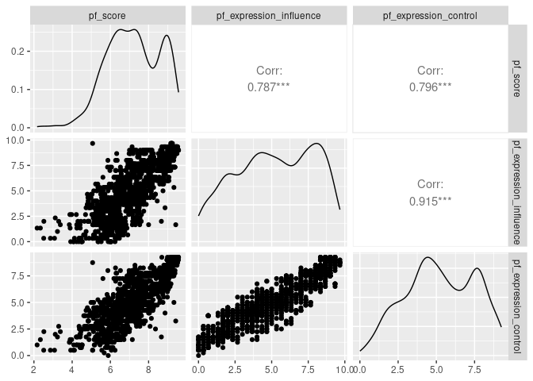

Activity 3 - Day 1
================

``` r
library(tidyverse)
```

    ## ── Attaching packages ─────────────────────────────────────── tidyverse 1.3.2 ──
    ## ✔ tibble  3.1.8     ✔ dplyr   1.0.9
    ## ✔ tidyr   1.2.0     ✔ stringr 1.4.1
    ## ✔ readr   2.1.3     ✔ forcats 0.5.2
    ## ✔ purrr   0.3.4     
    ## ── Conflicts ────────────────────────────────────────── tidyverse_conflicts() ──
    ## ✖ dplyr::filter() masks stats::filter()
    ## ✖ dplyr::lag()    masks stats::lag()

``` r
library(tidymodels)
```

    ## ── Attaching packages ────────────────────────────────────── tidymodels 1.0.0 ──
    ## ✔ broom        1.0.1     ✔ rsample      1.1.0
    ## ✔ dials        1.0.0     ✔ tune         1.0.0
    ## ✔ infer        1.0.3     ✔ workflows    1.0.0
    ## ✔ modeldata    1.0.0     ✔ workflowsets 1.0.0
    ## ✔ parsnip      1.0.1     ✔ yardstick    1.0.0
    ## ✔ recipes      1.0.1     
    ## ── Conflicts ───────────────────────────────────────── tidymodels_conflicts() ──
    ## ✖ scales::discard() masks purrr::discard()
    ## ✖ dplyr::filter()   masks stats::filter()
    ## ✖ recipes::fixed()  masks stringr::fixed()
    ## ✖ dplyr::lag()      masks stats::lag()
    ## ✖ yardstick::spec() masks readr::spec()
    ## ✖ recipes::step()   masks stats::step()
    ## • Dig deeper into tidy modeling with R at https://www.tmwr.org

``` r
library(scatterplot3d)
```

``` r
hfi <- readr::read_csv("https://www.openintro.org/data/csv/hfi.csv")
```

    ## Rows: 1458 Columns: 123
    ## ── Column specification ────────────────────────────────────────────────────────
    ## Delimiter: ","
    ## chr   (3): ISO_code, countries, region
    ## dbl (120): year, pf_rol_procedural, pf_rol_civil, pf_rol_criminal, pf_rol, p...
    ## 
    ## ℹ Use `spec()` to retrieve the full column specification for this data.
    ## ℹ Specify the column types or set `show_col_types = FALSE` to quiet this message.

``` r
hfi
```

    ## # A tibble: 1,458 × 123
    ##     year ISO_code countr…¹ region pf_ro…² pf_ro…³ pf_ro…⁴ pf_rol pf_ss…⁵ pf_ss…⁶
    ##    <dbl> <chr>    <chr>    <chr>    <dbl>   <dbl>   <dbl>  <dbl>   <dbl>   <dbl>
    ##  1  2016 ALB      Albania  Easte…    6.66    4.55    4.67   5.29    8.92      10
    ##  2  2016 DZA      Algeria  Middl…   NA      NA      NA      3.82    9.46      10
    ##  3  2016 AGO      Angola   Sub-S…   NA      NA      NA      3.45    8.06       5
    ##  4  2016 ARG      Argenti… Latin…    7.10    5.79    4.34   5.74    7.62      10
    ##  5  2016 ARM      Armenia  Cauca…   NA      NA      NA      5.00    8.81      10
    ##  6  2016 AUS      Austral… Ocean…    8.44    7.53    7.36   7.78    9.62      10
    ##  7  2016 AUT      Austria  Weste…    8.97    7.87    7.67   8.17    9.74      10
    ##  8  2016 AZE      Azerbai… Cauca…   NA      NA      NA      4.27    9.14      10
    ##  9  2016 BHS      Bahamas  Latin…    6.93    6.01    6.26   6.40    0         10
    ## 10  2016 BHR      Bahrain  Middl…   NA      NA      NA      5.90    9.79      10
    ## # … with 1,448 more rows, 113 more variables:
    ## #   pf_ss_disappearances_violent <dbl>, pf_ss_disappearances_organized <dbl>,
    ## #   pf_ss_disappearances_fatalities <dbl>, pf_ss_disappearances_injuries <dbl>,
    ## #   pf_ss_disappearances <dbl>, pf_ss_women_fgm <dbl>,
    ## #   pf_ss_women_missing <dbl>, pf_ss_women_inheritance_widows <dbl>,
    ## #   pf_ss_women_inheritance_daughters <dbl>, pf_ss_women_inheritance <dbl>,
    ## #   pf_ss_women <dbl>, pf_ss <dbl>, pf_movement_domestic <dbl>, …

``` r
hfi_2016 <- hfi %>% filter (year == 2016)
```

``` r
m1 <- lm(pf_score~pf_expression_control + hf_score + ef_score, data = hfi)
tidy(m1)
```

    ## # A tibble: 4 × 5
    ##   term                   estimate std.error statistic p.value
    ##   <chr>                     <dbl>     <dbl>     <dbl>   <dbl>
    ## 1 (Intercept)            4.53e-11  1.62e-10  2.79e- 1   0.781
    ## 2 pf_expression_control  6.99e-12  1.43e-11  4.88e- 1   0.626
    ## 3 hf_score               2.00e+ 0  5.11e-11  3.92e+10   0    
    ## 4 ef_score              -1.00e+ 0  4.53e-11 -2.21e+10   0

``` r
hfi_2016 %>% 
  select(ends_with("_score")) %>% 
  ggpairs()
```

<!-- -->

``` r
m_hr_ef <- lm(pf_score ~ hf_score + ef_score, data = hfi_2016)
tidy(m_hr_ef)
```

    ## # A tibble: 3 × 5
    ##   term         estimate std.error statistic p.value
    ##   <chr>           <dbl>     <dbl>     <dbl>   <dbl>
    ## 1 (Intercept)  1.44e-10  4.34e-10  3.32e- 1   0.741
    ## 2 hf_score     2.00e+ 0  9.66e-11  2.07e+10   0    
    ## 3 ef_score    -1.00e+ 0  1.18e-10 -8.49e+ 9   0

``` r
hfi_scatter_3d <- hfi_2016 %>% select(hf_score, ef_score, pf_score)
scatterplot3d(hfi_scatter_3d[,1:3], 
              pch = 15, 
              color="steelblue",
              grid = TRUE)
```

    ## Warning: Unknown or uninitialised column: `color`.

<!-- -->

# Day 02

``` r
# review any visual patterns
hfi %>% 
  select(pf_score, pf_expression_influence, pf_expression_control) %>% 
  ggpairs()
```

    ## Warning: Removed 80 rows containing non-finite values (`stat_density()`).

    ## Warning in ggally_statistic(data = data, mapping = mapping, na.rm = na.rm, :
    ## Removed 80 rows containing missing values

    ## Warning in ggally_statistic(data = data, mapping = mapping, na.rm = na.rm, :
    ## Removed 80 rows containing missing values

    ## Warning: Removed 80 rows containing missing values (`geom_point()`).

    ## Warning: Removed 80 rows containing non-finite values (`stat_density()`).

    ## Warning in ggally_statistic(data = data, mapping = mapping, na.rm = na.rm, :
    ## Removed 80 rows containing missing values

    ## Warning: Removed 80 rows containing missing values (`geom_point()`).
    ## Removed 80 rows containing missing values (`geom_point()`).

    ## Warning: Removed 80 rows containing non-finite values (`stat_density()`).

<!-- -->

``` r
#fit the mlr model
m_pf <- lm(pf_score ~ pf_expression_influence + pf_expression_control, data = hfi)
tidy(m_pf)
```

    ## # A tibble: 3 × 5
    ##   term                    estimate std.error statistic  p.value
    ##   <chr>                      <dbl>     <dbl>     <dbl>    <dbl>
    ## 1 (Intercept)                4.71     0.0566     83.1  0       
    ## 2 pf_expression_influence    0.188    0.0205      9.19 1.44e-19
    ## 3 pf_expression_control      0.288    0.0242     11.9  2.84e-31

``` r
summary(m_pf)
```

    ## 
    ## Call:
    ## lm(formula = pf_score ~ pf_expression_influence + pf_expression_control, 
    ##     data = hfi)
    ## 
    ## Residuals:
    ##     Min      1Q  Median      3Q     Max 
    ## -3.9776 -0.5338  0.1493  0.5807  3.4627 
    ## 
    ## Coefficients:
    ##                         Estimate Std. Error t value Pr(>|t|)    
    ## (Intercept)              4.70699    0.05664  83.102   <2e-16 ***
    ## pf_expression_influence  0.18812    0.02048   9.187   <2e-16 ***
    ## pf_expression_control    0.28829    0.02417  11.926   <2e-16 ***
    ## ---
    ## Signif. codes:  0 '***' 0.001 '**' 0.01 '*' 0.05 '.' 0.1 ' ' 1
    ## 
    ## Residual standard error: 0.8077 on 1375 degrees of freedom
    ##   (80 observations deleted due to missingness)
    ## Multiple R-squared:  0.6554, Adjusted R-squared:  0.6549 
    ## F-statistic:  1308 on 2 and 1375 DF,  p-value: < 2.2e-16

``` r
glance(m_pf)
```

    ## # A tibble: 1 × 12
    ##   r.squared adj.r.squ…¹ sigma stati…²   p.value    df logLik   AIC   BIC devia…³
    ##       <dbl>       <dbl> <dbl>   <dbl>     <dbl> <dbl>  <dbl> <dbl> <dbl>   <dbl>
    ## 1     0.655       0.655 0.808   1308. 8.19e-319     2 -1660. 3327. 3348.    897.
    ## # … with 2 more variables: df.residual <int>, nobs <int>, and abbreviated
    ## #   variable names ¹​adj.r.squared, ²​statistic, ³​deviance

``` r
# obtain fitted values and residuals
m_pf_aug <- augment(m_pf)

# plot fitted values and residuals
ggplot(data = m_pf_aug, aes(x = .fitted, y = .resid)) +
  geom_point() +
  geom_hline(yintercept = 0, linetype = "dashed", color = "red") +
  xlab("Fitted values") +
  ylab("Residuals")
```

<!-- -->

``` r
ggplot(data = m_pf_aug, aes(x = .resid)) +
  geom_histogram(binwidth = 0.25) +
  xlab("Residuals")
```

<!-- -->

``` r
hfi %>%
  filter(countries == "United States" & year == 2016) %>%
  select(pf_score, pf_expression_influence, pf_expression_control)
```

    ## # A tibble: 1 × 3
    ##   pf_score pf_expression_influence pf_expression_control
    ##      <dbl>                   <dbl>                 <dbl>
    ## 1     8.75                       8                     7

``` r
hfi %>%
  filter(countries == "United States" & year == 2016) %>%
  predict(m_pf, .)
```

    ##       1 
    ## 8.23002
