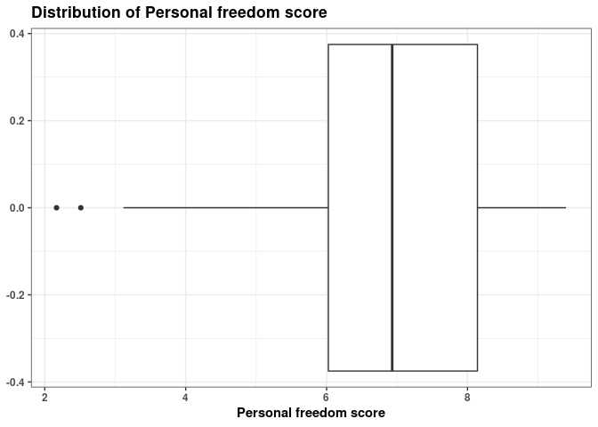

Activity 3 - Day 1
================

### Task 2: Loading the necessary packages

### Task 3: Loading the data

``` r
hfi <- data.frame(readr::read_csv("https://www.openintro.org/data/csv/hfi.csv"))
```

    ## Rows: 1458 Columns: 123
    ## ── Column specification ────────────────────────────────────────────────────────
    ## Delimiter: ","
    ## chr   (3): ISO_code, countries, region
    ## dbl (120): year, pf_rol_procedural, pf_rol_civil, pf_rol_criminal, pf_rol, p...
    ## 
    ## ℹ Use `spec()` to retrieve the full column specification for this data.
    ## ℹ Specify the column types or set `show_col_types = FALSE` to quiet this message.

``` r
hfi_2016 <- hfi %>% filter(year == "2016") 
```

This is an observational study.

``` r
# Plotting the Personal freedom score distribution using a histogram
ggplot(hfi_2016, aes(x = pf_score)) +
  geom_histogram() + 
  labs(title = "Distribution of Personal freedom score",
       x = "Personal freedom score")
```

    ## `stat_bin()` using `bins = 30`. Pick better value with `binwidth`.

<!-- -->

``` r
# Plotting the Personal freedom score distribution using a boxplot
ggplot(hfi_2016, aes(x = pf_score)) +
  geom_boxplot() +
  labs(title = "Distribution of Personal freedom score",
       x = "Personal freedom score") +
  theme_bw() +
  theme(legend.position = "bottom") +
  theme(text = element_text(face = "bold"))
```

<!-- -->

The distribution of pf\_score is left-skewed with outliers and multiple
peaks present. This says that most observations of countries’ personal
freedom score lies an abnormal distance from other values in our data
set. This was not expected since the average personal freedom score
being 7.2 and there are some places where personal freedom score is
between 2 to 3 means there is absence of state-level policies,
regulations, and laws governing injury-related behaviors.

``` r
# hf score vs ef score
hfi_2016 %>% ggplot(aes(x = hf_score,
                   y = ef_score)) + 
  geom_point(alpha=0.20) +
  geom_smooth(se = FALSE, method = "lm", size = 1) +
  labs(title = "Relationship between the hf score and ef score",
       x = "Human Freedom Score",
       y = "Economic freedom score",
       caption = "Data source: The OpenIntro site") + 
  theme_bw()
```

    ## `geom_smooth()` using formula 'y ~ x'

<!-- -->

The above plot says that there is a linear relationship between these
two variables.

### Task 4: Pairwise relationships

Next we will use hf\_score and ef\_score variables to describe/predict
the patterns in pf\_score.

``` r
hfi_2016 %>% 
  select(ends_with("_score")) %>% 
  ggpairs()
```

<!-- -->

There is a low positive correlation between ef score and pf score
whereas there is a high positive correlation between hf score and pf
score. Also there is a high positive correlation between hf score and ef
score. Most of the relationships look linear.

There are outliers present in the pf score vs ef score correlation
graph.

For each pair of variables, the correlation coefficient between ef score
and pf score is 0.627, between hf score and pf score the value is 0.948,
and between hf score and ef score the value is 0.843.

### Task 5: The multiple linear regression model

``` r
# Fitting the model
m_hr_ef <- lm(pf_score ~ hf_score + ef_score, data = hfi_2016)
tidy(m_hr_ef)
```

    ## # A tibble: 3 × 5
    ##   term         estimate std.error statistic p.value
    ##   <chr>           <dbl>     <dbl>     <dbl>   <dbl>
    ## 1 (Intercept)  1.44e-10  4.34e-10  3.32e- 1   0.741
    ## 2 hf_score     2.00e+ 0  9.66e-11  2.07e+10   0    
    ## 3 ef_score    -1.00e+ 0  1.18e-10 -8.49e+ 9   0

Estimated equation for this model: estimated pf\_score = beta0 + (beta1
\* hf\_score) + (beta2 \* ef\_score)

Slope Interpretation for hf\_score: Interpretation: For every 1 unit
increase in human freedom score, we expect the personal freedom score to
increase by 2.00 units, holding economic freedom score constant.

Slope Interpretation for ef\_score: Interpretation: For every 1 unit
increase in economic freedom score, we expect the personal freedom score
to decrease by 1 unit, holding human freedom score constant.

Intercept Interpretation for pf\_score: Interpretation: The expected
personal freedom score when the human freedom score is 0 unit and
economic freedom score is 0 unit is 1.438869e-10 units.

### Challenge: 3-D plots

``` r
hfi_score_table <- hfi_2016 %>% select(hf_score, ef_score, pf_score)

# Creating 3-D scatter plot
scatterplot3d(hfi_score_table[,1:3], 
              pch = 16, color="steelblue",
              main="3D Scatter Plot",
              xlab = "Human Freedom Score",
              ylab = "Personal Freedom Score",
              zlab = "Economic Freedom Score")
```

<!-- -->

### Task 2: Overall model - is at least one predictor useful?

``` r
# review any visual patterns
hfi %>% 
  select(pf_score, pf_expression_influence, pf_expression_control) %>% 
  ggpairs()
```

<!-- -->

``` r
#fit the mlr model
m_pf <- lm(pf_score ~ pf_expression_influence + pf_expression_control, data = hfi)
tidy(m_pf)
```

    ## # A tibble: 3 × 5
    ##   term                    estimate std.error statistic  p.value
    ##   <chr>                      <dbl>     <dbl>     <dbl>    <dbl>
    ## 1 (Intercept)                4.71     0.0566     83.1  0       
    ## 2 pf_expression_influence    0.188    0.0205      9.19 1.44e-19
    ## 3 pf_expression_control      0.288    0.0242     11.9  2.84e-31

Estimated equation for this model: estimated pf\_score = beta0 + (beta1
\* pf\_expression\_influence) + (beta2 \* pf\_expression\_control)

Intercept Interpretation for pf\_score: For countries with a
pf\_expression\_influence of 0 (those with the largest amount of
laws/regulations on media content) and pf\_expression\_control of 0
(those with the largest amount of political pressure on media content),
we expect their mean personal freedom score to be 4.71.

Slope Interpretation for pf\_expression\_influence: For a given
pf\_expression\_control value (i.e., a given level of laws/regulations
on media content), a 1 unit increase in pf\_expression\_influence is
associated with a 0.188 unit increase of a country’s mean personal
freedom score.

Slope Interpretation for pf\_expression\_control: For a given
pf\_expression\_influence value (i.e., a given level of political
pressure on media content), a 1 unit increase in pf\_expression\_control
is associated with a 0.288 unit increase of a country’s mean personal
freedom score.

# Is there a relationship between the response and predictors?

``` r
summary(m_pf)
```

    ## 
    ## Call:
    ## lm(formula = pf_score ~ pf_expression_influence + pf_expression_control, 
    ##     data = hfi)
    ## 
    ## Residuals:
    ##     Min      1Q  Median      3Q     Max 
    ## -3.9776 -0.5338  0.1493  0.5807  3.4627 
    ## 
    ## Coefficients:
    ##                         Estimate Std. Error t value Pr(>|t|)    
    ## (Intercept)              4.70699    0.05664  83.102   <2e-16 ***
    ## pf_expression_influence  0.18812    0.02048   9.187   <2e-16 ***
    ## pf_expression_control    0.28829    0.02417  11.926   <2e-16 ***
    ## ---
    ## Signif. codes:  0 '***' 0.001 '**' 0.01 '*' 0.05 '.' 0.1 ' ' 1
    ## 
    ## Residual standard error: 0.8077 on 1375 degrees of freedom
    ##   (80 observations deleted due to missingness)
    ## Multiple R-squared:  0.6554, Adjusted R-squared:  0.6549 
    ## F-statistic:  1308 on 2 and 1375 DF,  p-value: < 2.2e-16

Decision: Since the p-value &lt; 0.05, we are going to reject the null
hypothesis.

Interpretation: Since the p-value &lt; 0.05, we have sufficient evidence
that at least one of the slopes associated with this MLR model exists at
the 5% significance level.

### Task 3: Deciding on important variables

### Task 4: Model fit

``` r
glance(m_pf)
```

    ## # A tibble: 1 × 12
    ##   r.squared adj.r.squ…¹ sigma stati…²   p.value    df logLik   AIC   BIC devia…³
    ##       <dbl>       <dbl> <dbl>   <dbl>     <dbl> <dbl>  <dbl> <dbl> <dbl>   <dbl>
    ## 1     0.655       0.655 0.808   1308. 8.19e-319     2 -1660. 3327. 3348.    897.
    ## # … with 2 more variables: df.residual <int>, nobs <int>, and abbreviated
    ## #   variable names ¹​adj.r.squared, ²​statistic, ³​deviance

The value of R^2 for this model is 0.7266672.

This means 72.67% of the variability in the country’s personal freedom
score is explained by their personal freedom expression control and
personal freedom expression influence.

In SLR model R^2 value was 0.7141342. Whereas in MLR model R^2 value is
0.7266672.

## Linearity

``` r
# obtain fitted values and residuals
m_pf_aug <- augment(m_pf)

# plot fitted values and residuals
ggplot(data = m_pf_aug, aes(x = .fitted, y = .resid)) +
  geom_point() +
  geom_hline(yintercept = 0, linetype = "dashed", color = "red") +
  xlab("Fitted values") +
  ylab("Residuals")
```

<!-- -->

Linearity: From the above Residual by predicted value plot, there is no
apparent pattern in the residuals plot. So it indicates there is a
linear relationship between these variables. Thus, the linearity
assumption is met here.

## Nearly normal residuals

``` r
ggplot(data = m_pf_aug, aes(x = .resid)) +
  geom_histogram(binwidth = 0.25) +
  xlab("Residuals")
```

<!-- -->

``` r
# QQ-plot
qqnorm(m_pf_aug$.resid)
qqline(m_pf_aug$.resid)
```

<!-- -->

Nearly normal residuals: Based on the histogram, the residuals are
nearly normal. There is only one real peak (uni-modal) on the bell curve
in the residual histogram, so the nearly normal condition is met.

Constant variability: The points residuals vs. fitted plot show that
points are scattered around 0, there is a constant variability.Thus, the
constant variability condition appear to be met.

### Task 5: Prediction

``` r
# Variables associated with the United States in 2016 
hfi %>% 
  filter(countries == "United States" & year == 2016) %>% 
  select(pf_score, pf_expression_influence, pf_expression_control)
```

    ##   pf_score pf_expression_influence pf_expression_control
    ## 1  8.74731                       8                     7

``` r
hfi %>% 
  filter(countries == "United States" & year == 2016) %>% 
  predict(m_pf, .)
```

    ##       1 
    ## 8.23002

Estimated model:

estimated pf\_score = 4.71 + 0.188 \* pf\_expression\_influence + 0.288
\* pf\_expression\_control

estimated pf\_score = 4.71 + 0.188 \* 8 + 0.288 \* 7 = 8.23

The actual personal freedom score for the United States in 2016 was
8.74731 and predicted personal freedom score is 8.23. The residual would
be 8.74731 - 8.23 = 0.51731.
